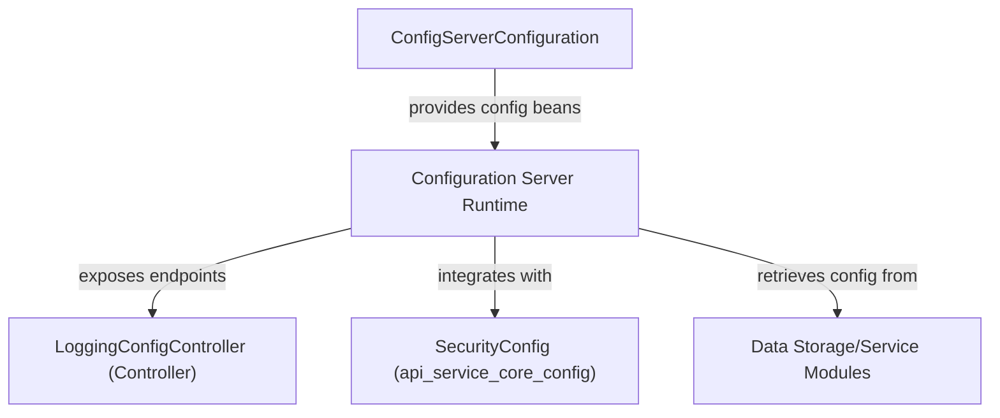
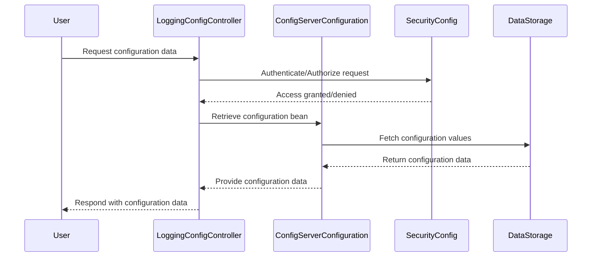

# config_core_core Module Documentation

## Introduction

The `config_core_core` module is responsible for the core configuration of the configuration server within the system. It provides foundational configuration settings and beans that enable the configuration server to operate, integrate with other services, and expose configuration endpoints. This module is essential for initializing and managing the configuration server's runtime environment, ensuring that configuration data is accessible and secure across the platform.

## Core Component

### ConfigServerConfiguration

- **Purpose:**
  - Serves as the primary configuration class for the configuration server.
  - Defines beans and settings required for the configuration server to function within the broader system.
  - Integrates with other core modules to provide configuration data and management capabilities.

- **Responsibilities:**
  - Bootstraps the configuration server with necessary properties and beans.
  - Ensures secure and reliable access to configuration data.
  - May define endpoints or interfaces for configuration retrieval and management.

## Architecture Overview

The `config_core_core` module is a foundational part of the configuration server subsystem. It typically interacts with:
- **Controllers** (e.g., [config_core_controller.md]) that expose configuration endpoints.
- **Security and Authentication Modules** (e.g., [api_service_core_config.md], [security_core_config.md]) to ensure secure access to configuration data.
- **Data Storage or Service Modules** for persisting and retrieving configuration values.

### High-Level Architecture Diagram

### Component Relationships

- **ConfigServerConfiguration** is the entry point for configuration server setup.
- **LoggingConfigController** (from [config_core_controller.md]) uses the configuration beans to expose configuration-related endpoints.
- **SecurityConfig** (from [api_service_core_config.md]) ensures that only authorized users can access or modify configuration data.
- **Data Storage/Service Modules** provide persistent storage and retrieval of configuration values.

## Data Flow

## Module Dependencies

- **[config_core_controller.md]:** Exposes configuration endpoints, such as logging configuration.
- **[api_service_core_config.md]:** Provides security and application configuration beans.
- **[security_core_config.md]:** Handles authentication and authorization for configuration endpoints.
- **Data Storage/Service Modules:** (e.g., MongoDB, Redis, or custom services) for persistent configuration management.

## Integration in the System

The `config_core_core` module is a low-level, foundational module that should be loaded early in the configuration server's lifecycle. It is not typically used directly by business logic, but rather by other configuration-related modules and controllers.

- **Initialization:** Loaded at application startup to provide configuration beans.
- **Security:** Works with security modules to protect sensitive configuration data.
- **Extensibility:** Other modules can define additional configuration beans or override existing ones as needed.

## References

- [config_core_controller.md]: Details on controllers that use configuration beans.
- [api_service_core_config.md]: Security and application configuration details.
- [security_core_config.md]: Security configuration for endpoints.

---
*For more details on related modules, see the referenced documentation files.*
