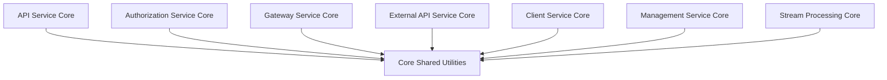
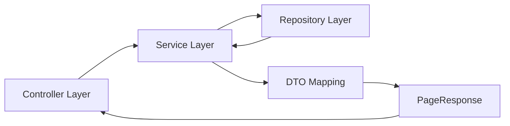
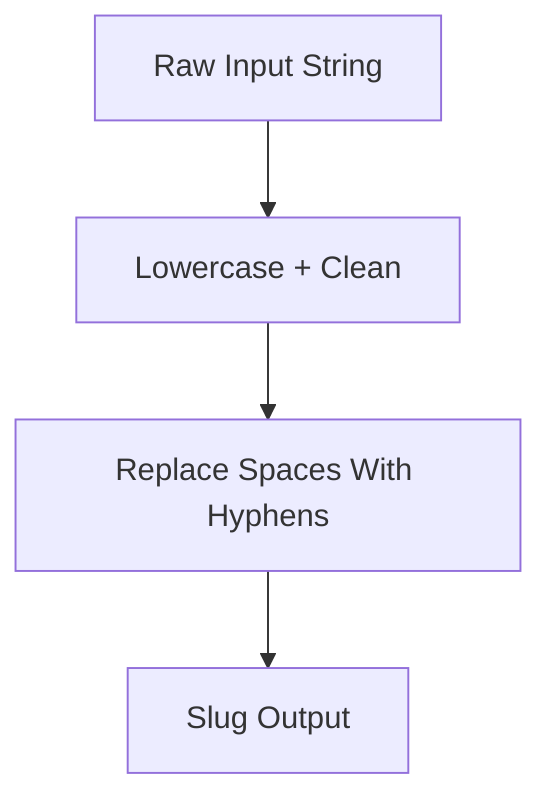
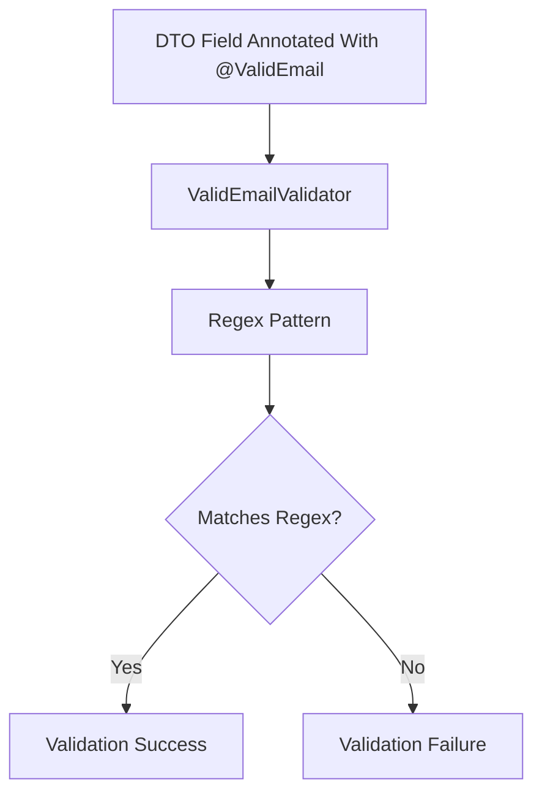
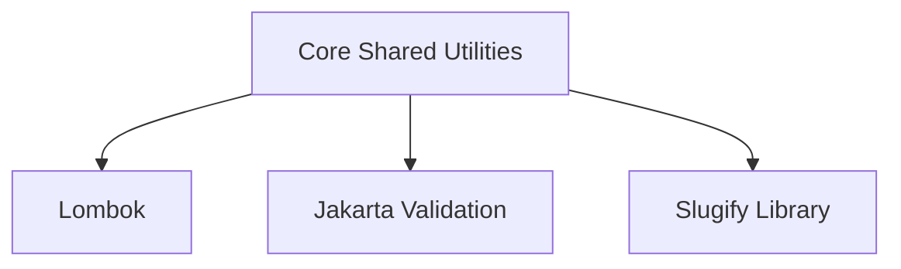

# Core Shared Utilities

The **Core Shared Utilities** module provides lightweight, framework-agnostic building blocks used across the OpenFrame platform. It contains foundational utilities and reusable DTOs that standardize pagination, string normalization, and validation logic.

Unlike higher-level modules (such as API services, authorization, or data layers), this module has:

- ✅ No business-domain logic  
- ✅ No infrastructure coupling  
- ✅ Minimal external dependencies  
- ✅ High reuse across services  

It acts as a *foundation layer* for consistency and shared conventions across microservices.

---

## Architectural Role in the Platform

Core Shared Utilities sits at the bottom of the dependency hierarchy. All service modules may depend on it, but it depends on none of them.



### Design Principles

1. **Stateless Utilities** – No runtime state or persistence.
2. **Generic & Type-Safe** – Uses generics where applicable.
3. **Minimal Surface Area** – Only essential cross-cutting abstractions.
4. **Framework-Compatible** – Works seamlessly with Spring Boot and Jakarta Validation.

---

# Core Components

The module currently contains three primary components:

- `PageResponse<T>` – Standardized pagination response wrapper  
- `SlugUtil` – Consistent slug generation utility  
- `ValidEmailValidator` – Custom email validation constraint implementation  

---

# 1. PageResponse

**Class:** `PageResponse<T>`  
**Package:** `com.openframe.core.dto`

## Purpose

Provides a standardized, reusable pagination response model for REST and GraphQL endpoints across the platform.

This avoids duplicated pagination DTOs in modules such as:

- API Service Core  
- External API Service Core  
- Management Service Core  

## Structure

```java
public class PageResponse<T> {
    private List<T> items;
    private int page;
    private int size;
    private long totalElements;
    private int totalPages;
    private boolean hasNext;
}
```

## Field Responsibilities

| Field | Description |
|--------|-------------|
| `items` | Current page data items |
| `page` | Zero- or one-based page index (depending on service convention) |
| `size` | Number of items requested per page |
| `totalElements` | Total number of matching records |
| `totalPages` | Computed number of pages |
| `hasNext` | Indicates if a next page exists |

## Typical Flow



### Why This Matters

- Enforces consistent pagination contracts.
- Decouples transport format from persistence framework.
- Works for both REST and GraphQL responses.
- Simplifies frontend consumption.

---

# 2. SlugUtil

**Class:** `SlugUtil`  
**Package:** `com.openframe.core.util`

## Purpose

Generates URL-friendly, lowercase slugs from arbitrary input strings.

Used in scenarios such as:

- Organization identifiers  
- Tenant slugs  
- Public resource URLs  
- Tool identifiers  

## Implementation Highlights

```java
private static final Slugify SLUGIFY = Slugify.builder()
        .lowerCase(true)
        .underscoreSeparator(false)
        .build();
```

### Behavior

- Converts text to lowercase
- Removes unsafe characters
- Replaces spaces with hyphens
- Ensures deterministic formatting
- Defaults to "org" when input is null

## Flow Example



### Example Transformations

```text
"My Organization"        -> "my-organization"
"ACME Corp 2025"         -> "acme-corp-2025"
null                      -> "org"
```

### Design Considerations

- Utility class is `final`
- Private constructor prevents instantiation
- Static method usage encourages simplicity
- Thread-safe due to static immutable configuration

---

# 3. ValidEmailValidator

**Class:** `ValidEmailValidator`  
**Package:** `com.openframe.core.validation`

## Purpose

Provides custom email validation logic via Jakarta Bean Validation.

This class implements:

```java
ConstraintValidator<ValidEmail, String>
```

It is intended to be used alongside a custom `@ValidEmail` annotation (defined elsewhere in the platform).

## Validation Flow



## Key Logic

```java
@Override
public boolean isValid(String value, ConstraintValidatorContext context) {
    if (value == null) {
        return false;
    }
    return pattern.matcher(value).matches();
}
```

### Important Characteristics

- Regex is configurable via annotation
- Null values are considered invalid
- Delegates pattern definition to annotation
- Integrates with Spring Boot validation pipeline

### Usage Scenario

```java
public class CreateUserRequest {

    @ValidEmail(regex = "^[A-Za-z0-9+_.-]+@[A-Za-z0-9.-]+$")
    private String email;
}
```

---

# Cross-Module Impact

Although small, this module has platform-wide influence:

| Utility | Used By |
|----------|----------|
| `PageResponse` | REST controllers, GraphQL resolvers, management endpoints |
| `SlugUtil` | Organization, tenant, tool, and integration modules |
| `ValidEmailValidator` | Authorization, user management, invitation flows |

Because these components are shared:

- Breaking changes require coordinated platform updates.
- API contracts must remain stable.
- Backward compatibility is critical.

---

# Dependency Characteristics



## External Libraries

- **Lombok** – Reduces boilerplate in DTOs
- **Jakarta Validation** – Enables annotation-based validation
- **Slugify** – Provides robust slug transformation logic

---

# Why This Module Matters

Even though it contains only a few classes, Core Shared Utilities ensures:

- ✅ Consistent pagination behavior
- ✅ Uniform slug formatting across services
- ✅ Centralized validation logic
- ✅ Reduced duplication across microservices
- ✅ Stable foundational abstractions

In a distributed microservice architecture, small shared modules like this prevent fragmentation and enforce standards across independently deployable services.

---

# Summary

The **Core Shared Utilities** module is a foundational layer in the OpenFrame ecosystem. It provides:

- A standardized pagination contract (`PageResponse<T>`)  
- Deterministic slug generation (`SlugUtil`)  
- Custom email validation support (`ValidEmailValidator`)  

Its simplicity is intentional. It is designed to be:

- Lightweight  
- Highly reusable  
- Framework-compatible  
- Platform-stable  

As the platform evolves, this module should remain minimal, stable, and focused exclusively on cross-cutting utility concerns.
