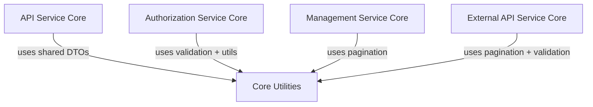
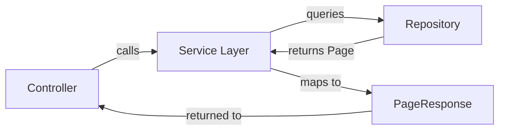
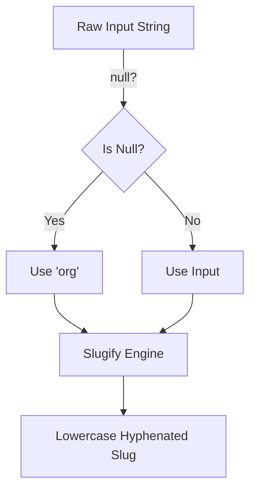
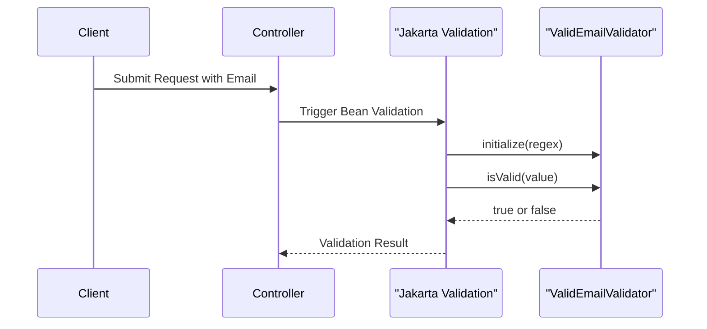

# Core Utilities

The **Core Utilities** module provides foundational, reusable building blocks that are shared across the OpenFrame platform. While small in scope, this module underpins higher-level services by standardizing pagination responses, string normalization (slug generation), and validation logic.

It is intentionally lightweight and dependency-minimal so it can be reused by:

- API Service Core
- Authorization Service Core
- Management Service Core
- External API Service Core
- Any other module requiring shared DTOs or validation utilities

Core components:

- `PageResponse<T>` – Generic pagination wrapper
- `SlugUtil` – Slug generation utility
- `ValidEmailValidator` – Custom email validation logic

---

## Architectural Role in the Platform

Although Core Utilities does not expose controllers, services, or repositories, it sits at the base of the platform dependency graph.



### Design Principles

1. **Framework-agnostic where possible** – Utilities avoid heavy framework coupling.
2. **Generic and reusable** – Designed for broad applicability across services.
3. **Stateless** – No persistence or infrastructure responsibilities.
4. **Low transitive dependency impact** – Safe to import anywhere.

---

# Components

## PageResponse

**Location:** `com.openframe.core.dto.PageResponse`

`PageResponse<T>` is a generic DTO that standardizes paginated responses across the platform.

### Structure

```java
public class PageResponse<T> {
    private List<T> items;
    private int page;
    private int size;
    private long totalElements;
    private int totalPages;
    private boolean hasNext;
}
```

### Responsibilities

- Wrap paginated data collections
- Provide consistent pagination metadata
- Support REST and GraphQL responses
- Decouple service-layer pagination logic from transport format

### Field Semantics

| Field | Description |
|--------|-------------|
| `items` | List of results for the current page |
| `page` | Zero-based or one-based page index (service-defined) |
| `size` | Number of items per page |
| `totalElements` | Total number of matching records |
| `totalPages` | Computed total pages |
| `hasNext` | Whether another page exists |

### Usage Flow



### Why It Matters

Without a standardized pagination DTO:

- Each module would define its own response structure
- Frontend integrations would become inconsistent
- Cross-service interoperability would degrade

`PageResponse` ensures platform-wide consistency.

---

## SlugUtil

**Location:** `com.openframe.core.util.SlugUtil`

`SlugUtil` is a stateless utility class that converts arbitrary strings into URL-friendly slugs.

### Implementation Overview

- Uses the `Slugify` library
- Enforces lowercase output
- Uses hyphen-separated format (no underscore separator)
- Provides a null-safe fallback

```java
public static String toSlug(String input) {
    String base = (input == null ? "org" : input);
    return SLUGIFY.slugify(base);
}
```

### Behavior

| Input | Output |
|--------|--------|
| `"My Organization"` | `"my-organization"` |
| `"ACME Corp 2025"` | `"acme-corp-2025"` |
| `null` | `"org"` |

### Typical Use Cases

- Organization identifiers
- Tenant identifiers
- SEO-friendly URLs
- Public-facing resource paths
- Slug-based routing in multi-tenant contexts

### Slug Generation Flow



### Design Considerations

- Marked `final` to prevent inheritance
- Private constructor prevents instantiation
- Thread-safe (shared immutable Slugify instance)

---

## ValidEmailValidator

**Location:** `com.openframe.core.validation.ValidEmailValidator`

`ValidEmailValidator` is a custom Jakarta Bean Validation constraint validator.

It validates email addresses using a configurable regular expression.

### Implementation Overview

```java
public class ValidEmailValidator implements ConstraintValidator<ValidEmail, String> {

    private Pattern pattern;

    @Override
    public void initialize(ValidEmail constraintAnnotation) {
        this.pattern = Pattern.compile(constraintAnnotation.regex());
    }

    @Override
    public boolean isValid(String value, ConstraintValidatorContext context) {
        if (value == null) {
            return false;
        }
        return pattern.matcher(value).matches();
    }
}
```

### Validation Lifecycle



### Key Characteristics

- Regex-driven (annotation-defined pattern)
- Stateless after initialization
- Integrated with Jakarta Validation framework
- Fails on `null` values

### Why Custom Validation?

Although Jakarta provides `@Email`, custom validation allows:

- Strict domain-specific validation rules
- Enforcement of organizational policies
- Enhanced consistency across services

---

# Cross-Module Impact

Core Utilities indirectly influences many platform areas:

| Area | Contribution |
|-------|-------------|
| API responses | Standardized pagination (`PageResponse`) |
| Multi-tenancy | Slug generation for tenant identifiers |
| User management | Email validation enforcement |
| External APIs | Consistent response structures |

Because it sits at the base of the dependency graph, changes in this module should be:

- Backward compatible
- Carefully versioned
- Extensively reviewed

---

# Extension Guidelines

When adding new utilities to Core Utilities:

✅ Keep them:
- Generic
- Stateless
- Framework-light
- Cross-domain reusable

❌ Avoid:
- Business logic
- Service orchestration
- Infrastructure configuration
- Module-specific DTOs

If a utility is specific to one bounded context (e.g., OAuth, Kafka, Mongo), it belongs in that respective module.

---

# Summary

The **Core Utilities** module provides foundational primitives for the OpenFrame ecosystem:

- A consistent pagination contract (`PageResponse`)
- Deterministic slug generation (`SlugUtil`)
- Centralized email validation (`ValidEmailValidator`)

While minimal in size, it ensures:

- Platform-wide consistency
- Reduced duplication
- Clean separation of concerns
- Stronger architectural cohesion

It acts as a stable base layer that higher-level modules build upon.