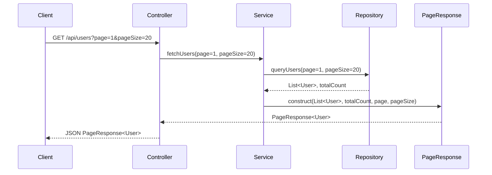

# core_dto Module Documentation

## Introduction

The `core_dto` module provides foundational Data Transfer Object (DTO) types that are used across multiple layers of the system to standardize paginated API responses. Its primary purpose is to encapsulate and structure paginated data, making it easier for both backend and frontend components to handle large datasets efficiently and consistently.

## Core Functionality

The main component of this module is:

- **PageResponse**: A generic DTO for paginated responses, typically used to wrap lists of entities along with pagination metadata (such as total count, current page, and page size).

This DTO is designed to be reusable and is referenced by many other modules that require paginated data delivery, such as user lists, device lists, event logs, and more.

## Architecture and Relationships

The `core_dto` module is a low-level utility module. It is referenced by higher-level DTO modules and service layers that need to return paginated results. The following diagram illustrates its relationship with other modules:

```mermaid
flowchart TD
    PageResponse["PageResponse"]
    api_service_core_dto["api_service_core_dto"]
    api_service_core_dto_user["api_service_core_dto_user"]
    api_service_core_dto_invitation["api_service_core_dto_invitation"]
    api_service_core_dto_event["api_service_core_dto_event"]
    api_service_core_dto_device["api_service_core_dto_device"]
    api_service_core_dto_tool["api_service_core_dto_tool"]
    external_api_service_core_dto_device["external_api_service_core_dto_device"]
    external_api_service_core_dto_event["external_api_service_core_dto_event"]
    external_api_service_core_dto_tool["external_api_service_core_dto_tool"]
    external_api_service_core_dto_organization["external_api_service_core_dto_organization"]
    frontend_core_hooks_ui["frontend_core_hooks_ui"]

    PageResponse -->|used by| api_service_core_dto
    PageResponse -->|used by| api_service_core_dto_user
    PageResponse -->|used by| api_service_core_dto_invitation
    PageResponse -->|used by| api_service_core_dto_event
    PageResponse -->|used by| api_service_core_dto_device
    PageResponse -->|used by| api_service_core_dto_tool
    PageResponse -->|used by| external_api_service_core_dto_device
    PageResponse -->|used by| external_api_service_core_dto_event
    PageResponse -->|used by| external_api_service_core_dto_tool
    PageResponse -->|used by| external_api_service_core_dto_organization
    PageResponse -->|used by| frontend_core_hooks_ui
```



### Data Flow Example

When a client requests a paginated list (e.g., users, devices, events), the service layer constructs a `PageResponse` object, populates it with the requested data and pagination metadata, and returns it to the client. This ensures a consistent API contract for all paginated endpoints.



## Component Details

### PageResponse

A generic DTO for paginated responses. It typically contains:
- `items`: The list of data items for the current page
- `totalCount`: The total number of items available
- `page`: The current page number
- `pageSize`: The number of items per page

#### Example Structure

```json
{
  "items": [
    { /* entity data */ },
    { /* entity data */ }
  ],
  "totalCount": 100,
  "page": 1,
  "pageSize": 20
}
```

## Integration with Other Modules

The `PageResponse` DTO is referenced by many other modules for paginated data delivery. For details on how paginated responses are used in specific contexts, see:
- [api_service_core_dto_user.md](api_service_core_dto_user.md)
- [api_service_core_dto_invitation.md](api_service_core_dto_invitation.md)
- [api_service_core_dto_event.md](api_service_core_dto_event.md)
- [api_service_core_dto_device.md](api_service_core_dto_device.md)
- [api_service_core_dto_tool.md](api_service_core_dto_tool.md)
- [external_api_service_core_dto_device.md](external_api_service_core_dto_device.md)
- [external_api_service_core_dto_event.md](external_api_service_core_dto_event.md)
- [external_api_service_core_dto_tool.md](external_api_service_core_dto_tool.md)
- [external_api_service_core_dto_organization.md](external_api_service_core_dto_organization.md)
- [frontend_core_hooks_ui.md](frontend_core_hooks_ui.md)

## Summary

The `core_dto` module is a foundational building block for paginated API responses throughout the system. By standardizing the structure of paginated data, it enables consistent, maintainable, and predictable API contracts for both backend and frontend consumers.
