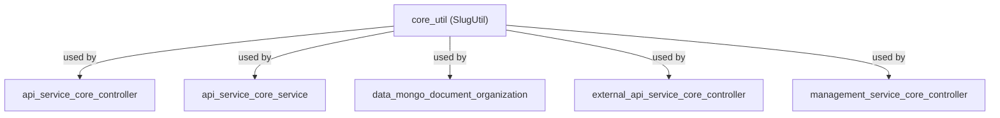
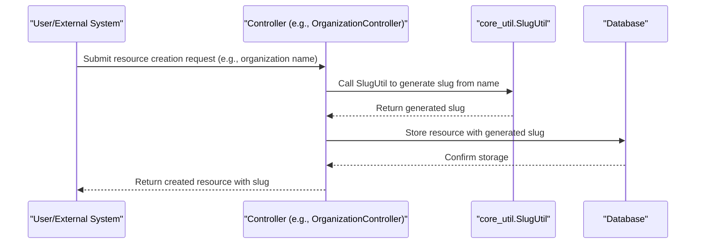

# core_util Module Documentation

## Introduction

The `core_util` module provides foundational utility functions and helpers that are used throughout the system. Its primary purpose is to encapsulate reusable logic that does not belong to any specific domain, but is essential for the smooth operation and consistency of the codebase. This module is designed to be lightweight, dependency-free (where possible), and easily accessible by other modules.

### Core Component
- **SlugUtil**: Utility for generating and handling slugs (URL-friendly, unique identifiers) from strings.

## Purpose and Core Functionality

The `core_util` module is intended to:
- Provide common utility functions that are used across multiple modules
- Ensure consistency in how certain operations (like slug generation) are performed
- Reduce code duplication by centralizing generic logic

### SlugUtil
`SlugUtil` is the main utility provided by this module. It is responsible for:
- Converting arbitrary strings (such as names or titles) into URL-safe slugs
- Ensuring slugs are unique and consistent across the system
- Handling edge cases such as special characters, whitespace, and case normalization

**Typical Use Cases:**
- Generating slugs for organizations, users, or resources for use in URLs
- Ensuring that slugs are consistent and collision-free
- Sanitizing user input for use in identifiers

## Architecture and Component Relationships

The `core_util` module is designed to be a low-level utility module with minimal dependencies. It is used by higher-level modules that require slug generation or similar utility functions. The diagram below illustrates its position in the system architecture:

- **Upstream**: `core_util` does not depend on other modules.
- **Downstream**: Many modules depend on `core_util` for slug generation and related utilities.

## Data Flow and Process

A typical process flow for slug generation using `SlugUtil` is as follows:

## Integration with Other Modules

The `core_util` module is referenced by many other modules, including:
- [api_service_core_controller.md](api_service_core_controller.md): Uses `SlugUtil` for generating slugs for API resources
- [data_mongo_document_organization.md](data_mongo_document_organization.md): Stores slugs as part of organization documents
- [management_service_core_controller.md](management_service_core_controller.md): Uses slugs for management endpoints

For more details on how slugs are used in specific domains, refer to the documentation of the respective modules.

## Best Practices
- Always use `SlugUtil` for slug generation to ensure consistency across the system
- Avoid duplicating slug logic in other modules
- Validate slugs for uniqueness at the database or service layer as needed

## References
- [api_service_core_controller.md](api_service_core_controller.md)
- [data_mongo_document_organization.md](data_mongo_document_organization.md)
- [management_service_core_controller.md](management_service_core_controller.md)

---
*This documentation is auto-generated to provide a comprehensive overview of the `core_util` module and its role in the system.*
