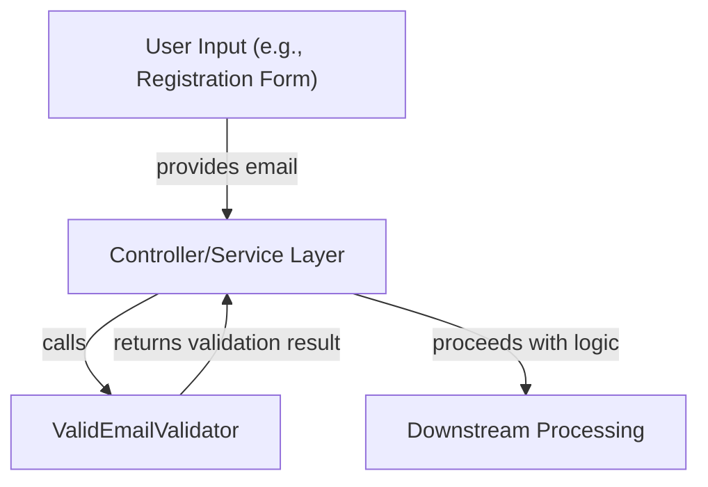

# core_validation Module Documentation

## Introduction

The `core_validation` module provides core validation utilities for the system, with a focus on reusable, centralized validation logic. Its primary responsibility is to ensure that data entering the system meets required formats and standards, thereby reducing errors and improving data integrity across services and APIs.

Currently, the module includes the `ValidEmailValidator` component, which is responsible for validating email addresses according to defined rules. This validator is designed to be used throughout the system wherever email validation is required, promoting consistency and maintainability.

---

## Core Components

### ValidEmailValidator

**Purpose:**
- Validates whether a given string is a properly formatted email address.
- Ensures that email inputs across the system conform to expected standards before further processing or storage.

**Usage Context:**
- Used in user registration, invitation flows, authentication, and any feature requiring email input validation.
- Can be integrated into service layers, controllers, or data transfer object (DTO) validation logic.

**Key Features:**
- Centralizes email validation logic for consistency.
- Reduces code duplication and risk of inconsistent validation across modules.
- Can be extended or replaced to support additional validation rules as needed.

---

## Architecture & Integration

The `core_validation` module is designed to be lightweight and highly reusable. It is typically invoked by higher-level modules such as service layers, controllers, or DTO mappers that require input validation.

### Component Interaction Diagram

### Example Data Flow

1. **User Input:** A user submits a form with an email address.
2. **Controller/Service:** The controller or service receives the input and invokes `ValidEmailValidator` to check the email.
3. **Validation:**
    - If valid, processing continues (e.g., user is registered, invitation is sent).
    - If invalid, an error is returned to the user or calling system.

---

## Dependencies & Relationships

- The `core_validation` module is intentionally decoupled from other modules, making it easy to use in any part of the system.
- It is commonly referenced by modules such as:
    - [api_service_core_controller.md]: For validating user input in API endpoints.
    - [api_service_core_dto.md]: For validating DTOs before processing.
    - [api_service_core_service_user.md]: For user-related business logic.
- For more information on how validation integrates with DTOs and controllers, see the documentation for those modules.

---

## Extending Validation Logic

While the current focus is on email validation, the `core_validation` module can be extended to include additional validators (e.g., phone number, password strength, custom business rules) as the system evolves. This approach ensures all validation logic remains centralized and maintainable.

---

## Summary

The `core_validation` module is a foundational utility for enforcing data integrity across the system. By centralizing validation logic, it ensures consistency, reduces duplication, and simplifies maintenance. Its current and future validators are designed to be easily integrated into any part of the system that requires input validation.
