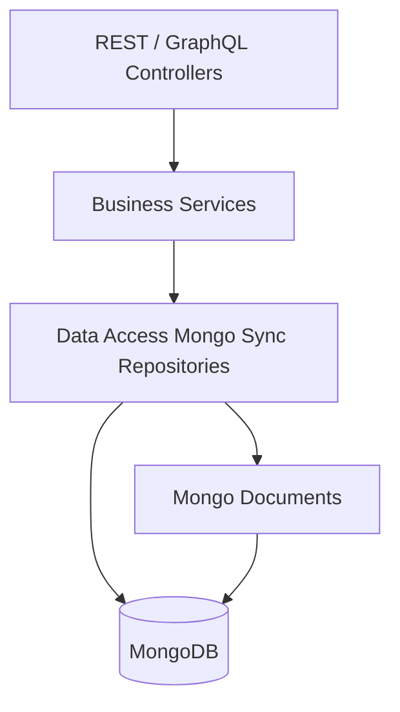
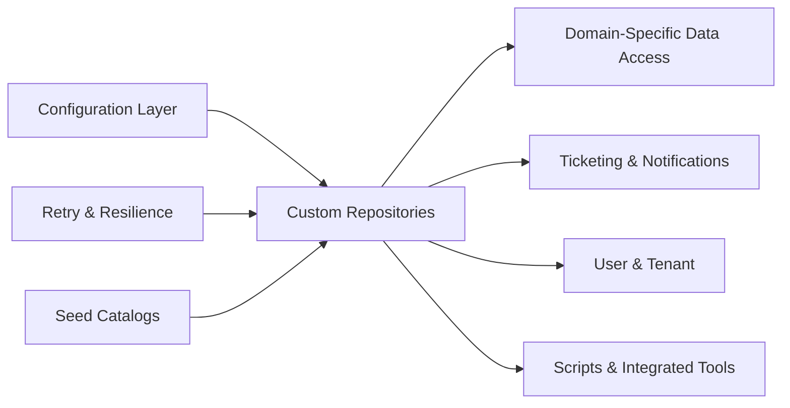
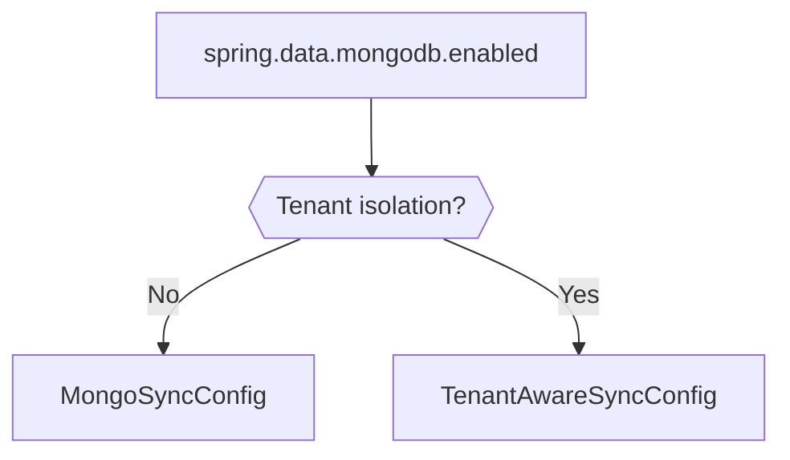
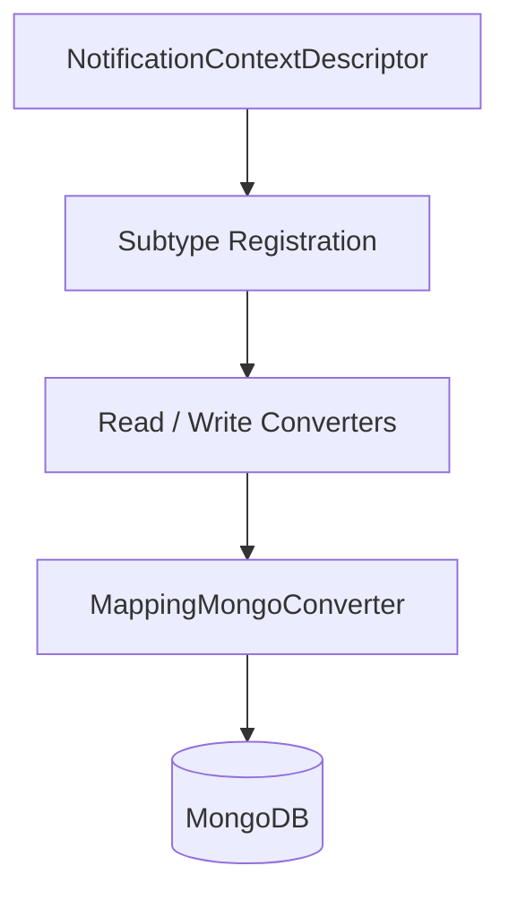
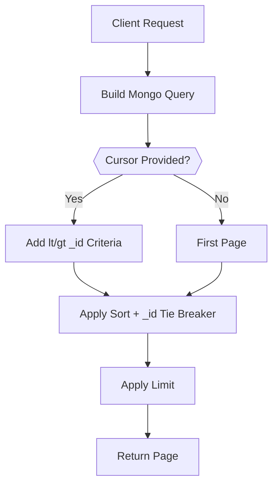
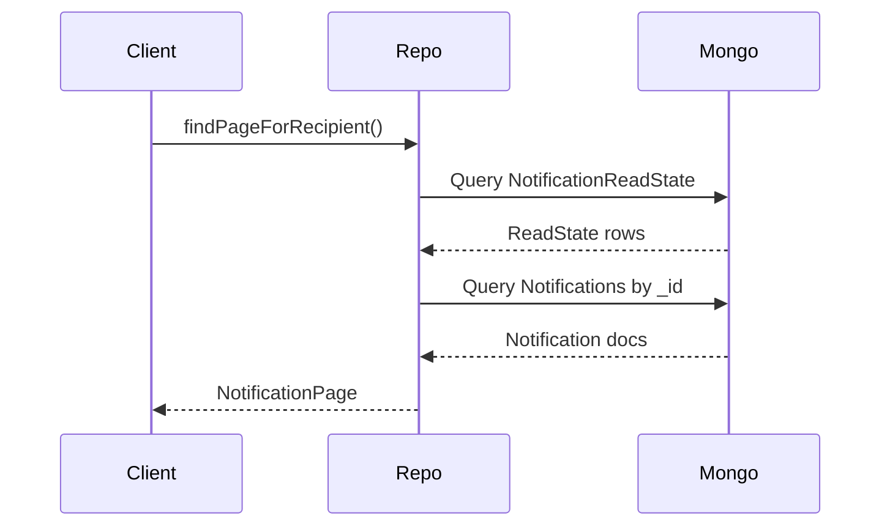
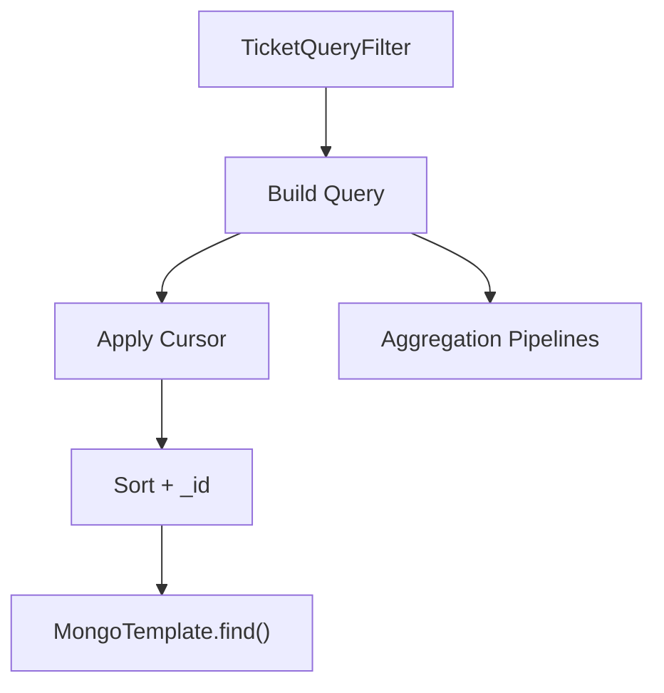
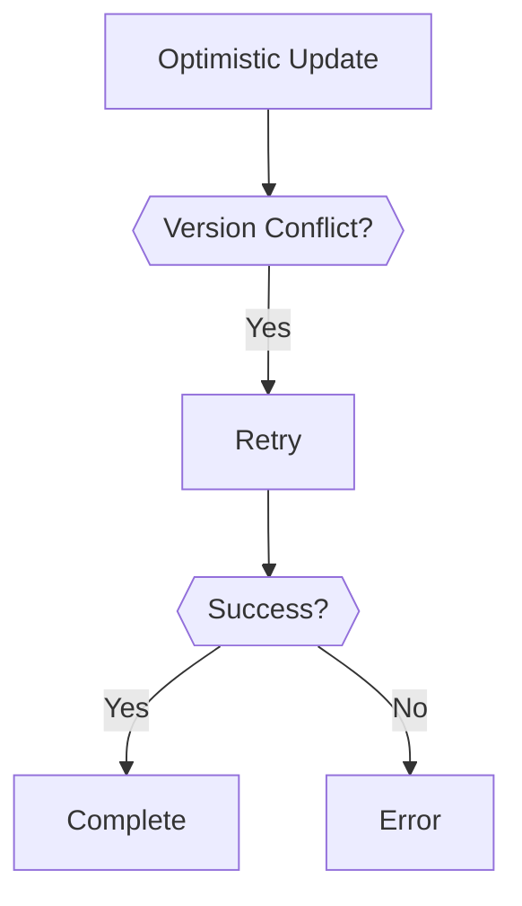

# Data Access Mongo Sync

## Overview

The **Data Access Mongo Sync** module provides the synchronous MongoDB persistence layer for the OpenFrame platform. It is responsible for:

- Configuring MongoDB infrastructure and converters
- Enabling tenant-aware and non-tenant repository modes
- Implementing custom query logic with cursor-based pagination
- Managing advanced filtering and aggregation for core domain entities
- Handling retry logic for optimistic locking scenarios
- Seeding and maintaining system-level reference data (e.g., ticket statuses)

This module sits directly above the MongoDB data model (documents and base repositories) and below business services in modules such as API Service Core and Authorization Service Core.

---

## Architectural Position

Data Access Mongo Sync acts as the concrete Mongo-backed implementation layer for repository contracts defined in the shared data model module.

### Key Responsibilities

1. Infrastructure configuration (MongoTemplate, converters, indexing)
2. Custom repository implementations using MongoTemplate
3. Cursor-based pagination and stable sorting
4. Aggregations and statistical queries
5. Multi-tenant repository activation
6. Retry handling for optimistic locking

---

## Module Structure

The module can be logically grouped into the following areas:

---

# 1. Configuration Layer

## MongoInfraConfig

- Enables Mongo auditing (`@EnableMongoAuditing`)
- Customizes `MappingMongoConverter`
- Configures map key dot replacement (`__dot__`) to avoid Mongo field path conflicts

This ensures safe serialization of nested maps and consistent document mapping.

## MongoSyncConfig

Activated when:

- `spring.data.mongodb.enabled=true`
- `openframe.tenant-isolation.enabled=false`

Enables Mongo repositories while excluding `TenantAwareRepository` annotated types.

## TenantAwareSyncConfig

Activated when both Mongo and tenant isolation are enabled.

This allows switching between:

- Global repositories
- Tenant-scoped repositories

without changing business code.

## MongoIndexConfig

Executed on startup (`@PostConstruct`):

- Ensures compound indexes on `application_events`
- Drops stale legacy indexes (e.g., tag uniqueness constraints)

This prevents schema drift and improves query performance.

## NotificationContextJacksonConfig & NotificationContextMongoConfig

These classes configure:

- Polymorphic subtype registration for notification contexts
- Custom read/write converters
- A selective type mapper for Mongo

This allows safe storage of heterogeneous notification context payloads.

---

# 2. Custom Repository Implementations

The module heavily uses `MongoTemplate` for advanced queries beyond basic CRUD.

## Common Patterns

Across repositories, the following patterns are consistent:

- Cursor-based pagination using `_id`
- Deterministic secondary sorting
- Allowlisted sortable fields
- Aggregation pipelines for grouped counts
- Search via case-insensitive regex

### Cursor Pagination Strategy

This ensures:

- Stable ordering
- No duplicates between pages
- Efficient index usage

---

# 3. Domain-Specific Data Access

## Assignment

**CustomItemAssignmentRepositoryImpl**

- Cursor-based pagination
- Search by display name
- Aggregation grouped by `AssignmentTargetType`

Supports fast statistics for assignment dashboards.

---

## Devices (Machines)

**CustomMachineRepositoryImpl**

- Dynamic filtering via `MachineQueryFilter`
- Status, OS, organization, device type filters
- Search across hostname, IP, serial, manufacturer
- Cursor-based pagination

Optimized for fleet views and RMM integrations.

---

## Events

### ExternalApplicationEventRepository
- Standard MongoRepository
- Time-range and tag-based queries

### CustomEventRepositoryImpl
- Date-range filtering
- Distinct event types and user IDs
- Cursor pagination

Used heavily in audit and activity feeds.

---

## Knowledge Base

**CustomKnowledgeBaseItemRepositoryImpl**

Features:

- Folder/article separation
- Draft and archived logic
- Combined `$and` + `$or` criteria merging
- Updated-at based cursor pagination

This supports hierarchical article browsing and admin collaboration workflows.

---

## Notifications

### CustomNotificationRepositoryImpl

Two-phase retrieval:

1. Fetch read-state rows (ordered by notification ID)
2. Fetch notification documents
3. Merge while preserving order

### CustomNotificationReadStateRepositoryImpl

- Bulk unordered insert
- Swallows duplicate-key errors safely

Prevents race-condition failures when marking notifications read.

---

# 4. Ticketing Subsystem

The ticket repository is one of the most advanced in the module.

## CustomTicketRepositoryImpl

Capabilities:

- Rich multi-criteria filtering
- Cursor pagination with composite tie-breaking
- Aggregations:
  - Count by status
  - Count by status kind
  - Count by status ID
  - Average resolution time
- Bulk status updates
- Status reassignment
- Partial updates (e.g., title)

## TicketAttachmentRepository
- Find by ticket ID
- Batch queries
- Cascade delete support

## TicketNoteRepository
- Sorted note retrieval
- Batch lookup

## TicketStatusDefinitionRepository
- Ordered retrieval by position
- Query by kind
- Existence validation

---

## TicketStatusSeedCatalog

Defines system-level ticket statuses using LexoRank positioning.

- AI Assistance
- Tech Required
- Resolved
- Archived
- Optional custom "On Hold"

This ensures deterministic ordering and consistent initial system state.

---

# 5. Tools and Scripts

## CustomIntegratedToolRepositoryImpl

- Filtering by enabled/type/category/platform
- Distinct field extraction
- Sortable-field validation

## CustomScriptRepositoryImpl

Tenant-scoped script retrieval with:

- Status filtering (soft-delete aware)
- Platform filtering
- Shell filtering
- Case-insensitive tag matching
- Direction-aware cursor logic

Special care is taken to correctly compare Mongo `ObjectId` values rather than raw strings.

---

# 6. Organization and Identity

## CustomOrganizationRepositoryImpl

Features:

- Contract validity filtering
- Employee range filters
- Status defaulting
- Composite AND/OR criteria merging
- Cursor pagination

## CustomUserRepositoryImpl

- Email regex filtering
- Name search (first/last)
- Status filtering
- Descending sort by creation date

## TenantRepository

Extends `MongoRepository` and `BaseTenantRepository`.

Supports:

- Domain lookup
- Domain existence checks
- Projection-based domain queries

---

# 7. OAuth Token Persistence

## OAuthTokenRepository

Provides Mongo-based token storage:

- Find by access token
- Find by refresh token

Used by the Authorization Service Core.

---

# 8. Retry & Resilience

## OptimisticLockingRetryListener

A Spring Retry listener that:

- Logs retry attempts for optimistic locking
- Logs success after retry
- Logs failure after exhaustion

Improves reliability under concurrent updates.

---

# Design Principles

The Data Access Mongo Sync module follows these core principles:

1. Database-level filtering for performance
2. Explicit allowlists for sortable fields
3. Stable cursor pagination
4. Aggregation over in-memory counting
5. Graceful handling of malformed cursors
6. Multi-tenant compatibility via configuration switching
7. Idempotent bulk operations

---

# Conclusion

The **Data Access Mongo Sync** module is the backbone of OpenFrame's persistence layer. It translates rich domain queries into efficient MongoDB operations while supporting:

- Multi-tenancy
- High-concurrency safety
- Advanced analytics
- Cursor-based pagination
- Complex filtering

By centralizing Mongo-specific logic here, higher-level modules remain clean, domain-focused, and database-agnostic.