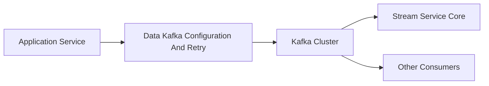
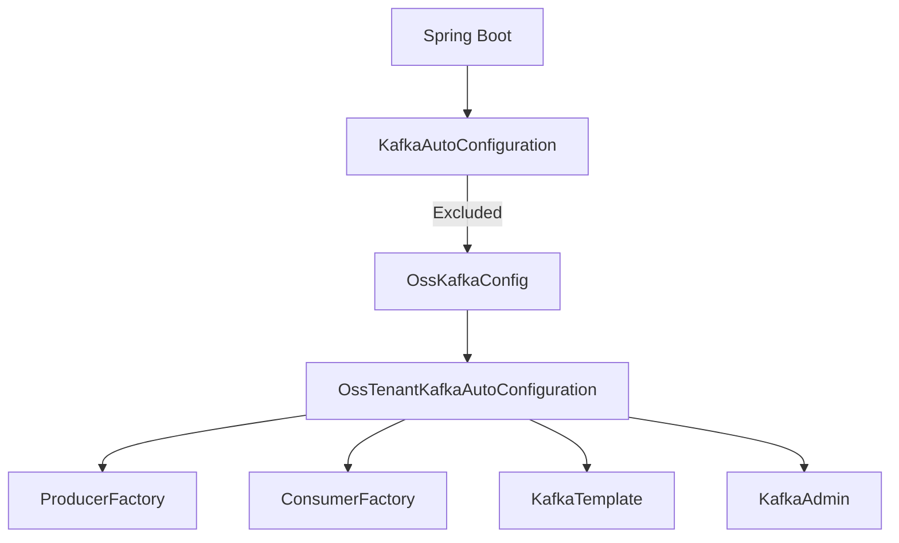
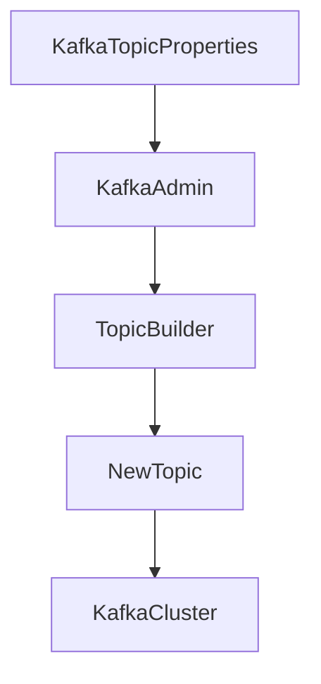
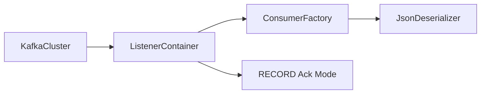
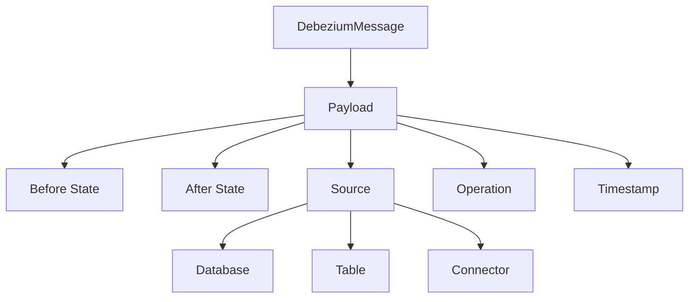
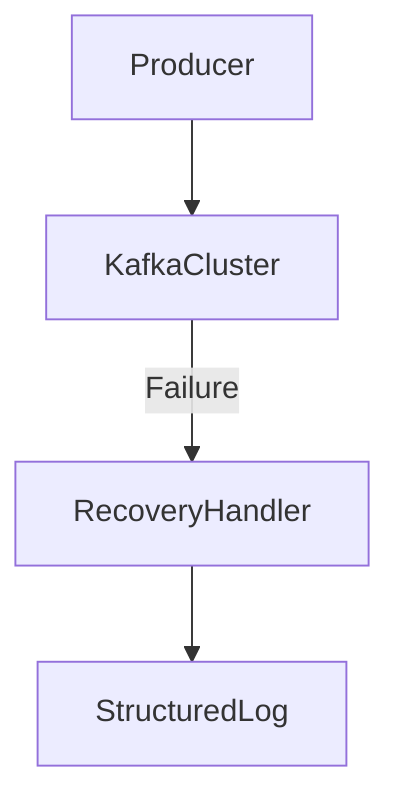

# Data Kafka Configuration And Retry

## Overview

The **Data Kafka Configuration And Retry** module provides the foundational Kafka infrastructure for the OpenFrame OSS ecosystem. It encapsulates:

- Multi-tenant Kafka configuration
- Custom Spring Boot auto-configuration for Kafka
- Topic provisioning and management
- Standardized Debezium message modeling
- Structured recovery handling for failed Kafka operations

This module is designed to be reusable across services such as Stream Service, Management Service, and other components that rely on event-driven communication.

It replaces default Spring Boot Kafka auto-configuration with a controlled, tenant-aware setup tailored for OpenFrame OSS.

---

## Architectural Role in the Platform

Within the overall system, this module acts as the **Kafka infrastructure layer** used by event-driven services.



### Responsibilities

1. Provide tenant-aware Kafka configuration
2. Standardize producer and consumer factories
3. Enable dynamic topic auto-creation
4. Provide a canonical Debezium message wrapper
5. Handle Kafka publishing failures via recovery logic

---

## Module Components

The module consists of the following core components:

| Component | Responsibility |
|------------|----------------|
| `KafkaTopicProperties` | Defines topic configuration and auto-creation behavior |
| `OssKafkaConfig` | Enables Kafka and disables default auto-configuration |
| `OssTenantKafkaAutoConfiguration` | Main bean wiring for producers, consumers, listeners, and admin |
| `OssTenantKafkaProperties` | Tenant-scoped Kafka configuration properties |
| `KafkaHeader` | Standardized Kafka header constants |
| `DebeziumMessage` | Generic wrapper for Debezium CDC events |
| `KafkaRecoveryHandlerImpl` | Structured recovery handler for failed Kafka publishes |

---

# Configuration Architecture

## Custom Kafka Bootstrapping

The module disables Spring Boot's default `KafkaAutoConfiguration` and replaces it with a controlled configuration:



### OssKafkaConfig

- Enables `@EnableKafka`
- Excludes `KafkaAutoConfiguration`
- Ensures only OSS tenant configuration is active

This prevents accidental configuration conflicts and guarantees predictable Kafka behavior.

---

## Tenant-Aware Kafka Properties

### OssTenantKafkaProperties

Bound to:

```text
spring.oss-tenant
```

This class wraps Spring's `KafkaProperties`, allowing full reuse of:

- Producer properties
- Consumer properties
- Listener configuration
- Template configuration
- Admin configuration

### Enabling Kafka

Kafka is conditionally activated using:

```text
spring.oss-tenant.enabled=true
```

If disabled, no Kafka beans are registered.

---

# Topic Management

## KafkaTopicProperties

Bound to:

```text
openframe.oss-tenant.kafka.topics
```

It supports:

- Automatic topic creation
- Partition configuration
- Replication factor configuration

### Structure

```text
openframe:
  oss-tenant:
    kafka:
      topics:
        inbound:
          device-events:
            name: device.events
            partitions: 3
            replication-factor: 2
```

### Auto-Creation Flow



If topic auto-creation is enabled:

- `KafkaAdmin` registers `NewTopic` beans
- Topics are created on startup
- Logging confirms partition and replica configuration

---

# Producer and Consumer Infrastructure

## Producer Side

### ProducerFactory

- Key serializer: `StringSerializer`
- Value serializer: `JsonSerializer`
- Backed by Spring `KafkaProperties`

### KafkaTemplate

- Default topic configurable
- JSON payload support
- Used by higher-level producers

### OssTenantKafkaProducer

Created as a bean to provide a simplified abstraction over `KafkaTemplate`.

---

## Consumer Side

### ConsumerFactory

- Key deserializer: `StringDeserializer`
- Value deserializer: `JsonDeserializer`
- Uses Spring-configured properties

### Listener Container Factory

Configurable:

- Concurrency
- AckMode (defaults to RECORD)
- Poll timeout
- Idle event interval
- Container logging



The default acknowledgment mode ensures per-record reliability if not explicitly configured.

---

# Debezium Event Modeling

## DebeziumMessage

The module defines a generic wrapper for Debezium Change Data Capture events.

### Structure



### Supported Fields

- `before` – state before change
- `after` – state after change
- `operation` – CDC operation (c, u, d)
- `ts_ms` – event timestamp
- `source` – connector metadata
  - database
  - table
  - connector type
  - schema
  - snapshot flag

This structure ensures:

- Strong typing of CDC events
- Cross-service consistency
- Cleaner event enrichment in downstream consumers

---

# Kafka Headers Standardization

## KafkaHeader

Defines common header keys used across producers and consumers.

Currently:

```text
message-type
```

This enables:

- Event routing
- Polymorphic deserialization
- Handler selection in downstream services

---

# Retry and Recovery Handling

## KafkaRecoveryHandlerImpl

This component implements structured error recovery for failed Kafka publish operations.

### Behavior

When publishing fails:

- The exception is captured
- Topic and key are logged
- Error class and message are recorded
- Payload summary is logged
- Full stacktrace is attached



### Logging Strategy

The recovery handler logs:

- `topic`
- `key`
- `errorClass`
- `errorMsg`
- `payload`

This ensures observability without introducing immediate dead-letter queue complexity.

It can later be extended to:

- Publish to retry topics
- Send to dead-letter queues
- Trigger alerting systems

---

# Integration with Other Modules

The **Data Kafka Configuration And Retry** module serves as a foundational infrastructure layer for:

- Stream processing services consuming Debezium events
- Management services publishing operational events
- Notification pipelines
- Cross-service event propagation

It does not implement business logic itself. Instead, it standardizes:

- How Kafka is configured
- How topics are created
- How messages are structured
- How failures are handled

---

# Design Principles

### 1. Tenant Isolation
Kafka configuration is explicitly scoped under:

```text
spring.oss-tenant
```

This prevents accidental mixing with default Kafka configurations.

### 2. Explicit Auto-Configuration
Default Spring Kafka auto-configuration is excluded to avoid:

- Bean conflicts
- Hidden configuration overrides
- Environment-specific ambiguity

### 3. Strong CDC Modeling
Debezium events are modeled as typed structures instead of raw maps.

### 4. Safe Defaults
- Ack mode defaults to RECORD
- Admin auto-creation enabled unless disabled
- Kafka enabled by default but explicitly configurable

### 5. Observability First
Failure handling prioritizes structured logging for operational visibility.

---

# Summary

The **Data Kafka Configuration And Retry** module provides a controlled, tenant-aware Kafka foundation for the OpenFrame OSS platform.

It ensures:

- Deterministic Kafka bootstrapping
- Configurable topic lifecycle management
- Structured Debezium message handling
- Safe producer/consumer defaults
- Clear recovery and error logging

By centralizing Kafka configuration and retry behavior, the module guarantees consistency across all services that rely on event-driven communication.