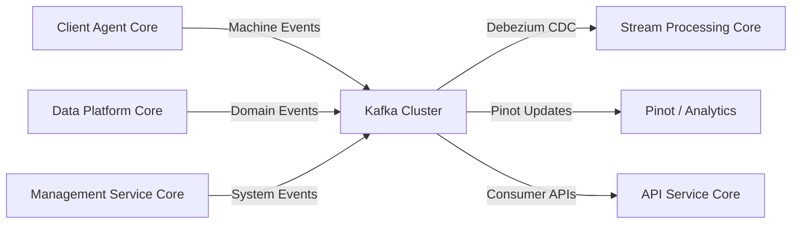
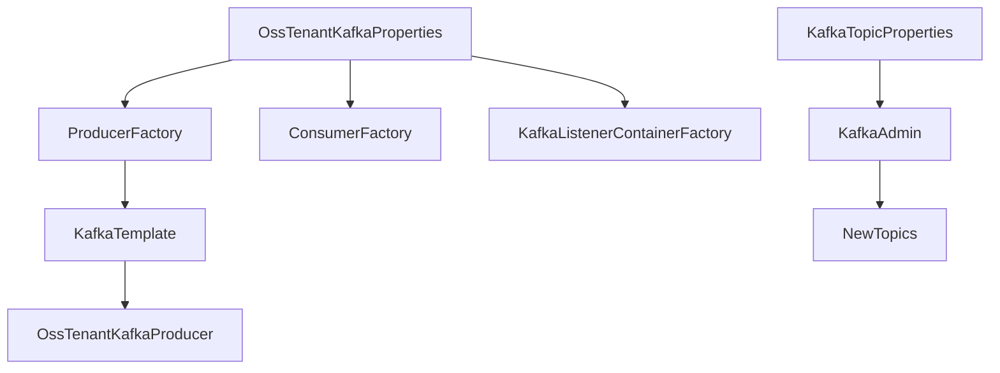
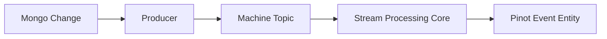
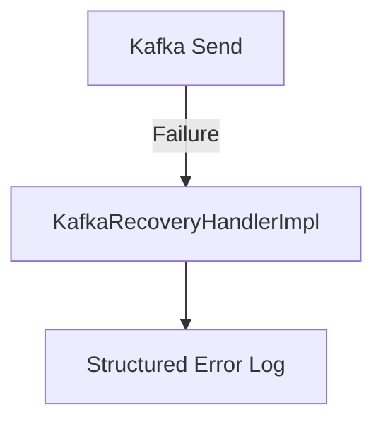
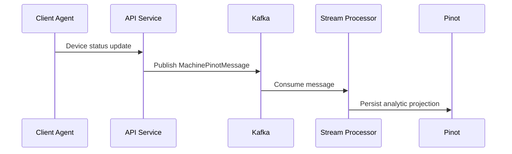

# Data Kafka Core

## Overview

**Data Kafka Core** provides the foundational Kafka infrastructure for the OpenFrame OSS platform. It centralizes multi-tenant Kafka configuration, topic management, message models, and recovery handling. 

This module acts as the backbone for event-driven communication between:

- Stream Processing Core
- Management Service Core
- Data Platform Core
- Client Agent Core
- External integrations via Debezium and Kafka Streams

It abstracts raw Spring Kafka configuration into a tenant-aware, production-ready setup with:

- Custom auto-configuration
- Multi-tenant Kafka properties
- Topic auto-registration
- Standardized message models
- Producer recovery handling

---

## Architectural Role in the Platform

Data Kafka Core sits between data producers (services emitting events) and stream consumers (analytics, projections, enrichment services).



**Key Responsibilities:**

1. Provide Spring Boot auto-configuration for OSS tenant Kafka cluster
2. Standardize producer/consumer factories
3. Support topic auto-creation
4. Define canonical Kafka message models
5. Provide structured error recovery hooks

---

# Core Components

## 1. Kafka Configuration Layer

This layer replaces Spring's default Kafka auto-configuration with a tenant-aware configuration.

### OssKafkaConfig

- Enables Kafka support via `@EnableKafka`
- Explicitly excludes Spring Boot's default `KafkaAutoConfiguration`
- Ensures custom OpenFrame Kafka configuration is always used

Purpose: Prevents configuration conflicts and enforces OSS-specific setup.

---

### OssTenantKafkaProperties

Configuration prefix:

```text
spring.oss-tenant
```

This class:

- Wraps Spring's `KafkaProperties`
- Enables/disables Kafka via `spring.oss-tenant.enabled`
- Centralizes producer, consumer, listener, and template configuration

Example structure:

```yaml
spring:
  oss-tenant:
    enabled: true
    kafka:
      bootstrap-servers: localhost:9092
      producer:
        acks: all
      consumer:
        group-id: openframe-group
```

---

### KafkaTopicProperties

Configuration prefix:

```text
openframe.oss-tenant.kafka.topics
```

Allows dynamic topic configuration and optional auto-creation.

Key features:

- `autoCreate` flag
- Map of inbound topics
- Per-topic partition and replication configuration

Example:

```yaml
openframe:
  oss-tenant:
    kafka:
      topics:
        auto-create: true
        inbound:
          machine-events:
            name: machine.events
            partitions: 3
            replication-factor: 2
```

---

## 2. Auto-Configuration Engine

### OssTenantKafkaAutoConfiguration

This is the heart of the module.

Activated when:

```text
spring.oss-tenant.kafka.enabled=true
```

It registers:

- ProducerFactory
- KafkaTemplate
- ConsumerFactory
- KafkaListenerContainerFactory
- KafkaAdmin
- Topic auto-registration
- OssTenantKafkaProducer

### Bean Graph



### Listener Configuration

Supports:

- Concurrency
- Ack mode (defaults to RECORD)
- Poll timeout
- Idle event interval
- Container logging

This ensures predictable consumer behavior across services.

---

## 3. Message Model Layer

This module defines shared Kafka message structures.

---

### MachinePinotMessage

Represents device state changes propagated to analytics systems.

Fields:

- machineId
- organizationId
- deviceType
- status
- osType
- tags

Used when:

- Machine documents change
- Tags are updated
- Device metadata changes

Data flow:



---

### DebeziumMessage

Generic wrapper for Debezium Change Data Capture events.

Structure:

```text
DebeziumMessage
 └── payload
     ├── before
     ├── after
     ├── source
     ├── operation
     └── timestamp
```

Supports:

- before/after state transitions
- CDC metadata
- Operation types (create, update, delete)

This model integrates tightly with:

- Stream Processing Core Debezium handlers
- Management Service Core CDC health checks

---

## 4. Kafka Header Standardization

### KafkaHeader

Defines shared header constants.

Currently:

```text
MESSAGE_TYPE_HEADER = "message-type"
```

Purpose:

- Allow consumers to branch logic by message type
- Support polymorphic message handling
- Reduce reliance on topic-level routing

---

## 5. Producer Recovery Strategy

### KafkaRecoveryHandlerImpl

Implements `KafkaRecoveryHandler`.

When a producer send fails:

- Captures topic
- Captures key
- Logs structured error
- Logs exception class
- Logs message
- Logs payload snapshot



This ensures:

- Observability
- Easier debugging
- No silent message loss

Future extensions may include:

- Dead-letter topic publishing
- Retry scheduling
- External alerting

---

# Runtime Behavior

## Topic Auto-Creation

When enabled:

- KafkaAdmin registers configured topics
- Partitions and replication are applied
- Logs confirm registration

Condition:

```text
spring.oss-tenant.kafka.admin.enabled=true
```

---

## Multi-Tenant Strategy

Although named OSS Tenant, this configuration pattern supports:

- Logical tenant separation
- Dedicated Kafka clusters per environment
- Isolated consumer groups

Configuration-driven isolation allows horizontal scalability.

---

# Integration with Other Modules

Data Kafka Core integrates with:

- Stream Processing Core for Kafka Streams and message handlers
- Data Platform Core for domain event publishing
- Management Service Core for Debezium connectors
- Client Agent Core for heartbeat and connection events

This module does not implement business logic. It provides infrastructure primitives that other modules consume.

---

# End-to-End Event Flow Example



---

# Design Principles

1. Infrastructure over business logic
2. Spring-native configuration
3. Strong typing for Kafka payloads
4. Explicit tenant scoping
5. Observability-first recovery handling

---

# Summary

Data Kafka Core provides the standardized Kafka infrastructure layer for OpenFrame OSS.

It enables:

- Safe and consistent Kafka configuration
- Tenant-aware cluster setup
- Structured CDC integration
- Topic lifecycle management
- Reliable producer error handling

It is the event backbone of the OpenFrame distributed architecture.
