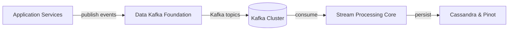
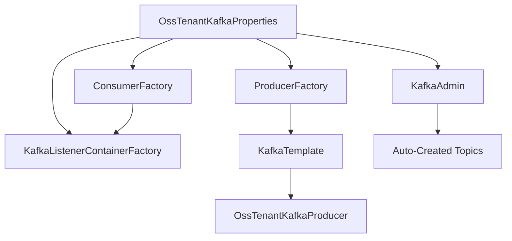
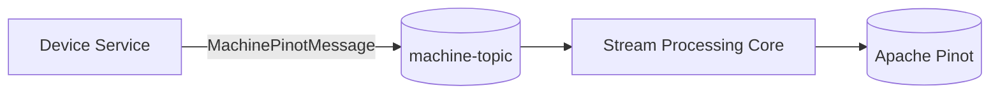
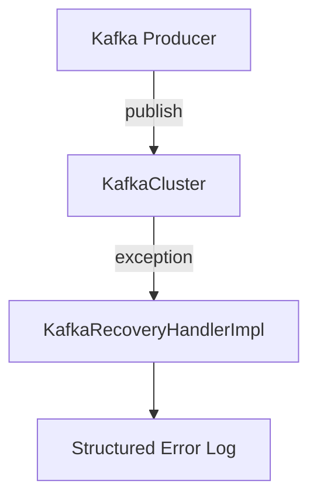
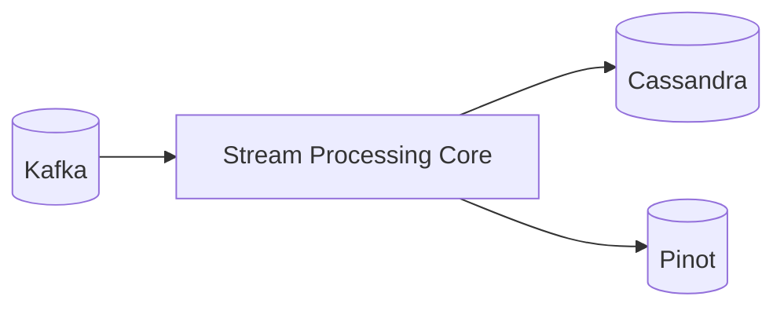

# Data Kafka Foundation

## Overview

The **Data Kafka Foundation** module provides the core Kafka infrastructure layer for the OpenFrame platform. It standardizes how services publish and consume Kafka messages, manages tenant-aware Kafka configuration, and defines shared message models used across streaming, data processing, and analytics pipelines.

This module is intentionally infrastructure-focused. It does not implement business logic. Instead, it:

- Configures Kafka producers, consumers, and admin clients
- Supports multi-tenant Kafka clusters
- Defines common Kafka message models (e.g., Debezium and machine events)
- Provides recovery hooks for failed message publishing
- Enables controlled topic auto-creation

It acts as the foundation for higher-level modules such as Stream Processing Core and Data Platform Cassandra and Pinot.

---

## Architectural Role in the Platform

The Data Kafka Foundation module sits between application services and stream processing components.



### Responsibilities

- **Application Services** use the provided `KafkaTemplate` and producer abstractions.
- **Data Kafka Foundation** configures producers, consumers, topic definitions, and shared message models.
- **Stream Processing Core** consumes messages and applies enrichment or transformation.
- **Data Platform Cassandra and Pinot** stores operational and analytical data.

Related modules:

- [Stream Processing Core](../stream-processing-core/stream-processing-core.md)
- [Data Platform Cassandra and Pinot](../data-platform-cassandra-and-pinot/data-platform-cassandra-and-pinot.md)

---

## Core Configuration Components

### 1. OssKafkaConfig

**Component:** `OssKafkaConfig`

- Enables Kafka support via `@EnableKafka`
- Explicitly excludes Spring Boot's default `KafkaAutoConfiguration`
- Ensures the platform uses its own tenant-aware configuration

This prevents conflicts and guarantees consistent behavior across services.

---

### 2. OssTenantKafkaProperties

**Component:** `OssTenantKafkaProperties`

Configuration prefix:

```text
spring.oss-tenant
```

Key responsibilities:

- Enables/disables OSS tenant Kafka integration
- Wraps Spring `KafkaProperties`
- Allows full control of:
  - Bootstrap servers
  - Producer settings
  - Consumer settings
  - Listener configuration
  - Template configuration

This abstraction allows all services to share a consistent Kafka configuration model.

---

### 3. OssTenantKafkaAutoConfiguration

**Component:** `OssTenantKafkaAutoConfiguration`

Conditional activation:

```text
spring.oss-tenant.kafka.enabled=true
```

This class wires all Kafka infrastructure beans:

- `ProducerFactory`
- `KafkaTemplate`
- `ConsumerFactory`
- `ConcurrentKafkaListenerContainerFactory`
- `KafkaAdmin`
- Topic auto-registration
- `OssTenantKafkaProducer`

### Bean Architecture



### Listener Behavior

The listener container factory applies:

- Configurable concurrency
- Configurable `AckMode` (defaults to `RECORD`)
- Poll timeout
- Idle event interval

This ensures reliable, fine-grained consumption behavior.

---

## Topic Management

### KafkaTopicProperties

**Component:** `KafkaTopicProperties`

Configuration prefix:

```text
openframe.oss-tenant.kafka.topics
```

Structure:

```text
openframe:
  oss-tenant:
    kafka:
      topics:
        autoCreate: true
        inbound:
          machine-events:
            name: machine-events
            partitions: 3
            replicationFactor: 2
```

### Features

- Supports inbound topic definitions
- Configurable partitions
- Configurable replication factor
- Optional automatic topic creation via `KafkaAdmin`

When enabled, topics are registered during application startup.

---

## Message Models

The module defines shared message contracts used across producers and consumers.

### 1. MachinePinotMessage

**Component:** `MachinePinotMessage`

Represents a machine/device state change event.

Fields:

- `machineId`
- `organizationId`
- `deviceType`
- `status`
- `osType`
- `tags`

Used when:

- Device data changes
- Tags are updated
- Machine state transitions occur

Flow example:



---

### 2. DebeziumMessage

**Component:** `DebeziumMessage<T>`

A generic wrapper for CDC (Change Data Capture) events emitted by Debezium.

Structure:

```text
DebeziumMessage
  payload
    before
    after
    source
    operation
    timestamp
```

Supports:

- `before` state
- `after` state
- Operation type (`c`, `u`, `d`)
- Source metadata
- Timestamp tracking

This model is consumed by the Stream Processing Core module to transform database change events into domain-level events.

---

## Kafka Headers

### KafkaHeader

Defines standardized Kafka header keys.

Example:

```text
message-type
```

This allows consumers to:

- Route by message type
- Apply different deserialization logic
- Implement polymorphic message handling

---

## Error Handling and Recovery

### KafkaRecoveryHandlerImpl

**Component:** `KafkaRecoveryHandlerImpl`

Purpose:

- Handles failed Kafka publish attempts
- Logs structured error information
- Captures topic, key, error class, and payload

Current behavior:

- Logs structured error details
- Attaches stacktrace

Future extension points may include:

- Dead-letter topic publishing
- Retry scheduling
- Alert integration

Error Flow:



---

## Multi-Tenant Design

The Data Kafka Foundation module is designed for tenant-aware deployments.

Key mechanisms:

- Dedicated property namespace: `spring.oss-tenant`
- Tenant-specific bootstrap configuration
- Controlled topic registration
- Isolation at configuration level

This design allows:

- Separate Kafka clusters per environment
- Shared cluster with tenant-prefixed topics
- Flexible scaling strategies

---

## Integration with Stream Processing Core

The Stream Processing Core module:

- Consumes `DebeziumMessage` events
- Deserializes tool-specific events
- Enriches activity messages
- Persists to Cassandra and Pinot

The Data Kafka Foundation module ensures all upstream services produce events in a standardized, reliable format.

See:

- [Stream Processing Core](../stream-processing-core/stream-processing-core.md)

---

## Integration with Data Platform Cassandra and Pinot

Machine and event messages eventually flow into analytics and operational storage layers.



The Data Kafka Foundation module ensures consistent topic and message configuration for this pipeline.

See:

- [Data Platform Cassandra and Pinot](../data-platform-cassandra-and-pinot/data-platform-cassandra-and-pinot.md)

---

## Summary

The **Data Kafka Foundation** module provides:

- Tenant-aware Kafka configuration
- Centralized producer and consumer setup
- Topic lifecycle management
- Standardized message contracts
- Structured failure handling

It forms the backbone of OpenFrame's event-driven architecture, enabling reliable, scalable, and extensible data streaming across services.