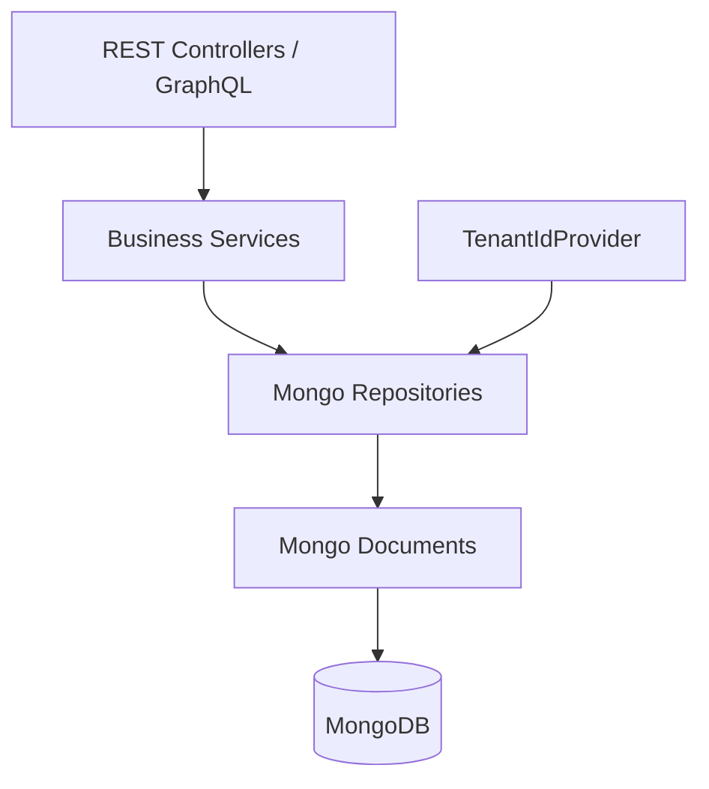
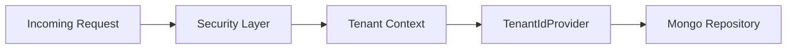
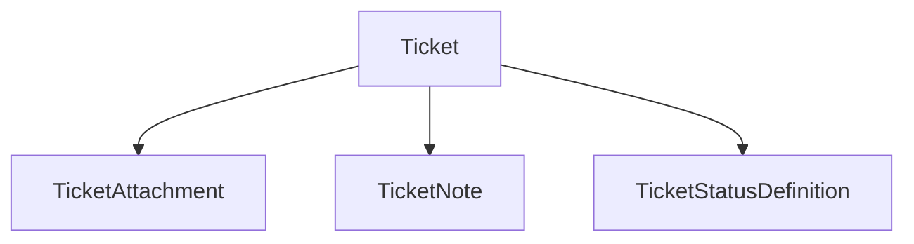
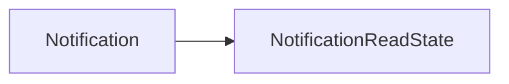
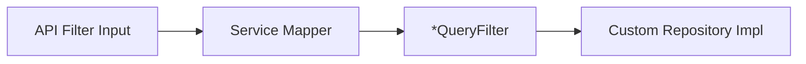

# Data Model And Repositories Mongo

## Overview

The **Data Model And Repositories Mongo** module defines the canonical MongoDB domain model for OpenFrame OSS and provides base repository abstractions and tenant-aware infrastructure primitives.

This module is the foundation for:

- Multi-tenant persistence
- Domain entities (Users, Organizations, Devices, Tickets, Events, Notifications, OAuth, Tools)
- Query filter objects used by services and GraphQL
- Base repository contracts (technology-agnostic)
- Tenant resolution via `TenantIdProvider`

It is consumed by higher-level modules such as API services, Authorization Server, Management services, Stream Processing, and Gateway layers.

---

## Architectural Position



### Responsibilities

| Layer | Responsibility |
|--------|----------------|
| Documents | Define Mongo collections and embedded models |
| Query Filters | Encapsulate search criteria without API-layer dependency |
| Base Repositories | Define cross-cutting repository contracts |
| Tenant Provider | Provide current tenant context |

---

# Multi-Tenancy Model

Multi-tenancy is enforced at the document and repository level.

### TenantScoped Pattern

Most aggregate root documents implement `TenantScoped` and include:

- `tenantId` field
- Index on `tenantId`

Example collections:

- `users`
- `organizations`
- `devices`
- `tickets`
- `events`
- `notifications`
- `oauth_tokens`

### Tenant Resolution



The default implementation is:

- `DefaultTenantIdProvider`

It reads the `TENANT_ID` environment variable (default: `oss`).

---

# Core Domain Aggregates

## 1. User & Authentication

### User

Collection: `users`

Key fields:

- `email` (indexed)
- `roles`
- `emailVerified`
- `status`
- `tenantId`

Email is normalized to lowercase.

### AuthUser

Extends `User` and is used by the Authorization Server.

Additional fields:

- `passwordHash`
- `loginProvider` (LOCAL, GOOGLE, etc.)
- `externalUserId`
- `lastLogin`
- `imageUrl`

Unique compound index:

```text
{'tenantId': 1, 'email': 1}
```

This guarantees per-tenant email uniqueness.

---

## 2. Organization

Collection: `organizations`

Key capabilities:

- Soft delete via `status` (ACTIVE, ARCHIVED, DELETED)
- Immutable `organizationId`
- Contract lifecycle validation (`isContractActive()`)
- Contact information embedding

Indexed fields:

- `tenantId`
- `name`
- `organizationId` (unique)
- `isDefault`
- `status`

### OrganizationQueryFilter

Encapsulates:

- Category
- Employee ranges
- Active contract flag
- Status

Used by repository implementations to build dynamic queries.

---

## 3. Device Domain

Collection: `devices`

Fields include:

- `machineId`
- `serialNumber`
- `osVersion`
- `status`
- `lastCheckin`
- Embedded:
  - `DeviceConfiguration`
  - `DeviceHealth`

### Embedded Substructures

- `Alert`
- `SecurityAlert`
- `ComplianceRequirement`

These are embedded and not stored as separate collections.

---

## 4. Ticketing System

### Ticket

Collection: `tickets`

Compound indexes include:

```text
'tenant_ticketNumber_idx'
'status_order'
'status_kind'
'status_id_order'
```

Key characteristics:

- Tenant-scoped numbering
- Owner polymorphism:
  - `AdminTicketOwner`
  - `ClientTicketOwner`
- Status evolution support:
  - Legacy `TicketStatus`
  - New lifecycle via `statusId` + `statusKind`

### Related Collections

- `ticket_attachments`
- `ticket_notes`
- `ticket_statuses`



### TicketQueryFilter

Supports:

- Status filters (legacy + lifecycle)
- Assignee filters
- Organization filters
- Device filters
- Creation source
- Date ranges

---

## 5. Events

### CoreEvent

Collection: `events`

Represents internal system events.

Fields:

- `type`
- `payload`
- `status` (CREATED, PROCESSING, COMPLETED, FAILED)
- `timestamp`

### ExternalApplicationEvent

Collection: `external_application_events`

Adds metadata:

- `source`
- `version`
- `tags`

### EventQueryFilter

Supports filtering by:

- User IDs
- Event types
- Date range

---

## 6. Notifications

### Notification

Collection: `notifications`

Fields:

- `severity`
- `title`
- `description`
- `context`

### NotificationReadState

Collection: `notification_read_states`

Compound indexes enforce:

- Unique recipient + notification
- Efficient unread queries



---

## 7. OAuth & Authorization

### MongoRegisteredClient

Collection: `oauth_registered_clients`

Compound unique index:

```text
{'tenantId':1,'clientId':1}
```

Stores:

- Grant types
- Redirect URIs
- Token TTL configuration
- PKCE requirements

### OAuthToken

Collection: `oauth_tokens`

Fields:

- `accessToken`
- `refreshToken`
- Expiry timestamps
- `clientId`

---

## 8. Tagging System

### TagAssignment

Collection: `tag_assignments`

Compound unique index:

```text
{'tenantId': 1, 'entityId': 1, 'tagId': 1, 'entityType': 1}
```

Supports:

- Multi-value tags
- Multiple entity types

### TagValidation

Provides:

- Regex enforcement
- Max length (64)
- Key/value validation helpers

---

## 9. Tool & Agent Configuration

### IntegratedToolAgentConfiguration

Defines:

- Version metadata
- Download configurations
- Assets
- Installation command arguments

### ToolAgentAsset

Includes:

- Version
- Download configurations
- Local filename mapping
- Executable flag

### ScriptEnvVar

Embedded within Script documents.

Supports future secret encryption strategy (currently plaintext).

---

# Query Filter Pattern

Query filter classes:

- `UserQueryFilter`
- `OrganizationQueryFilter`
- `EventQueryFilter`
- `TicketQueryFilter`
- `ScriptQueryFilter`
- `ToolQueryFilter`

### Design Principle

These filters:

- Mirror API input models
- Avoid dependency on API layer
- Keep repository layer modular



---

# Base Repository Abstractions

The module defines technology-agnostic repository contracts.

## BaseUserRepository

Defines:

- `findByEmail`
- `existsByEmail`
- `existsByEmailAndStatus`

## BaseTenantRepository

Defines:

- `findByDomain`
- `existsByDomain`

## BaseIntegratedToolRepository

Defines:

- `findByType`
- `findByKey`

## BaseApiKeyRepository

Defines:

- `findByIdAndUserId`
- `findByUserId`
- `findExpiredKeys`

### Design Characteristics

- Generic return wrappers (`Optional`, `Mono`, `Flux`)
- Enables both blocking and reactive implementations
- Prevents service layer coupling to Mongo implementation details

---

# Indexing Strategy

Common patterns used across documents:

1. `@Indexed` for high-frequency lookups
2. `@CompoundIndex` for:
   - Tenant + natural key uniqueness
   - Lifecycle sorting
   - Recipient uniqueness
3. Partial indexes for constrained uniqueness (e.g., TicketStatusDefinition)

This ensures:

- Tenant isolation
- Efficient filtering
- Strong consistency for natural keys

---

# Design Principles

1. Tenant-first modeling
2. Soft deletion instead of hard deletes
3. Embedded documents for high-cohesion substructures
4. Strict index discipline for performance
5. Separation of API DTOs and persistence filters
6. Technology-agnostic repository contracts

---

# Summary

The **Data Model And Repositories Mongo** module:

- Defines the canonical MongoDB schema for OpenFrame OSS
- Enforces multi-tenant boundaries
- Provides reusable repository contracts
- Supports ticketing, devices, events, notifications, OAuth, tagging, and tool configuration
- Acts as the persistence foundation for all higher-level services

It is the backbone of the platform’s state management and tenant isolation strategy.