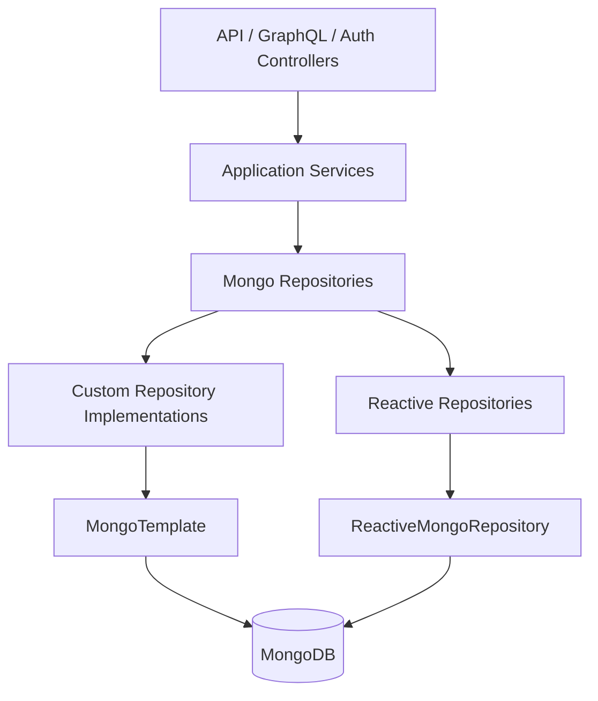
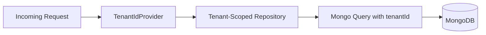
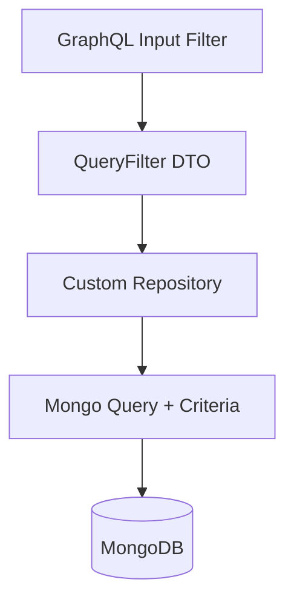
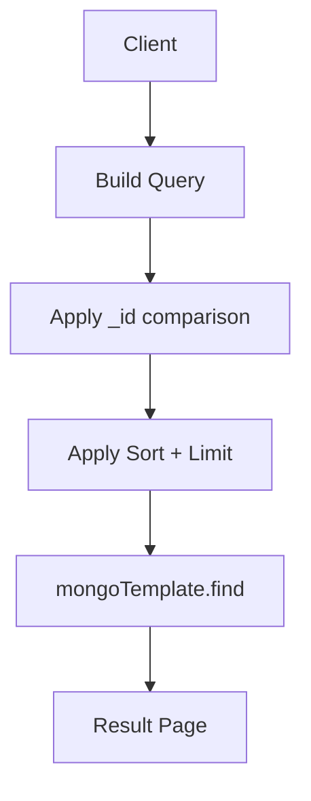
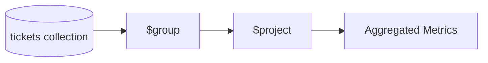

# Data Models And Repositories Mongo

## Overview

The **Data Models And Repositories Mongo** module provides the MongoDB-backed persistence layer for the OpenFrame platform. It defines:

- Core MongoDB document models (users, tickets, devices, organizations, events, notifications, etc.)
- Query filter objects for advanced searching
- Base repository abstractions (technology-agnostic)
- Reactive and synchronous repository implementations
- Custom MongoTemplate-based query logic with cursor pagination
- Multi-tenant support via tenant-aware scoping

This module is the foundation for higher-level modules such as:

- API Service Core HTTP And GraphQL  
- Authorization Service Core  
- Management Service Core  
- Gateway Service Core (indirectly via upstream services)

It centralizes all MongoDB persistence logic to keep business services storage-agnostic.

---

## High-Level Architecture



### Responsibilities by Layer

- **Document Models** → Define MongoDB collections and indexes  
- **Query Filters** → Encapsulate search and filtering logic  
- **Base Repositories** → Provide technology-agnostic contracts  
- **Reactive Repositories** → Used by reactive services (e.g., auth flows)  
- **Custom Repositories** → Advanced queries, aggregation, cursor pagination  
- **Tenant Provider** → Injects tenant context into queries

---

## Multi-Tenancy Model

Most domain documents implement `TenantScoped`, containing a `tenantId` field indexed for isolation.



### Tenant ID Resolution

`DefaultTenantIdProvider`:

- Reads tenant ID from `TENANT_ID` environment variable
- Defaults to `oss`
- Can be overridden by custom `TenantIdProvider` bean

This enables:

- SaaS multi-tenant isolation  
- OSS single-tenant mode  
- Authorization server tenant-aware domain resolution

---

# Core Document Models

## User and AuthUser

### User
Collection: `users`

Fields:
- `email` (indexed, normalized to lowercase)
- `roles`
- `status`
- `emailVerified`
- `createdAt`, `updatedAt`
- `tenantId`

### AuthUser
Extends `User`.
Collection: `users` (same inheritance hierarchy).

Additional fields:
- `passwordHash`
- `loginProvider` (LOCAL, GOOGLE, etc.)
- `externalUserId`
- `lastLogin`
- `imageUrl` (SSO profile cache)

Compound index:

```text
{ tenantId: 1, email: 1 } (unique)
```

Used heavily by:
- Authorization Service Core
- API Service Core

---

## Organization

Collection: `organizations`

Key features:
- Unique `organizationId`
- Soft deletion (`status` = ACTIVE, ARCHIVED, DELETED)
- Contract lifecycle tracking
- Indexed search fields

Business helpers:
- `isContractActive()`
- `isArchived()`
- `isDeleted()`

Custom queries handled by `CustomOrganizationRepositoryImpl`.

---

## Device

Collection: `devices`

Fields include:
- `machineId`
- `serialNumber`
- `status`
- `type`
- `lastCheckin`

Indexed on `tenantId`.

Used by:
- Device controllers
- Fleet integrations
- Management schedulers

---

## Ticket

Collection: `tickets`

Compound indexes:

```text
{ tenantId:1, ticketNumber:1 } (unique)
{ status:1, order:1 }
{ statusKind:1 }
{ statusId:1, order:1 }
```

Supports:
- Legacy `status`
- Lifecycle-based `statusId` and `statusKind`
- Cursor pagination
- Aggregation metrics
- Bulk updates

`CustomTicketRepositoryImpl` provides:

- Cursor-based pagination  
- Aggregation counts by status  
- Average resolution time  
- Bulk status reassignment  
- Search across title, device, org, assignee

---

## CoreEvent

Collection: `events`

Fields:
- `type`
- `payload`
- `timestamp`
- `userId`
- `status`

Used by:
- Stream Processing Kafka module
- Activity dashboards
- Audit queries

`CustomEventRepositoryImpl` supports:
- Date range filtering
- Cursor pagination
- Distinct event types
- Distinct user IDs

---

## Notification

Collection: `notifications`

Supports:
- Severity levels
- Context embedding
- Created date auto-population

`CustomNotificationRepositoryImpl` provides:
- Recipient-based pagination
- Read/unread filtering
- Cursor-based navigation
- Status joining with read state

---

# Query Filter Objects

Filter objects encapsulate dynamic search logic.

Examples:

- `EventQueryFilter`
- `OrganizationQueryFilter`
- `TicketQueryFilter`
- `ToolQueryFilter`
- `UserQueryFilter`

These objects:
- Avoid controller-level query construction  
- Enable reusable MongoTemplate queries  
- Support complex combinations of AND / OR criteria

Example flow:



---

# Repository Architecture

## Base Repository Contracts

Technology-agnostic interfaces:

- `BaseUserRepository`
- `BaseTenantRepository`
- `BaseApiKeyRepository`
- `BaseIntegratedToolRepository`

These abstract return types:

- Blocking (`Optional`, `boolean`, `List`)
- Reactive (`Mono`, `Flux`)

This enables both reactive and synchronous implementations.

---

## Reactive Repositories

Located under `openframe-data-mongo-reactive`.

Examples:
- `ReactiveUserRepository`
- `ReactiveTenantRepository`
- `ReactiveOAuthClientRepository`

Used primarily by:
- Authorization Service Core
- Reactive authentication flows

Built on `ReactiveMongoRepository`.

---

## Synchronous Configuration

Two configurations control repository activation:

- `MongoSyncConfig`
- `TenantAwareSyncConfig`

Activation is controlled via properties:

```text
spring.data.mongodb.enabled
openframe.tenant-isolation.enabled
```

This allows:
- Tenant-aware repositories
- Shared cluster mode
- Flexible deployment strategies

---

# Custom Repository Implementations

Custom implementations use `MongoTemplate` for advanced querying.

Common capabilities:

- Cursor-based pagination using `_id`
- Multi-field sorting
- Compound search with `$or` and `$and`
- Aggregation pipelines
- Distinct field retrieval
- Bulk updates

## Cursor Pagination Pattern



Behavior:
- If sort field is `_id`, compare directly
- Otherwise:
  - Compare primary sort field
  - Tie-break using `_id`
- Invalid cursor logs warning and returns first page

Implemented in:
- CustomMachineRepositoryImpl  
- CustomTicketRepositoryImpl  
- CustomEventRepositoryImpl  
- CustomOrganizationRepositoryImpl  
- CustomScriptRepositoryImpl  
- CustomNotificationRepositoryImpl  
- CustomIntegratedToolRepositoryImpl  
- CustomUserRepositoryImpl

---

# Aggregation and Metrics

Ticket repository provides aggregation-based metrics:

- Count by `status`
- Count by `statusKind`
- Count by `statusId`
- Average resolution time

Uses MongoDB Aggregation Framework.



---

# Integration with Other Modules

## API Service Core HTTP And GraphQL

Uses:
- Document models
- Query filters
- Custom repositories
- Pagination utilities

GraphQL resolvers delegate persistence to this module.

## Authorization Service Core

Uses:
- AuthUser document
- ReactiveUserRepository
- ReactiveTenantRepository
- MongoAuthorizationService

Enables domain-based tenancy and OAuth client storage.

## Management Service Core

Uses:
- Device
- Ticket
- IntegratedTool
- Script repositories

For schedulers, migrations, and background processing.

## Stream Processing Kafka

Consumes events and writes:
- CoreEvent documents
- Enriched activity records

---

# Design Principles

1. Clear separation between domain model and service logic  
2. Technology-agnostic repository contracts  
3. Multi-tenant safety by default  
4. Cursor-based pagination for scalability  
5. Aggregation-driven metrics  
6. Index-first design  
7. Reactive + synchronous support

---

# Summary

The **Data Models And Repositories Mongo** module is the persistence backbone of OpenFrame.

It provides:

- Strongly typed MongoDB documents  
- Multi-tenant data isolation  
- Reactive and blocking repository layers  
- Advanced filtering and pagination  
- Aggregation-based analytics  
- Custom query implementations for complex domains

All higher-level services rely on this module for consistent, scalable, and tenant-safe data access.