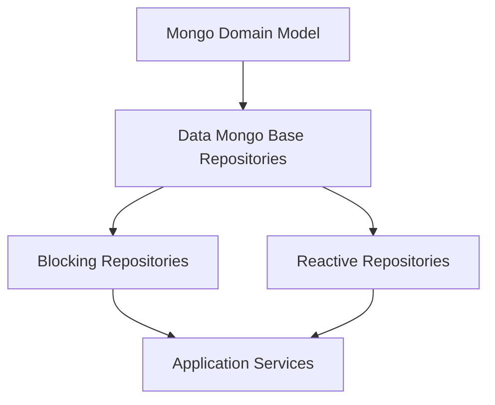
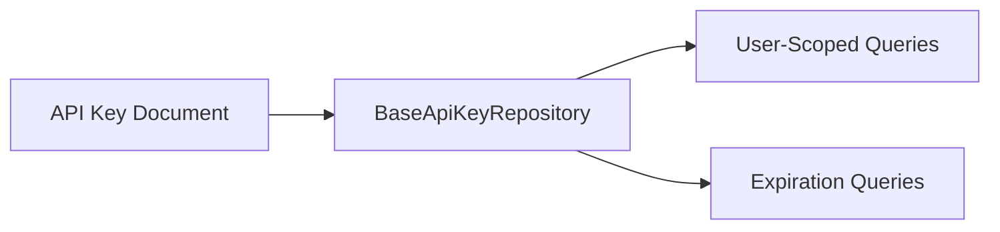
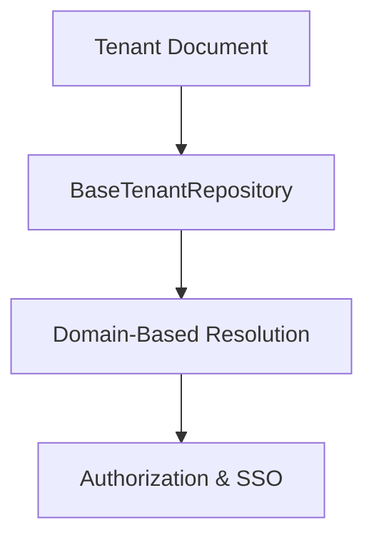
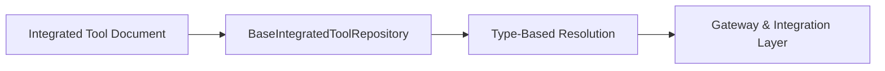
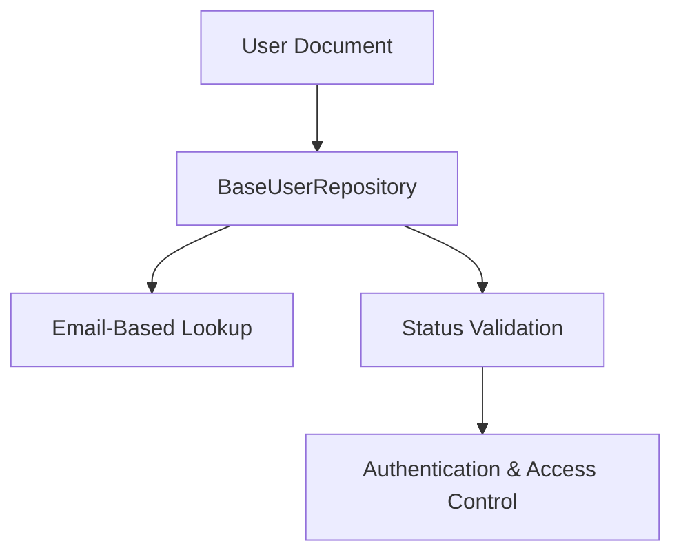
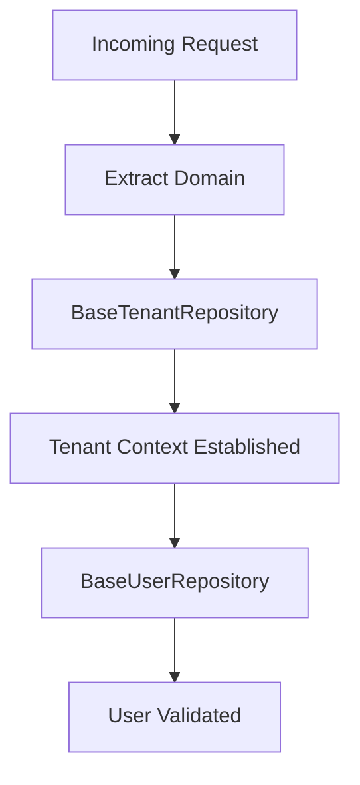
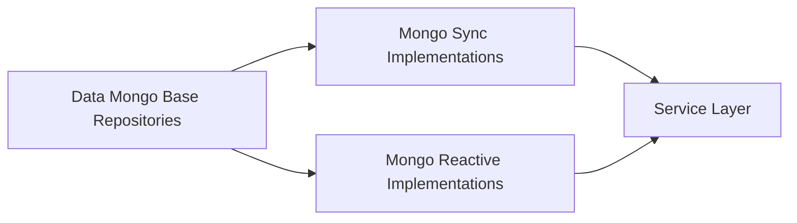

# Data Mongo Base Repositories

## Overview

The **Data Mongo Base Repositories** module defines technology-agnostic repository contracts for core MongoDB-backed domain entities in the OpenFrame platform. These base interfaces act as a unifying abstraction layer between:

- The **domain model** (Mongo documents such as User, Tenant, API Key, Integrated Tool)
- The **blocking (imperative)** repository implementations
- The **reactive (Project Reactor)** repository implementations

By introducing generic wrapper types (`T`, `B`, `L`, `ID`), this module ensures that the same repository contract can be reused across both blocking and reactive stacks without duplicating business semantics.

---

## Architectural Role in the Data Layer

Within the broader persistence architecture, this module sits between the domain documents and concrete repository implementations.



### Responsibilities

- Define **common repository operations** for core entities
- Provide **generic signatures** adaptable to Optional / List or Mono / Flux
- Ensure **consistent query semantics** across execution models
- Reduce duplication between blocking and reactive repository layers

---

## Design Philosophy

Each base repository follows a consistent pattern:

```text
public interface BaseXRepository<T, B, L?, ID> {
    T findBy...(...);
    B existsBy...(...);
    L findAllBy...(...);
}
```

Where:

- `T` → Wrapper for single-result queries
  - Blocking: `Optional<Entity>`
  - Reactive: `Mono<Entity>`
- `B` → Wrapper for boolean responses
  - Blocking: `boolean`
  - Reactive: `Mono<Boolean>`
- `L` → Wrapper for multi-result queries (if applicable)
  - Blocking: `List<Entity>`
  - Reactive: `Flux<Entity>`
- `ID` → Identifier type (typically `String`)

This allows downstream modules to:

- Implement blocking repositories using Spring Data Mongo
- Implement reactive repositories using Spring Data Reactive Mongo
- Preserve identical method semantics across implementations

---

# Core Interfaces

## 1. BaseApiKeyRepository

**Purpose:** Defines common API key query operations.

### Key Methods

- `findByIdAndUserId(String keyId, String userId)`
- `findByUserId(String userId)`
- `findExpiredKeys(Instant currentTime)`

### Architectural Context



### Design Considerations

- API keys are **user-scoped**.
- Expiration handling is centralized via `findExpiredKeys`.
- Enables scheduled cleanup and security enforcement logic.

This repository is critical for authentication flows and API access management.

---

## 2. BaseTenantRepository

**Purpose:** Defines tenant lookup and domain validation operations.

### Key Methods

- `findByDomain(String domain)`
- `existsByDomain(String domain)`

### Architectural Context



### Design Considerations

- Domain-based lookup enables **multi-tenant resolution**.
- Used heavily in authentication and tenant-aware request routing.
- `existsByDomain` supports validation during registration and onboarding flows.

---

## 3. BaseIntegratedToolRepository

**Purpose:** Provides lookup functionality for integrated tools.

### Key Methods

- `findByType(String type)`

### Architectural Context



### Design Considerations

- Tool resolution is based on logical tool type.
- Enables integration routing and upstream configuration.
- Keeps tool lookup semantics consistent across sync and reactive stacks.

---

## 4. BaseUserRepository

**Purpose:** Defines foundational user lookup and existence checks.

### Key Methods

- `findByEmail(String email)`
- `existsByEmail(String email)`
- `existsByEmailAndStatus(String email, UserStatus status)`

### Architectural Context



### Design Considerations

- Email is the primary identity attribute.
- Status validation supports enforcement of states such as ACTIVE or DISABLED.
- Provides a consistent existence-check abstraction across blocking and reactive implementations.

---

# Cross-Cutting Patterns

## 1. Technology Agnostic Contracts

All repositories avoid direct dependencies on:

- Spring Data interfaces
- Reactive types
- Mongo-specific annotations

Instead, they rely on generic wrapper types, allowing different execution models without rewriting business contracts.

---

## 2. Multi-Tenancy Alignment

The BaseTenantRepository and BaseUserRepository are foundational for tenant-aware identity resolution.



This separation ensures that:

- Tenant resolution is independent from authentication logic.
- User validation remains consistent regardless of execution model.

---

## 3. Expiration and Lifecycle Handling

Repositories such as BaseApiKeyRepository expose lifecycle-oriented queries (e.g., expired keys). This supports:

- Scheduled cleanup tasks
- Security enforcement policies
- Token rotation and revocation strategies

---

# Interaction with Other Data Modules

Although this module only defines interfaces, it enables:

- Concrete Mongo repository implementations in synchronization modules.
- Reactive repository implementations in reactive data modules.
- Service-layer logic in API and authorization services.



The base repository layer ensures consistent semantics regardless of whether the application is running in blocking or reactive mode.

---

# Summary

The **Data Mongo Base Repositories** module is a foundational abstraction layer in the OpenFrame persistence architecture.

It provides:

- Unified repository contracts
- Execution-model independence (blocking vs reactive)
- Tenant-aware and security-aware query primitives
- Reduced duplication across repository implementations

By separating repository semantics from implementation details, this module ensures long-term maintainability, flexibility, and architectural consistency across the OpenFrame data stack.
