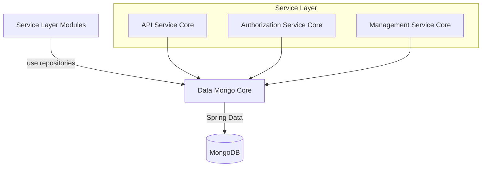
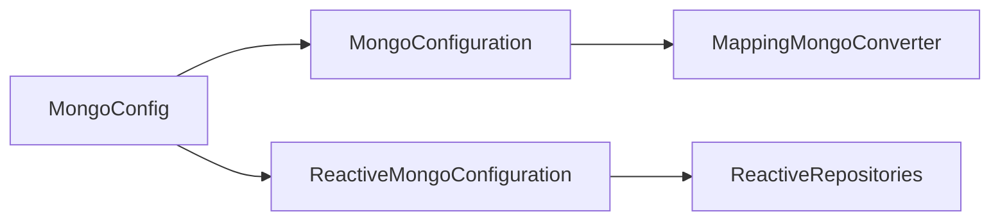
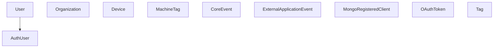
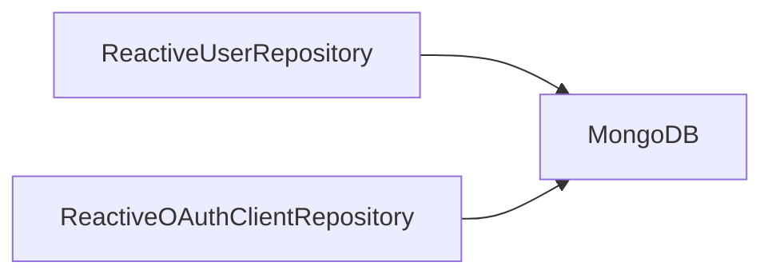
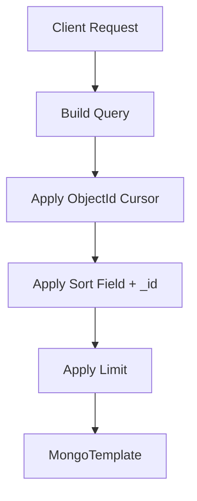
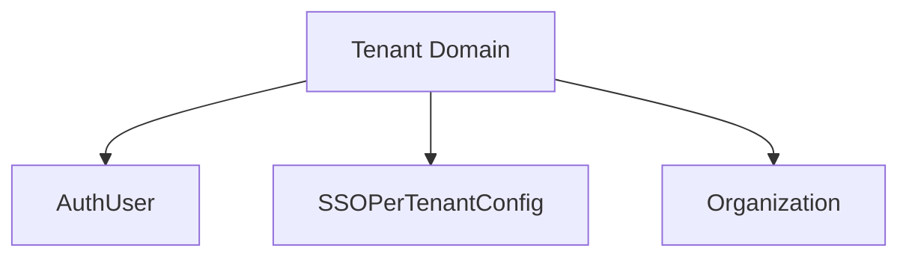

# Data Mongo Core

## Overview

**Data Mongo Core** is the primary MongoDB persistence module for the OpenFrame platform. It provides:

- MongoDB configuration (blocking and reactive)
- Domain document models (users, organizations, devices, events, OAuth, tools)
- Custom repository implementations with advanced filtering and cursor-based pagination
- Multi-tenant–aware authentication and SSO persistence
- Index configuration and query optimization

This module acts as the foundational data layer used by service modules such as API Service Core, Authorization Service Core, Management Service Core, and others.

---

## Architectural Role in the Platform

Data Mongo Core is the **document persistence layer** for operational data stored in MongoDB.

### Responsibilities

- Define MongoDB documents via `@Document`
- Expose Spring Data repositories (blocking + reactive)
- Provide custom query builders using `MongoTemplate`
- Enforce indexing strategy
- Support cursor-based pagination
- Support soft delete and multi-tenant isolation patterns

---

## Module Structure

The module is logically divided into:

1. **Configuration**
2. **Domain Documents**
3. **Reactive Repositories**
4. **Blocking Repositories**
5. **Custom Repository Implementations**
6. **Technology-Agnostic Base Repository Contracts**

---

# 1. Configuration Layer

## MongoConfig

Configures MongoDB behavior for both blocking and reactive stacks.

### Key Features

- Enables `@EnableMongoRepositories` when `spring.data.mongodb.enabled=true`
- Enables Mongo auditing (`@EnableMongoAuditing`)
- Custom `MappingMongoConverter`
  - Custom conversions
  - Replaces `.` in map keys with `__dot__`
- Enables reactive repositories for WebFlux applications

This allows the platform to support:

- Traditional MVC (blocking)
- WebFlux (reactive)

---

## MongoIndexConfig

Creates runtime indexes using `MongoTemplate`.

### Indexed Collection

`external_application_events`:

- Compound index: `userId ASC + timestamp DESC`
- Compound index: `type ASC + metadata.tags ASC`

This ensures:

- Fast user activity lookups
- Efficient tag-based filtering

---

# 2. Domain Document Model

The module defines MongoDB documents grouped by domain.

---

## User & Authentication

### User

Collection: `users`

- Email (indexed, normalized lowercase)
- Roles
- Email verification flag
- Status (ACTIVE, etc.)
- Auditing fields (`createdAt`, `updatedAt`)

### AuthUser

Extends `User`.

Adds:

- `tenantId` (indexed)
- `passwordHash`
- `loginProvider` (LOCAL, GOOGLE, etc.)
- `externalUserId`
- `lastLogin`

Compound unique index:

- `{ tenantId, email }`

This enforces **multi-tenant email uniqueness**.

---

## Organization

Collection: `organizations`

Key features:

- Immutable `organizationId` (unique)
- Soft delete (`deleted`, `deletedAt`)
- Contract lifecycle tracking
- Auditing timestamps
- Indexed fields for search and filtering

Implements domain logic:

- `isContractActive()`
- `isDeleted()`

---

## Device & Tagging

### Device

Collection: `devices`

Represents managed endpoints:

- Machine metadata
- OS version
- Status (ACTIVE, OFFLINE, etc.)
- Health + configuration
- Last check-in timestamp

### MachineTag

Collection: `machine_tags`

Compound unique index:

- `{ machineId, tagId }`

Prevents duplicate tag assignments.

### Tag

Collection: `tags`

- Unique `name`
- Optional color
- Scoped by `organizationId`

---

## Events

### CoreEvent

Collection: `events`

- `type`
- `payload`
- `timestamp`
- `userId`
- `status` (CREATED, PROCESSING, COMPLETED, FAILED)

### ExternalApplicationEvent

Collection: `external_application_events`

- External source metadata
- Tag map for flexible filtering

Optimized by compound indexes defined in `MongoIndexConfig`.

---

## OAuth & Authorization

### MongoRegisteredClient

Collection: `oauth_registered_clients`

- Unique `clientId`
- Grant types
- Redirect URIs
- Token TTL configuration
- PKCE + consent flags

### OAuthToken

Collection: `oauth_tokens`

- `accessToken`
- `refreshToken`
- Expiry timestamps
- Client + scope binding

Used by Authorization Service Core.

---

## SSO Per Tenant

### SSOPerTenantConfig

Extends base SSO configuration.

- Unique `tenantId`
- Created/updated timestamps

Enables:

- Per-tenant OAuth provider configuration
- Isolation of SSO credentials per domain

---

# 3. Reactive Repositories

Enabled only in reactive web applications.

## ReactiveUserRepository

Extends:

- `ReactiveMongoRepository<User, String>`
- `BaseUserRepository`

Returns:

- `Mono<User>`
- `Mono<Boolean>`

Supports reactive authentication flows.

---

## ReactiveOAuthClientRepository

- `findByClientId(String clientId)` → `Mono<OAuthClient>`

Used by reactive authorization components.

---

# 4. Blocking Repositories

Standard `MongoRepository` interfaces.

Examples:

- `OAuthTokenRepository`
- `ExternalApplicationEventRepository`

Support derived queries and custom `@Query` definitions.

---

# 5. Custom Repository Implementations

Custom repositories use `MongoTemplate` for advanced querying.

## Common Capabilities

- Dynamic filter composition
- Cursor-based pagination
- Field validation for sorting
- Regex search support
- Distinct value extraction

---

## Cursor-Based Pagination Pattern

Used in:

- `CustomMachineRepositoryImpl`
- `CustomEventRepositoryImpl`
- `CustomOrganizationRepositoryImpl`

### Why Cursor-Based?

- Avoids offset-based performance issues
- Stable ordering using `_id`
- Efficient for large datasets

---

## Filtering Abstractions

Each major domain defines a filter object:

- `EventQueryFilter`
- `OrganizationQueryFilter`
- `ToolQueryFilter`

These filters:

- Translate business constraints into Mongo `Criteria`
- Avoid in-memory filtering
- Improve query performance

---

# 6. Base Repository Contracts

Technology-agnostic interfaces:

- `BaseUserRepository`
- `BaseApiKeyRepository`
- `BaseTenantRepository`
- `BaseIntegratedToolRepository`

Purpose:

- Shared method contracts
- Reactive and blocking implementations share logic
- Clean separation between domain and persistence strategy

---

# Multi-Tenancy Model

Multi-tenancy is enforced at multiple levels:

Mechanisms:

- Compound unique indexes
- Domain-based user isolation
- Tenant-specific SSO configuration
- Repository-level filtering

---

# Indexing & Performance Strategy

Performance improvements include:

- Explicit compound indexes
- Indexed search fields
- Cursor-based pagination
- MongoTemplate-level filtering
- Distinct queries executed at DB level

This ensures scalability for:

- Large device fleets
- High event volume
- Multi-organization deployments

---

# Design Principles

Data Mongo Core follows these principles:

- ✅ Clear separation between domain and repository logic
- ✅ Reactive + blocking compatibility
- ✅ Multi-tenant safety
- ✅ Cursor-based pagination
- ✅ Soft delete strategy for critical entities
- ✅ Query-level filtering (no in-memory filtering)

---

# Summary

**Data Mongo Core** is the backbone MongoDB persistence layer of OpenFrame.

It provides:

- Well-structured domain documents
- Advanced custom repositories
- Multi-tenant-aware authentication persistence
- Reactive and blocking compatibility
- Performance-optimized querying and indexing

This module ensures that all higher-level services operate on a scalable, consistent, and secure MongoDB data foundation.