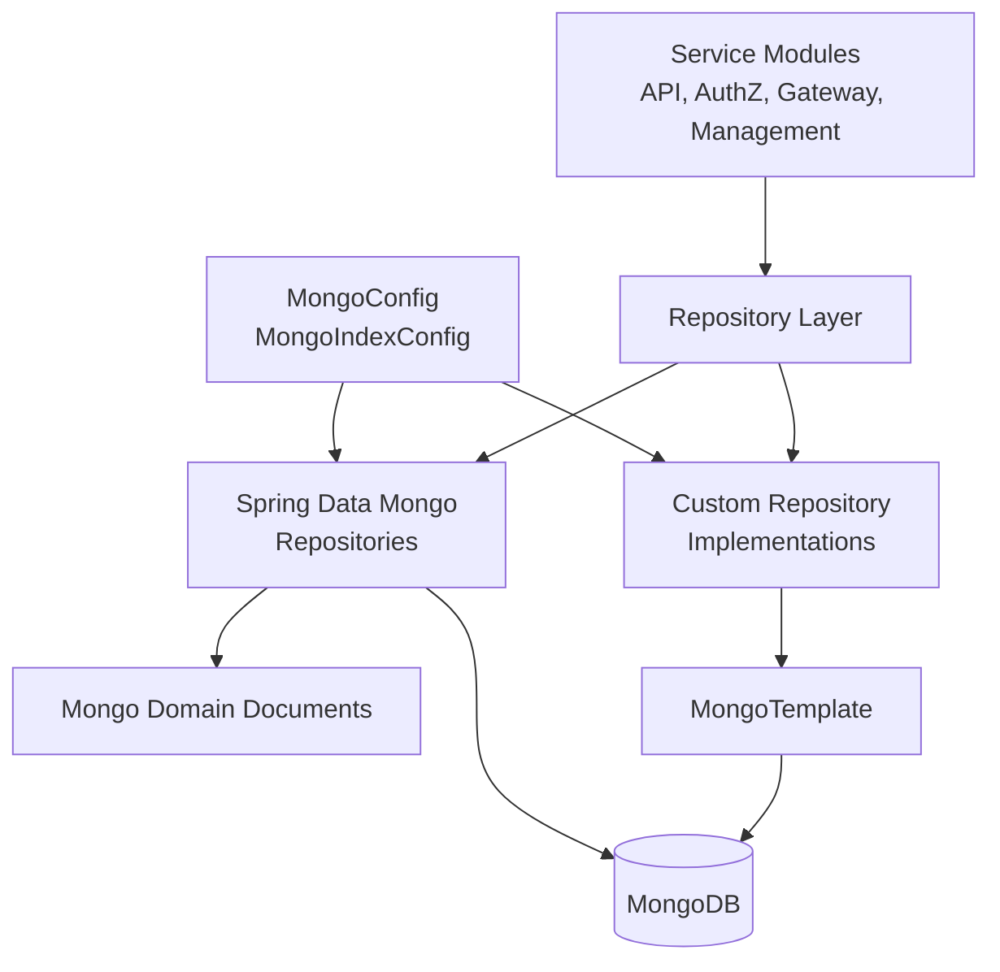
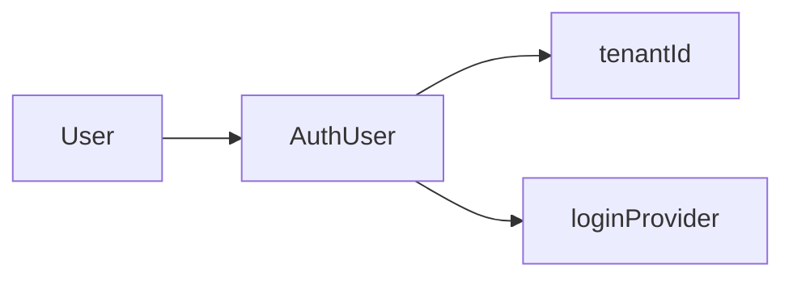
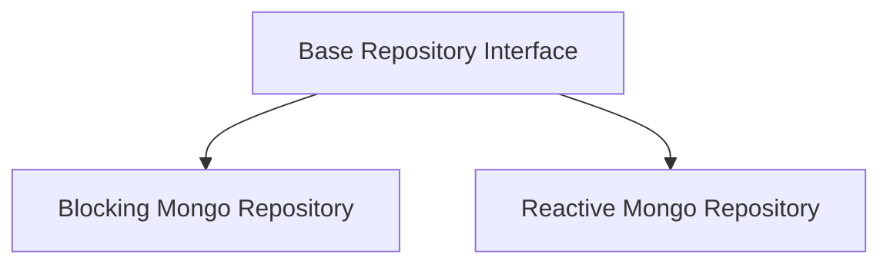
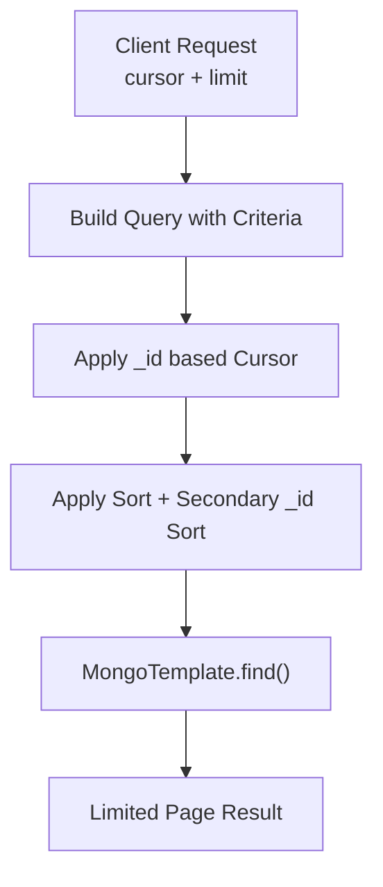

# Data Mongo Domain And Repos

The **Data Mongo Domain And Repos** module is the MongoDB persistence foundation of the OpenFrame platform. It defines:

- MongoDB configuration and indexing
- Domain documents (entities) mapped to Mongo collections
- Reactive and blocking repository interfaces
- Custom query implementations with filtering, search, and cursor-based pagination
- Technology-agnostic base repository contracts

This module is consumed by higher-level modules such as API Service Core, Authorization Service Core, Gateway Service Core, and Management Service Core. It encapsulates all MongoDB-specific concerns behind domain models and repository abstractions.

---

## 1. Architectural Overview

At a high level, this module follows a layered structure:

- **Configuration Layer** – Mongo setup, converters, auditing, and indexes
- **Domain Layer** – Document models representing collections
- **Repository Layer** – Spring Data repositories (blocking + reactive)
- **Custom Repository Implementations** – Complex filtering, search, cursor pagination
- **Base Repository Contracts** – Technology-agnostic interfaces



This design ensures:

- Clear separation of domain and persistence logic
- Reusability across blocking and reactive stacks
- Encapsulation of query complexity inside repository implementations
- Minimal MongoDB leakage into higher-level modules

---

## 2. Mongo Configuration Layer

### 2.1 MongoConfig

`MongoConfig` enables both blocking and reactive Mongo repositories:

- `@EnableMongoRepositories` for `com.openframe.data.repository`
- `@EnableReactiveMongoRepositories` for `com.openframe.data.reactive.repository`
- `@EnableMongoAuditing` for automatic `@CreatedDate` and `@LastModifiedDate`
- Custom `MappingMongoConverter` with:
  - Custom conversions
  - Dot replacement (`__dot__`) for map keys

Key responsibilities:

- Centralized Mongo wiring
- Support for hybrid (blocking + reactive) applications
- Ensuring consistent object-document mapping

### 2.2 MongoIndexConfig

`MongoIndexConfig` ensures indexes are created at startup.

Example:

- Compound index on `application_events`:
  - `userId` (ASC)
  - `timestamp` (DESC)
- Index on:
  - `type`
  - `metadata.tags`

This enforces:

- Efficient event filtering by user and time
- Optimized querying by event type and tags

---

## 3. Domain Document Model

The module defines MongoDB documents grouped by business domain.

### 3.1 User & Authentication

**Collections:**

- `users` → `User`
- `users` (extended) → `AuthUser`

#### User

Core fields:

- `email` (normalized to lowercase)
- `roles`
- `status` (ACTIVE, etc.)
- `emailVerified`
- Auditing fields

#### AuthUser (Multi-tenant)

Extends `User` and adds:

- `tenantId` (indexed, compound unique with email)
- `passwordHash`
- `loginProvider` (LOCAL, GOOGLE, etc.)
- `externalUserId`
- `lastLogin`



This structure supports:

- Multi-tenant isolation
- Local + social login
- Authorization Server integration

---

### 3.2 OAuth Domain

**Collections:**

- `oauth_registered_clients` → `MongoRegisteredClient`
- `oauth_tokens` → `OAuthToken`

#### MongoRegisteredClient

Stores:

- `clientId` (unique)
- `clientSecret`
- Grant types
- Redirect URIs
- Token TTL settings
- PKCE and consent flags

#### OAuthToken

Stores:

- `accessToken`
- `refreshToken`
- Expiry timestamps
- `clientId`
- `userId`
- `scopes`

These entities are consumed by the Authorization Service Core.

---

### 3.3 Organization Domain

**Collection:** `organizations`

#### Organization

Key characteristics:

- Unique `organizationId`
- Soft delete (`deleted`, `deletedAt`)
- Contract dates
- Revenue and employee metrics
- Embedded `ContactInformation`

Helper logic:

- `isContractActive()`
- `isDeleted()`

#### ContactPerson

Embedded document representing organization contacts.

#### OrganizationQueryFilter

Encapsulates filtering logic:

- Category
- Employee range
- Active contract flag

---

### 3.4 Device & Machine Tag Domain

**Collections:**

- `devices` → `Device`
- `machine_tags` → `MachineTag`

#### Device

Represents a managed endpoint:

- `machineId`
- `serialNumber`
- `status` (ACTIVE, OFFLINE, etc.)
- `type`
- `lastCheckin`
- `configuration`
- `health`

#### MachineTag

Compound unique index:

- `{ machineId, tagId }`

Enables:

- Tag-based segmentation
- Organization-scoped labeling

---

### 3.5 Event Domain

**Collections:**

- `events` → `CoreEvent`
- `external_application_events` → `ExternalApplicationEvent`

#### CoreEvent

- `type`
- `payload`
- `timestamp`
- `userId`
- `status` (CREATED, PROCESSING, COMPLETED, FAILED)

#### ExternalApplicationEvent

Adds:

- `metadata.source`
- `metadata.version`
- `metadata.tags`

#### EventQueryFilter

Supports:

- User-based filtering
- Type-based filtering
- Date range filtering

---

### 3.6 Tool & Tag Domain

**Collections:**

- `tags` → `Tag`
- Integrated tool domain (via custom repository)

#### Tag

- Unique `name`
- `organizationId` scoping
- `color`
- `createdBy`

#### ToolQueryFilter

Supports filtering by:

- `enabled`
- `type`
- `category`
- `platformCategory`

---

### 3.7 Tenant & SSO Domain

#### SSOPerTenantConfig

Extends base SSO configuration and adds:

- `tenantId` (unique, sparse index)
- `createdAt`
- `updatedAt`

Supports per-tenant SSO customization.

---

### 3.8 Client & Tool Agent Assets

#### DownloadConfiguration

Defines:

- OS
- Link template
- File name
- Installation type

#### ToolAgentAsset

Contains:

- Version
- Download configurations
- Source
- Local filename mappings
- Executable flag

These support client and tool distribution workflows.

---

## 4. Repository Layer

The repository layer is divided into:

- Spring Data interfaces
- Reactive repositories
- Custom implementations
- Base technology-agnostic contracts

### 4.1 Spring Data Repositories

Examples:

- `OAuthTokenRepository`
- `ExternalApplicationEventRepository`

Provide:

- Derived queries
- `@Query` annotations
- Basic CRUD operations

Example pattern:

```text
Optional<OAuthToken> findByAccessToken(String accessToken)
```

---

### 4.2 Reactive Repositories

Examples:

- `ReactiveUserRepository`
- `ReactiveOAuthClientRepository`

Built on `ReactiveMongoRepository` and return `Mono` types.

Supports:

- WebFlux-based services
- Non-blocking pipelines

---

### 4.3 Base Repository Contracts

Technology-agnostic interfaces:

- `BaseUserRepository`
- `BaseApiKeyRepository`
- `BaseTenantRepository`
- `BaseIntegratedToolRepository`

These define method contracts without binding to:

- Blocking (`Optional`, `List`)
- Reactive (`Mono`, `Flux`)



This abstraction enables:

- Flexible runtime stacks
- Shared service logic
- Cleaner testing strategies

---

## 5. Custom Repository Implementations

Complex filtering, search, and cursor pagination are implemented using `MongoTemplate`.

### 5.1 Common Patterns

Across:

- `CustomMachineRepositoryImpl`
- `CustomEventRepositoryImpl`
- `CustomOrganizationRepositoryImpl`
- `CustomIntegratedToolRepositoryImpl`

Common capabilities:

- Dynamic `Criteria` building
- Regex-based search
- Cursor-based pagination using `_id`
- Sort field validation
- Secondary sort on `_id` for stability

### 5.2 Cursor-Based Pagination Pattern



Key logic:

- Convert cursor string to `ObjectId`
- Apply `lt` or `gt` depending on sort direction
- Always include `_id` in sorting for deterministic results

This ensures:

- Stable pagination
- High performance
- No offset-based scanning

---

## 6. Cross-Module Integration

The Data Mongo Domain And Repos module supports:

- Authorization Service Core → AuthUser, MongoRegisteredClient, OAuthToken
- API Service Core → Device, Organization, Event, Tag
- Management Service Core → Tool and organization metadata
- Gateway Service Core → Token and client lookups

It acts as:

- The canonical persistence layer for Mongo-backed domains
- A shared dependency across service modules

---

## 7. Design Principles

The module adheres to the following principles:

1. **Separation of Concerns** – Domain models are persistence-focused and isolated.
2. **Technology Abstraction** – Base repository interfaces decouple services from Mongo specifics.
3. **Hybrid Support** – Blocking and reactive stacks coexist.
4. **Database-Level Filtering** – Heavy filtering is pushed to MongoDB.
5. **Soft Deletes** – Organizations use soft deletion for safety.
6. **Index-Driven Design** – Explicit indexes for performance-critical queries.
7. **Cursor Pagination Over Offset** – Efficient and scalable pagination strategy.

---

## 8. Summary

The **Data Mongo Domain And Repos** module is the MongoDB backbone of OpenFrame.

It provides:

- Structured Mongo domain documents
- Clean repository abstractions
- Advanced filtering and cursor pagination
- Reactive and blocking persistence support
- Multi-tenant and OAuth-ready storage

By centralizing MongoDB logic here, the platform ensures:

- Consistency across services
- Reduced duplication
- Easier evolution of the persistence layer
- Clear architectural boundaries between domain, persistence, and service logic

This module forms the foundation upon which higher-level business services operate.