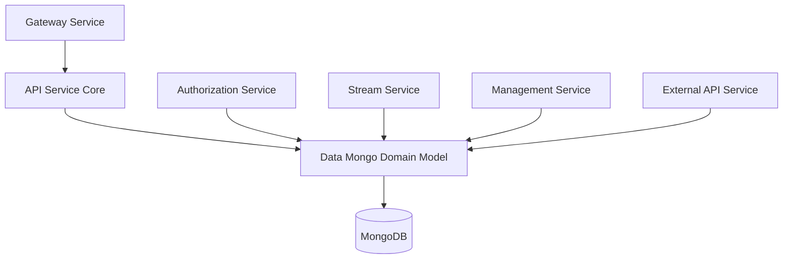
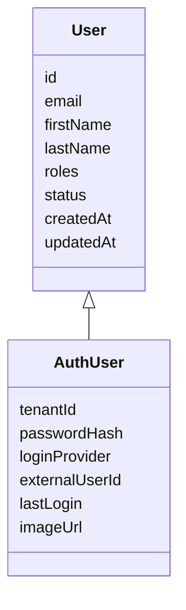
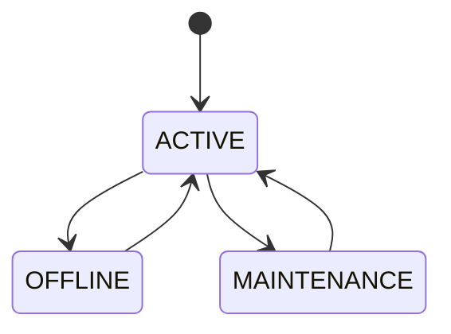
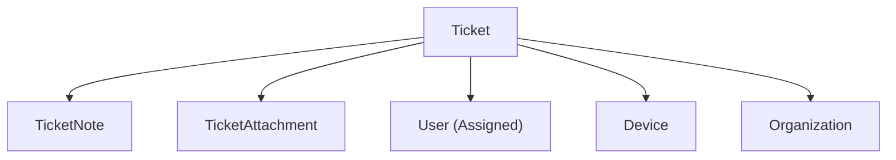
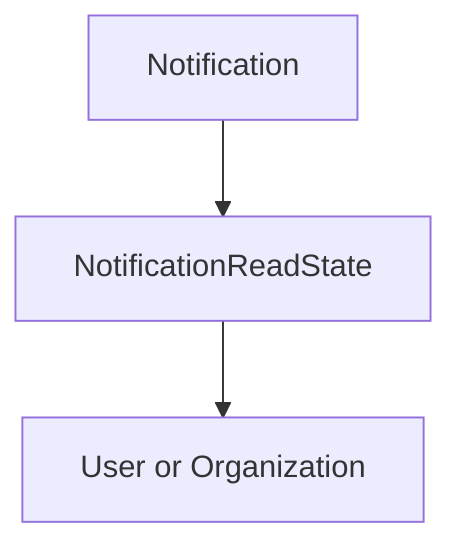
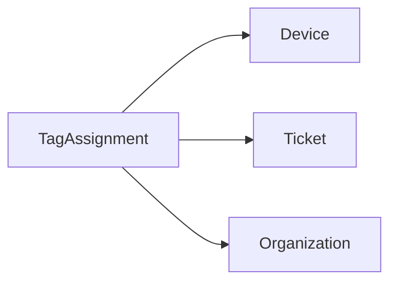

# Data Mongo Domain Model

## Overview

The **Data Mongo Domain Model** module defines the core MongoDB document structures used across the OpenFrame platform. It provides the canonical persistence model for:

- Multi-tenant users and authentication
- Organizations and tenancy boundaries
- Devices and operational state
- Tickets and PSA workflows
- Events and audit trail
- Notifications and read states
- OAuth clients and tokens
- Tag assignments

This module acts as the **persistence foundation** for API services, authorization services, stream processing, gateway routing, and management components. All higher-level services depend on these document definitions for consistent storage and indexing strategies.

---

## Architectural Role in the Platform

The Data Mongo Domain Model sits at the base of the application stack and is shared by:

- API Service Core (REST + GraphQL)
- Authorization Service Core
- Stream Service Core (Kafka consumers)
- Management Service Core
- External API Service Core
- Gateway and Security components (indirectly via persistence)

### High-Level Data Flow

The module defines **document schemas and indexing strategies**, while repositories and services (in other modules) implement business logic on top of these models.

---

## Core Domain Areas

The domain model can be grouped into the following bounded contexts:

1. Identity & Authentication
2. Organization & Tenancy
3. Device Management
4. Ticketing (PSA)
5. Events & Audit
6. Notifications
7. OAuth & Client Registration
8. Tagging System

---

# 1. Identity & Authentication

## User

**Collection:** `users`

Represents an application user within a tenant.

Key characteristics:

- Indexed by `email`
- Supports multiple roles (`UserRole`)
- Email normalization (lowercased, trimmed)
- Soft status control via `UserStatus`
- Audit fields (`createdAt`, `updatedAt`)

### Responsibilities

- Technician identity
- Role-based authorization support
- Assignment target for tickets
- Reporter reference for tickets

---

## AuthUser

Extends `User` for multi-tenant authorization server use.

**Compound Index:** `(tenantId, email)` unique when tenant exists.

Additional fields:

- `tenantId` (multi-tenancy boundary)
- `passwordHash`
- `loginProvider` (LOCAL, GOOGLE, etc.)
- `externalUserId`
- `lastLogin`
- `imageUrl` (cached profile picture)

### Purpose

- Used by the Authorization Service
- Supports SSO and external identity providers
- Maintains domain-based tenancy

### Identity Model Diagram

---

# 2. Organization & Tenancy

## Organization

**Collection:** `organizations`

Represents a company or tenant-scoped business entity.

Key features:

- Unique `organizationId`
- Indexed `name`
- `isDefault` flag
- Business metadata (revenue, employees, contract dates)
- Soft-delete via `OrganizationStatus` (ACTIVE, ARCHIVED, DELETED)
- Contract validation logic

### Important Design Decision

Organizations are **never hard-deleted** to preserve device and ticket references. Instead:

- `ARCHIVED` → hidden from standard queries
- `DELETED` → soft-deleted but still referentially valid

---

# 3. Device Management

## Device

**Collection:** `devices`

Represents a managed endpoint.

Key fields:

- `machineId` (link to external Machine entity)
- `serialNumber`, `model`, `osVersion`
- `status` (ACTIVE, OFFLINE, MAINTENANCE)
- `DeviceType`
- `lastCheckin`
- `DeviceConfiguration`
- `DeviceHealth`

### Device Lifecycle

Devices are heavily used by:

- Ticketing
- Stream event ingestion
- Management schedulers
- External API integrations

---

# 4. Ticketing (PSA Domain)

Ticketing is modeled as a primary entity with related collections.

## Ticket

**Collection:** `tickets`

Primary PSA entity.

Key design elements:

- Unique `ticketNumber` (auto-increment per tenant)
- Indexed status and assignment fields
- Linked to:
  - `deviceId`
  - `organizationId`
  - `assignedTo` (User)
  - `reporterId`
- Soft resolution via `resolvedAt`

### Index Strategy

Compound indexes support:

- Status-based dashboards
- Assignment filtering
- Organization filtering
- Device filtering

---

## TicketNote

**Collection:** `ticket_notes`

Technician-only internal notes.

- Indexed by `ticketId`
- Sorted by `createdAt`
- Editable (tracked via `updatedAt`)

---

## TicketAttachment

**Collection:** `ticket_attachments`

Metadata-only storage.

Files are stored externally (S3/MinIO), while this document stores:

- `ticketId`
- `fileName`
- `contentType`
- `fileSize`
- `storagePath`

---

### Ticket Aggregate Model

Ticket owns metadata; attachments and notes are independent collections for scalability.

---

# 5. Events & Audit

## CoreEvent

**Collection:** `events`

Represents system-level or domain events.

Fields:

- `type`
- `payload`
- `timestamp`
- `userId`
- `status` (CREATED, PROCESSING, COMPLETED, FAILED)

### Usage

- Stream ingestion persistence
- Audit logs
- Async processing workflows

---

# 6. Notifications

## Notification

**Collection:** `notifications`

Represents a system notification.

Fields:

- `severity`
- `title`
- `description`
- `createdAt`
- `context`

---

## NotificationReadState

**Collection:** `notification_read_states`

Tracks per-recipient state.

Compound indexes ensure:

- Unique (recipientId, recipientType, notificationId)
- Fast unread queries by status
- Filtering by category

### Notification Model

Notifications are immutable; read state is tracked separately.

---

# 7. OAuth & Client Registration

## MongoRegisteredClient

**Collection:** `oauth_registered_clients`

Represents OAuth2 clients.

Key features:

- Unique `clientId`
- Grant types
- Redirect URIs
- Scopes
- PKCE support
- Token TTL configuration

---

## OAuthToken

**Collection:** `oauth_tokens`

Stores issued tokens.

Fields:

- `userId`
- `accessToken`
- `refreshToken`
- Expiry timestamps
- `clientId`
- `scopes`

Used by Authorization Service for token validation and revocation.

---

# 8. Tagging System

## TagAssignment

**Collection:** `tag_assignments`

Provides a unified tagging mechanism across entities.

Unique compound index:

- `(entityId, tagId, entityType)`

Supports:

- Label-style tags
- Key-value tags with `values`
- Timestamped tagging (`taggedAt`)
- Attribution (`taggedBy`)

### Cross-Entity Tag Model

This design avoids embedding tags inside each entity and enables consistent querying.

---

# Multi-Tenancy Considerations

Multi-tenancy is enforced through:

- `tenantId` in AuthUser
- Tenant-scoped repositories in other modules
- Unique constraints within tenant boundaries
- Per-tenant ticket numbering

The domain model avoids hard coupling to tenant logic; enforcement is handled at repository and service layers.

---

# Indexing Strategy Summary

The module heavily leverages:

- `@Indexed` for query acceleration
- `@CompoundIndex` for dashboard queries
- Unique constraints for integrity
- Partial indexes for multi-tenant isolation

This ensures:

- Fast filtering
- Scalable dashboard queries
- Safe uniqueness guarantees
- Reduced cross-tenant data leakage risk

---

# Design Principles

The Data Mongo Domain Model follows these principles:

1. Document-per-aggregate boundary
2. Soft deletes over hard deletes
3. External storage for large binary data
4. Event-driven compatibility
5. Strong indexing strategy
6. Multi-tenant safe uniqueness
7. Clear separation of identity vs domain users

---

# Conclusion

The **Data Mongo Domain Model** is the foundational persistence layer of OpenFrame. It defines the canonical MongoDB structures that power:

- Authentication and SSO
- Tenant isolation
- Device monitoring
- Ticketing workflows
- Notifications
- Event processing
- OAuth client management

All higher-level services rely on these documents to provide consistent, scalable, and multi-tenant safe behavior across the platform.
