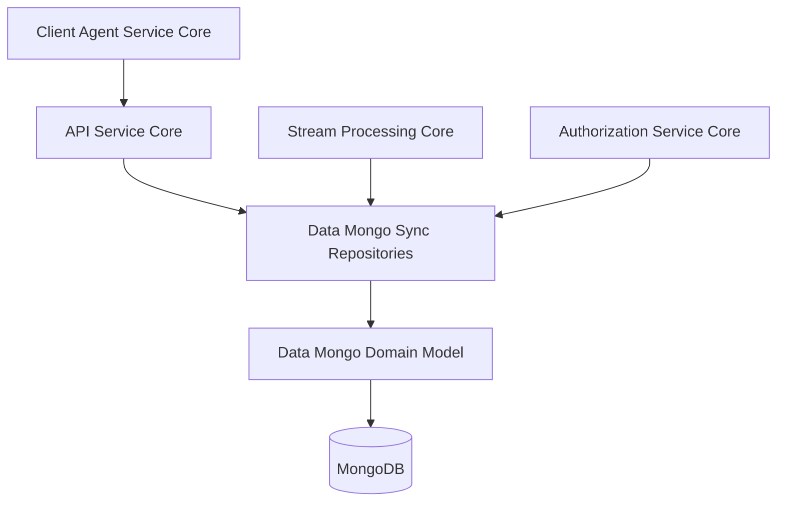
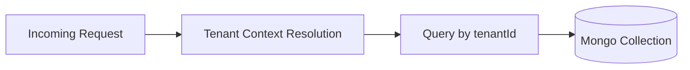
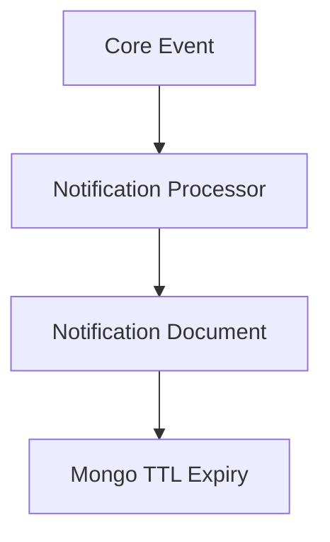
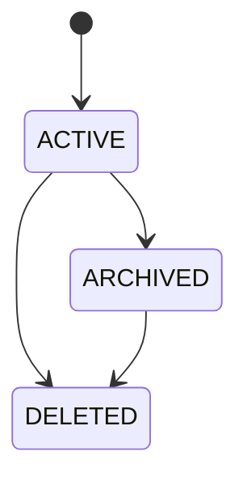
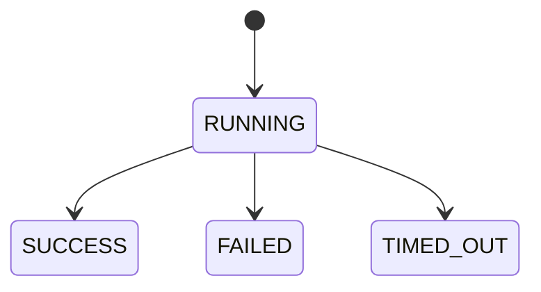
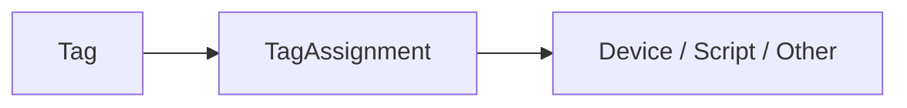

# Data Mongo Domain Model

## Overview

The **Data Mongo Domain Model** module defines the core MongoDB document model for the OpenFrame platform. It contains the primary domain entities persisted in MongoDB and shared across API, stream-processing, gateway, authorization, and client-agent services.

This module is part of the data layer and provides:

- Multi-tenant domain documents (via `TenantScoped`)
- Collection mappings and indexes
- Lifecycle fields (created/updated timestamps)
- Execution history models for RMM (Remote Monitoring & Management)
- Notification, tagging, and organization modeling

It is consumed by:

- [Data Mongo Sync Repositories](../data-mongo-sync-repositories.md)
- [API Service Core](../api-service-core-config-and-security.md)
- [Stream Processing Core](../stream-processing-core.md)
- [Authorization Service Core](../authorization-service-core.md)

This module contains **no business logic** or controllers — only domain documents and structural persistence rules.

---

## Architectural Role

The Data Mongo Domain Model sits at the foundation of the persistence architecture.

```mermaid
flowchart TD
    API["API Service Core"] --> REPO["Data Mongo Sync Repositories"]
    STREAM["Stream Processing Core"] --> REPO
    AUTH["Authorization Service Core"] --> REPO
    AGENT["Client Agent Service Core"] --> API

    REPO --> DOMAIN["Data Mongo Domain Model"]
    DOMAIN --> MONGO[("MongoDB")]
```

### Key Responsibilities

1. Define MongoDB collections
2. Define indexes and compound indexes
3. Enforce tenant scoping
4. Provide execution history persistence models
5. Support auditability and soft-deletion strategies

---

## Multi-Tenancy Model

All core documents implement `TenantScoped` and include:

- `tenantId`
- Indexes optimized for tenant-based querying

This ensures:

- Strict tenant isolation
- Efficient per-tenant queries
- Safe horizontal scaling

```mermaid
flowchart LR
    Request["Incoming Request"] --> Filter["Tenant Context Resolution"]
    Filter --> Query["Query by tenantId"]
    Query --> Collection[("Mongo Collection")]
```

Tenant context resolution is handled in upper layers (e.g., Authorization Service Core), while this module enforces structural tenant presence.

---

# Core Domain Documents

## Device

**Collection:** `devices`

Represents a managed endpoint device in the RMM system.

### Key Fields

- `machineId` — link to machine entity
- `status` — ACTIVE, OFFLINE, MAINTENANCE
- `type` — DESKTOP, LAPTOP, SERVER, etc.
- `lastCheckin` — heartbeat timestamp
- `configuration` — device-specific configuration
- `health` — computed health metrics

### Indexing Strategy

- Indexed `tenantId`
- Default `_id`

Devices are the backbone of monitoring, scripting, and command execution.

---

## CoreEvent

**Collection:** `events`

Represents platform-level events.

### Key Fields

- `type`
- `payload` (serialized content)
- `timestamp`
- `status` — CREATED, PROCESSING, COMPLETED, FAILED

Core events are often consumed by:

- Stream Processing Core
- Notification workflows
- Audit and activity logs

---

## Notification

**Collection:** `notifications`

Represents user-facing or system notifications.

### Key Characteristics

- `severity` — INFO, WARNING, ERROR
- `category`
- `context` — structured metadata
- `correlationId` — used for in-place updates
- `createdAt` — TTL indexed

### TTL Retention

Notifications use a TTL index:

- Automatically expire after configured retention window
- Keeps notification history bounded

```mermaid
flowchart TD
    Event["Core Event"] --> Processor["Notification Processor"]
    Processor --> NotificationDoc["Notification Document"]
    NotificationDoc --> TTL["Mongo TTL Expiry"]
```

---

## Organization

**Collection:** `organizations`

Represents a business entity within a tenant.

### Key Capabilities

- Unique `organizationId` (UUID, immutable)
- Soft deletion using `status`
- Contract lifecycle tracking
- Revenue and business metadata

### Status Model

```mermaid
stateDiagram-v2
    [*] --> ACTIVE
    ACTIVE --> ARCHIVED
    ACTIVE --> DELETED
    ARCHIVED --> DELETED
```

Organizations are not physically deleted to preserve referential integrity with devices and historical records.

---

## User

**Collection:** `users`

Represents authenticated platform users.

### Key Fields

- `email` (normalized to lowercase)
- `roles`
- `emailVerified`
- `status` — ACTIVE, etc.
- `crmSynced` — integration sync flag

Users are referenced by:

- Authorization Service Core
- API controllers
- Event audit records

---

# RMM Execution Model

The module models both **ad-hoc command execution** and **script execution history**.

## CommandExecution

**Collection:** `command_executions`

Represents one machine’s execution attempt for an ad-hoc command.

### Important Design Features

- Unique compound index on `(tenantId, executionId, machineId)`
- Status lifecycle tracking
- Execution timing metrics
- Output truncation protection

### Execution Lifecycle

```mermaid
stateDiagram-v2
    [*] --> RUNNING
    RUNNING --> SUCCESS
    RUNNING --> FAILED
    RUNNING --> TIMED_OUT
```

Output is capped at `MAX_OUTPUT_BYTES` (64 KiB) to prevent MongoDB document overflow.

---

## ScriptExecution

**Collection:** `script_executions`

Represents a script execution instance per machine.

### Unique Index

Compound unique constraint on:

- `tenantId`
- `executionId`
- `machineId`
- `scriptId`

This ensures idempotency when agents retry result delivery.

---

## ScriptScheduleMachineAssigned

**Collection:** `script_schedules_machines_assigned`

Represents the many-to-many relationship between:

- Script schedules
- Target machines

### Guarantees

- Unique assignment per `(tenantId, scriptScheduleId, machineId)`
- Auditable creation and modification timestamps

---

# Tagging Model

## TagAssignment

**Collection:** `tag_assignments`

Provides flexible tagging across entity types.

### Features

- Unique compound index preventing duplicate assignments
- Supports multi-value tag keys
- Tracks tagging time and actor

```mermaid
flowchart LR
    Tag["Tag"] --> Assignment["TagAssignment"]
    Assignment --> Entity["Device / Script / Other"]
```

Tags enable filtering, grouping, automation scoping, and reporting.

---

# Cross-Module Relationships

The Data Mongo Domain Model is consumed by several modules:

- [Data Mongo Sync Repositories](../data-mongo-sync-repositories.md) — Implements custom query logic.
- [API Service Core GraphQL](../api-service-core-graphql.md) — Reads and exposes domain entities.
- [Stream Processing Core](../stream-processing-core.md) — Updates execution status and event enrichment.
- [Client Agent Service Core](../client-agent-service-core.md) — Produces execution results.

This module intentionally avoids:

- Business services
- REST controllers
- GraphQL data fetchers
- Security configuration

Those responsibilities belong to higher layers.

---

# Design Principles

### 1. Tenant Isolation First
Every document includes `tenantId` and is indexed accordingly.

### 2. Write-Optimized for Event-Driven Systems
Execution and event documents are designed for:

- High write throughput
- Indexed status scanning
- Efficient watchdog sweeps

### 3. Soft Deletion Over Hard Deletion
Organizations and users rely on status fields instead of physical removal.

### 4. MongoDB Constraints Enforced via Indexes

- Unique compound indexes ensure idempotency
- TTL indexes control data retention
- Indexed timestamps enable efficient querying

---

# Summary

The **Data Mongo Domain Model** module defines the structural backbone of OpenFrame’s persistence layer.

It provides:

- Multi-tenant MongoDB document definitions
- RMM execution history modeling
- Event and notification storage
- Organization and user lifecycle modeling
- Tagging and relational association structures

All higher-level services depend on this module to ensure consistency, isolation, and durability across the platform.