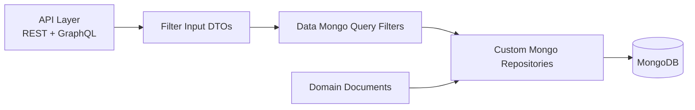
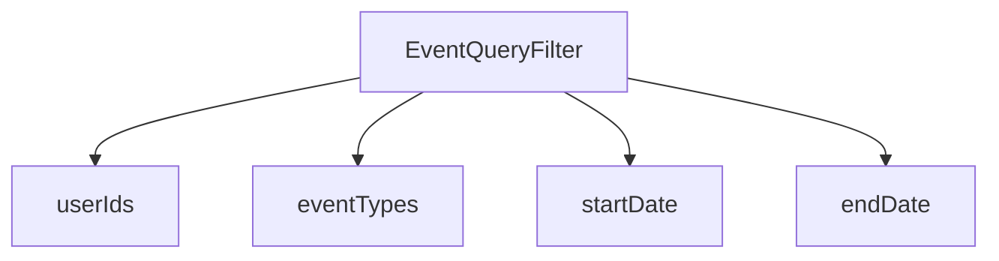
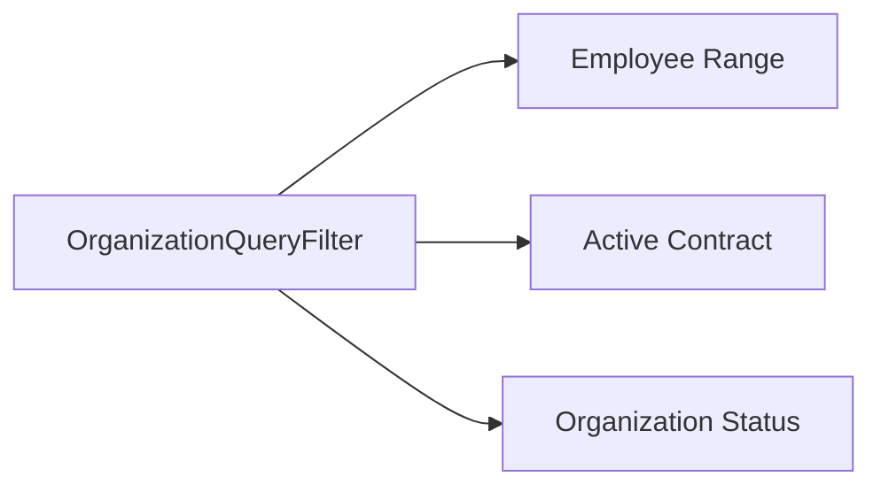
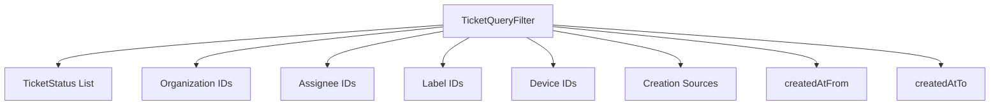
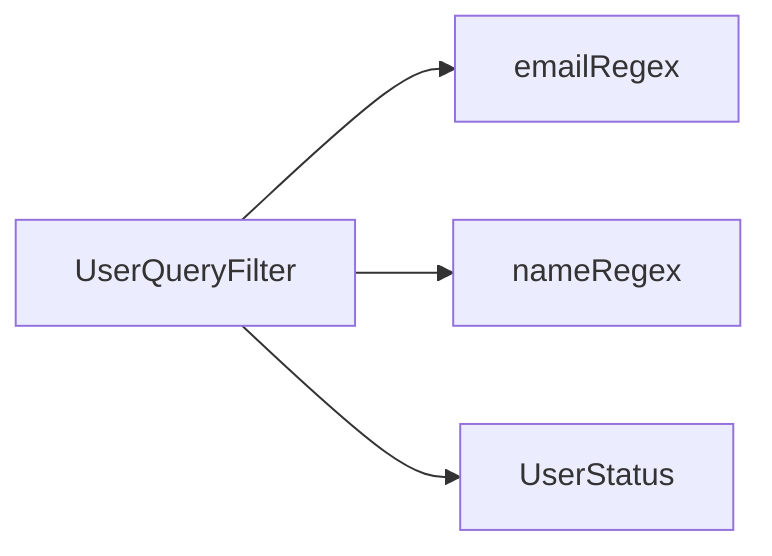
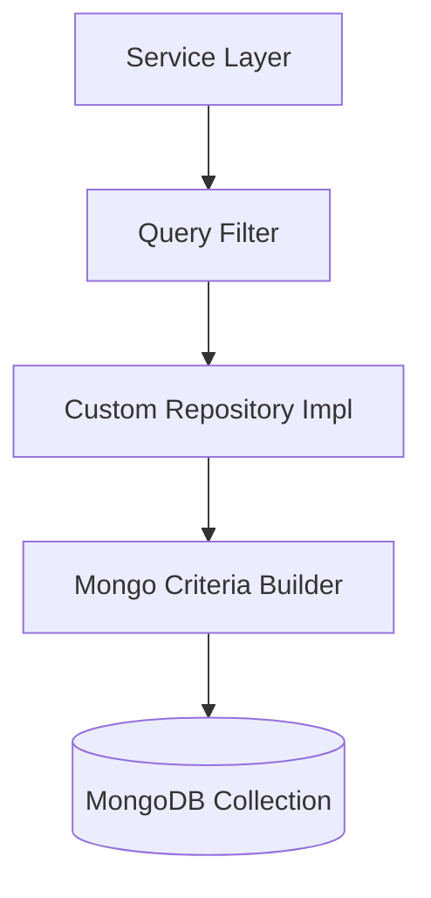

# Data Mongo Query Filters

## Overview

The **Data Mongo Query Filters** module defines strongly-typed filter objects used to construct dynamic MongoDB queries across the OpenFrame platform. These filters act as the boundary between higher-level API input (REST and GraphQL) and low-level repository query execution.

Rather than embedding query logic directly in controllers or services, this module provides composable filter models that:

- Encapsulate domain-specific filtering criteria
- Support time-based and enum-based constraints
- Enable clean separation between API DTOs and MongoDB query construction
- Promote consistency across sync and reactive repositories

This module is part of the data layer and works closely with:

- [Data Mongo Domain Model](../data-mongo-domain-model/data-mongo-domain-model.md)
- [Data Mongo Base Repositories](../data-mongo-base-repositories/data-mongo-base-repositories.md)
- [Data Mongo Sync Config and Custom Repositories](../data-mongo-sync-config-and-custom-repositories/data-mongo-sync-config-and-custom-repositories.md)
- [Data Mongo Reactive Repositories](../data-mongo-reactive-repositories/data-mongo-reactive-repositories.md)

---

## Architectural Role in the System

The Data Mongo Query Filters module sits between API-level filter inputs and repository-level query execution.



### Flow Explanation

1. **API Layer** receives filter inputs (e.g., `TicketFilterInput`, `UserFilterInput`).
2. These inputs are mapped into internal **Query Filter** objects defined in this module.
3. Custom repositories interpret the filter object and build a MongoDB `Criteria` / query.
4. Queries are executed against collections defined in the domain model.

This separation ensures:

- API contracts can evolve without tightly coupling to MongoDB internals.
- Query construction remains centralized and testable.
- Business services remain independent from persistence logic.

---

## Design Principles

### 1. Immutable, Builder-Based Construction

All filter classes use Lombok annotations:

- `@Data`
- `@Builder`
- `@NoArgsConstructor`
- `@AllArgsConstructor`

This enables safe, expressive creation:

```java
TicketQueryFilter filter = TicketQueryFilter.builder()
    .statuses(List.of(TicketStatus.OPEN))
    .organizationIds(List.of("org-1"))
    .createdAtFrom(Instant.now().minus(30, ChronoUnit.DAYS))
    .build();
```

### 2. Domain-Oriented Filtering

Each filter aligns directly with a Mongo document type from the domain model:

- Events → `EventQueryFilter`
- Organizations → `OrganizationQueryFilter`
- Tickets → `TicketQueryFilter`
- Tools → `ToolQueryFilter`
- Users → `UserQueryFilter`

### 3. Null-Safe Optional Criteria

All fields are optional. Repositories interpret `null` values as "no constraint".

This allows flexible query composition without requiring multiple overloaded methods.

---

# Filter Classes

## EventQueryFilter

**Component:**  
`openframe-oss-lib.openframe-data-mongo-common.src.main.java.com.openframe.data.document.event.filter.EventQueryFilter.EventQueryFilter`

### Purpose

Encapsulates filtering logic for querying event documents.

### Fields

- `List<String> userIds` – Filter by user IDs
- `List<String> eventTypes` – Restrict by event categories
- `LocalDate startDate` – Inclusive lower bound
- `LocalDate endDate` – Inclusive upper bound

### Usage Context

Used by event-related repositories to construct date-range and type-based queries.



---

## OrganizationQueryFilter

**Component:**  
`openframe-oss-lib.openframe-data-mongo-common.src.main.java.com.openframe.data.document.organization.filter.OrganizationQueryFilter.OrganizationQueryFilter`

### Purpose

Defines structured filtering for organization queries.

### Fields

- `String category`
- `Integer minEmployees`
- `Integer maxEmployees`
- `Boolean hasActiveContract`
- `String status`

### Typical Query Logic

Repositories may:

- Apply numeric range constraints for employee size
- Apply boolean checks for contract state
- Apply equality matching on category and status



---

## TicketQueryFilter

**Component:**  
`openframe-oss-lib.openframe-data-mongo-common.src.main.java.com.openframe.data.document.ticket.filter.TicketQueryFilter.TicketQueryFilter`

### Purpose

Provides comprehensive filtering for ticket documents.

### Fields

- `List<TicketStatus> statuses`
- `List<String> organizationIds`
- `List<String> assigneeIds`
- `List<String> labelIds`
- `List<String> deviceIds`
- `List<TicketCreationSource> creationSources`
- `Instant createdAtFrom`
- `Instant createdAtTo`

### Capabilities

- Multi-status filtering
- Organization-scoped filtering
- Assignee-based filtering
- Label and device constraints
- Creation source classification
- Time-window filtering using `Instant`



This filter is commonly used in custom repository implementations for advanced aggregation and dashboard queries.

---

## ToolQueryFilter

**Component:**  
`openframe-oss-lib.openframe-data-mongo-common.src.main.java.com.openframe.data.document.tool.filter.ToolQueryFilter.ToolQueryFilter`

### Purpose

Filters integrated tool documents based on enablement and classification.

### Fields

- `Boolean enabled`
- `String type`
- `String category`
- `String platformCategory`

### Common Use Cases

- Retrieve only enabled tools
- Filter by tool type (e.g., RMM, MDM)
- Segment tools by platform category

---

## UserQueryFilter

**Component:**  
`openframe-oss-lib.openframe-data-mongo-common.src.main.java.com.openframe.data.document.user.filter.UserQueryFilter.UserQueryFilter`

### Purpose

Defines flexible filtering for user queries.

### Fields

- `String emailRegex`
- `String nameRegex`
- `UserStatus status`

### Query Semantics

- Regex-based filtering for search capabilities
- Status-based filtering (e.g., ACTIVE, DISABLED)



---

# Integration with Repositories

The filters are interpreted by repository implementations in the sync and reactive Mongo modules.



Repositories typically:

1. Inspect each non-null filter field.
2. Add corresponding `Criteria` conditions.
3. Combine conditions using `andOperator` / `orOperator`.
4. Apply pagination and sorting.

---

# Benefits to the Platform

### Clean Separation of Concerns

- API DTOs define external contract.
- Query filters define internal query semantics.
- Repositories handle persistence mechanics.

### Extensibility

Adding a new filter field:

1. Extend the filter class.
2. Update repository criteria logic.
3. Expose through API input DTO if needed.

No cross-layer coupling is introduced.

### Consistency Across Domains

All filters follow a uniform pattern:

- Builder-based construction
- Optional fields
- Domain-aligned attributes
- Used exclusively by data layer

---

# Summary

The **Data Mongo Query Filters** module provides the structured, domain-driven filtering layer for MongoDB queries across OpenFrame.

It:

- Encapsulates filtering logic for events, organizations, tickets, tools, and users.
- Bridges API input models with Mongo repository implementations.
- Supports flexible, composable, and maintainable query construction.
- Enforces consistent filtering patterns across the data access layer.

This module is a foundational building block in the persistence architecture, enabling scalable, expressive, and maintainable MongoDB querying throughout the platform.