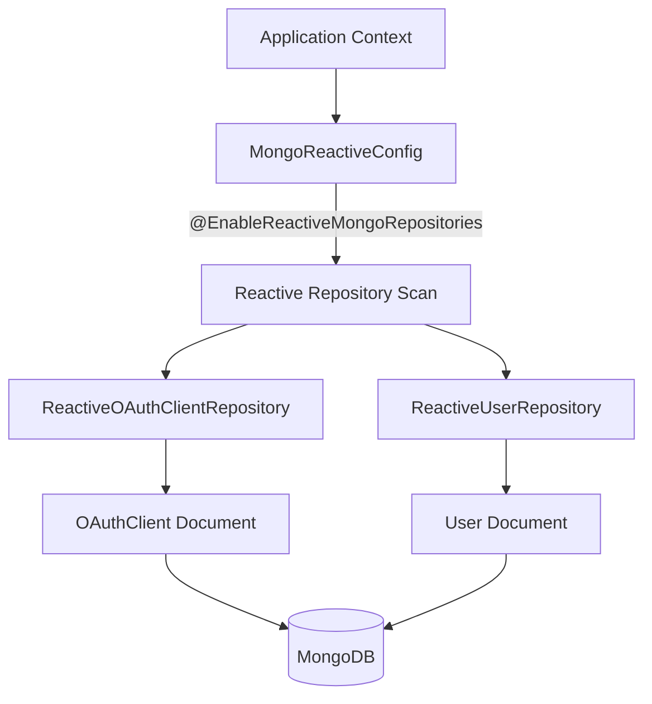
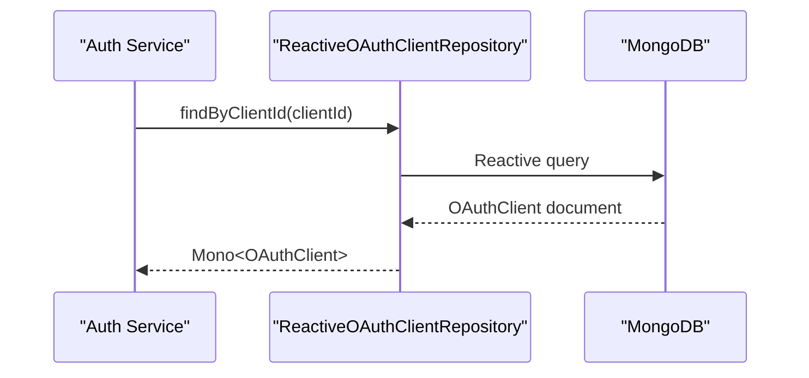
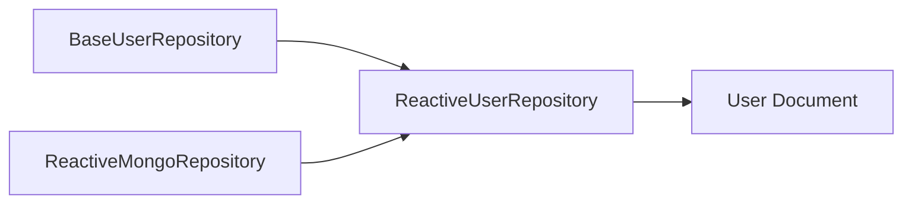

# Data Mongo Reactive Repositories

## Overview

The **Data Mongo Reactive Repositories** module provides reactive, non-blocking access to MongoDB for selected core domain entities in the OpenFrame platform. Built on **Spring Data Reactive MongoDB** and **Project Reactor**, this module enables asynchronous data access patterns using `Mono` and `Flux` types.

It complements the synchronous repository layer by offering reactive alternatives for high-concurrency or event-driven use cases, particularly around:

- OAuth client persistence
- User lookups and existence checks
- Security and authentication flows

This module integrates closely with:

- The domain model defined in **Data Mongo Domain Model**
- Shared base repository contracts from the synchronous layer
- Spring Boot auto-configuration and repository scanning

---

## Core Components

This module contains three primary components:

- `MongoReactiveConfig`
- `ReactiveOAuthClientRepository`
- `ReactiveUserRepository`

---

## Architecture Overview



The configuration class enables reactive repository scanning. Spring automatically wires implementations for repository interfaces extending `ReactiveMongoRepository`.

---

## Reactive Programming Model

This module uses **Project Reactor** primitives:

- `Mono<T>` — zero or one result
- `Flux<T>` — zero to many results

Example semantics:

```text
Mono<User>        → Asynchronous single user lookup
Mono<Boolean>     → Asynchronous existence check
```

Unlike synchronous repositories that block on I/O, reactive repositories:

- Use non-blocking MongoDB drivers
- Integrate with WebFlux and reactive security chains
- Support high-concurrency workloads efficiently

---

## Component Details

### MongoReactiveConfig

**Class:** `MongoReactiveConfig`  
**Package:** `com.openframe.data.config`

```java
@Configuration
@EnableReactiveMongoRepositories(basePackages = "com.openframe.data.reactive.repository")
public class MongoReactiveConfig {
}
```

#### Responsibilities

- Enables reactive MongoDB repository scanning
- Registers Spring Data reactive repository infrastructure
- Configures repositories located under:

```text
com.openframe.data.reactive.repository
```

This class acts as the entry point for the reactive persistence layer.

---

### ReactiveOAuthClientRepository

**Interface:** `ReactiveOAuthClientRepository`  
**Extends:** `ReactiveMongoRepository<OAuthClient, String>`

```java
@Repository
public interface ReactiveOAuthClientRepository 
        extends ReactiveMongoRepository<OAuthClient, String> {

    Mono<OAuthClient> findByClientId(String clientId);
}
```

#### Responsibilities

- Reactive CRUD operations for `OAuthClient`
- Lookup by `clientId`
- Used by authentication and OAuth flows

#### Data Flow



#### Typical Use Cases

- OAuth client validation
- Client credentials flow
- Token issuance validation
- Dynamic client lookup

---

### ReactiveUserRepository

**Interface:** `ReactiveUserRepository`  
**Extends:**
- `ReactiveMongoRepository<User, String>`
- `BaseUserRepository<Mono<User>, Mono<Boolean>, String>`

```java
@Repository
public interface ReactiveUserRepository 
    extends ReactiveMongoRepository<User, String>,
            BaseUserRepository<Mono<User>, Mono<Boolean>, String> {

    Mono<User> findByEmail(String email);

    Mono<Boolean> existsByEmail(String email);

    Mono<Boolean> existsByEmailAndStatus(String email, UserStatus status);
}
```

#### Responsibilities

- Reactive user retrieval by email
- Email existence checks
- Status-aware existence validation
- Compliance with shared `BaseUserRepository` contract

#### Inheritance Model



The repository:

- Inherits generic user contract behavior
- Adapts return types to `Mono<T>`
- Ensures consistency across reactive and synchronous layers

#### Example Reactive Pattern

```text
findByEmail(email)
    → returns Mono<User>
    → may emit value or complete empty
```

This integrates directly with:

- Reactive security filters
- OAuth BFF layers
- WebFlux controllers

---

## Relationship to Other Modules

### Data Mongo Domain Model

The reactive repositories operate on domain documents defined in:

- `User`
- `OAuthClient`

These are defined in the **Data Mongo Domain Model** module.

(See the corresponding domain model documentation for detailed schema information.)

---

### Data Mongo Base Repositories

`ReactiveUserRepository` implements the generic `BaseUserRepository` contract, ensuring:

- Cross-layer API consistency
- Shared query method definitions
- Type-safe generics for both blocking and reactive variants

This pattern allows the platform to maintain consistent repository contracts while supporting different execution models.

---

## Reactive vs Synchronous Repositories

| Aspect | Reactive | Synchronous |
|--------|----------|------------|
| Driver | Reactive MongoDB driver | Blocking MongoDB driver |
| Return Types | `Mono<T>`, `Flux<T>` | `T`, `List<T>` |
| Thread Model | Event-loop friendly | Thread-per-request |
| Backpressure | Supported | Not supported |

The reactive repositories are ideal for:

- High-concurrency authentication workloads
- Streaming integrations
- Event-driven services

---

## Security and OAuth Integration

Reactive repositories are particularly important in:

- OAuth client validation
- Email-based login checks
- Account existence validation
- Status-based user access control

Because these flows are frequently executed and latency-sensitive, non-blocking access improves scalability and throughput.

---

## Extension Guidelines

When adding new reactive repositories:

1. Place them under:

```text
com.openframe.data.reactive.repository
```

2. Extend `ReactiveMongoRepository<Entity, IdType>`
3. Return `Mono<T>` or `Flux<T>`
4. If applicable, implement shared base repository contracts
5. Ensure the entity exists in the domain model module

---

## Summary

The **Data Mongo Reactive Repositories** module provides:

- Spring Data reactive MongoDB integration
- Reactive user and OAuth client persistence
- Contract alignment with base repository interfaces
- Non-blocking access patterns for authentication-critical flows

It forms a lightweight but critical foundation for scalable security, authentication, and identity-related operations across the OpenFrame platform.