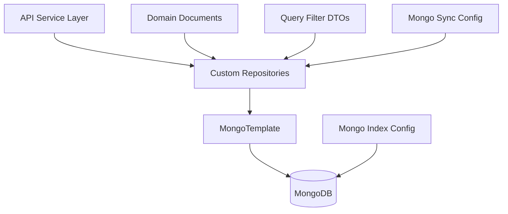
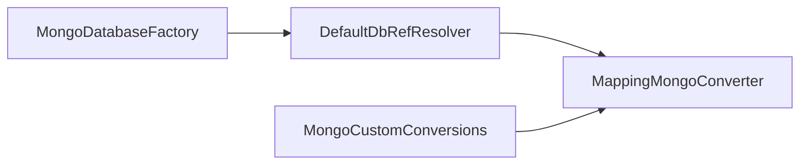
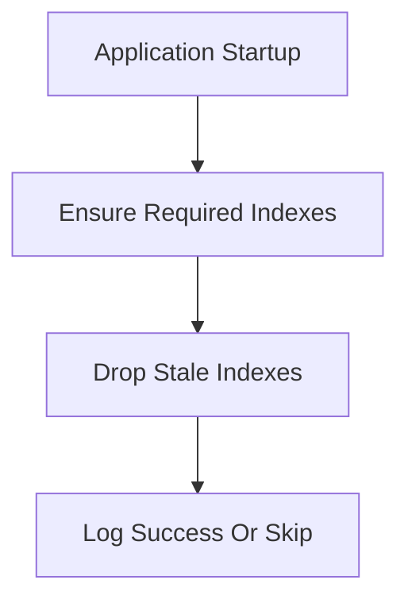
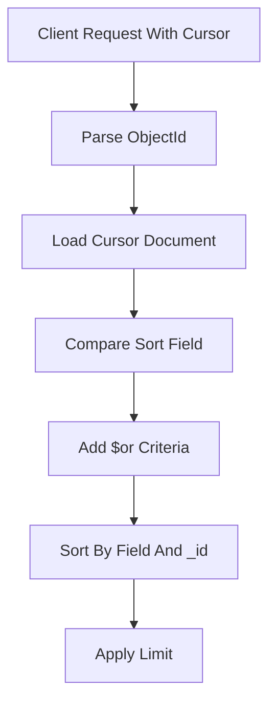
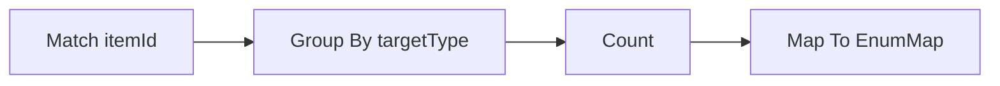
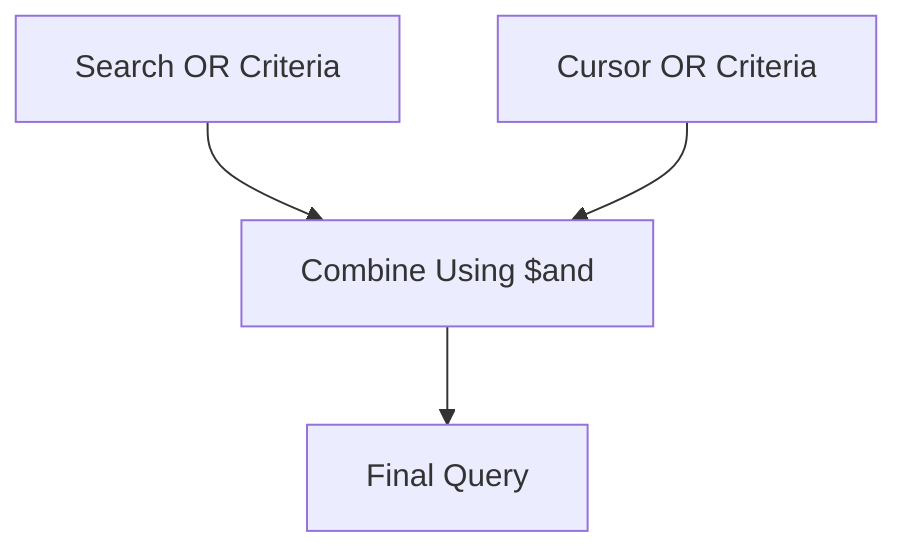
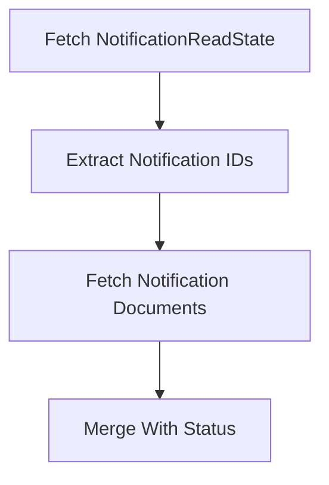
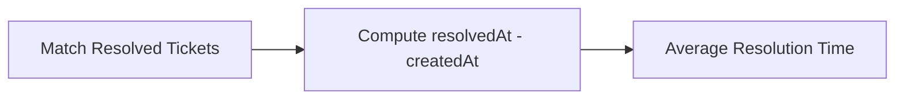
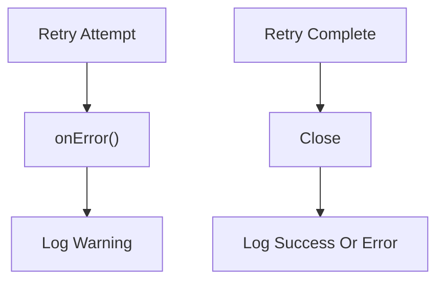

# Data Mongo Sync Config And Custom Repositories

## Overview

The **Data Mongo Sync Config And Custom Repositories** module provides the synchronous MongoDB configuration and advanced repository implementations used across the OpenFrame platform.

It is responsible for:

- Bootstrapping synchronous MongoDB repositories
- Customizing Mongo mapping and auditing behavior
- Managing indexes and legacy index cleanup
- Implementing advanced filtering, cursor-based pagination, sorting, and aggregation logic
- Providing bulk and optimized update operations
- Supporting optimistic locking retry observability

This module builds on:

- [Data Mongo Domain Model](../data-mongo-domain-model/data-mongo-domain-model.md)
- [Data Mongo Query Filters](../data-mongo-query-filters/data-mongo-query-filters.md)
- [Data Mongo Base Repositories](../data-mongo-base-repositories/data-mongo-base-repositories.md)

It acts as the **data-access execution layer** for API services, management services, and background processors.

---

## High-Level Architecture

### Key Responsibilities

| Layer | Responsibility |
|--------|----------------|
| Mongo Sync Config | Enables repositories, auditing, mapping customization |
| Mongo Index Config | Ensures required indexes, removes legacy indexes |
| Custom Repositories | Filtering, cursor pagination, aggregations, bulk updates |
| Retry Listener | Observability for optimistic locking retries |

---

# Configuration Layer

## Mongo Sync Config

**Component:** `MongoSyncConfig`

Enables synchronous Mongo repositories and configures Mongo mapping behavior.

### Features

- Conditional activation via `spring.data.mongodb.enabled`
- Enables `@EnableMongoRepositories` for `com.openframe.data.repository`
- Enables `@EnableMongoAuditing`
- Custom `MappingMongoConverter`

### Mapping Customization

Notable configuration:

- `setMapKeyDotReplacement("__dot__")`
  - Allows storing map keys containing dots (`.`) safely

This is critical for metadata-heavy documents like events and external application integrations.

---

## Mongo Index Config

**Component:** `MongoIndexConfig`

Executed at application startup via `@PostConstruct`.

### Index Responsibilities

- Ensures compound indexes on `application_events`
- Drops stale legacy indexes

### Example Indexes

- `{ userId: ASC, timestamp: DESC }`
- `{ type: ASC, metadata.tags: ASC }`

### Legacy Cleanup

The cleanup ensures:

- Schema evolution safety
- Removal of org-scoped uniqueness constraints
- Tenant-wide tag uniqueness enforcement consistency

---

# Custom Repository Implementations

This module implements advanced data-access behavior beyond standard Spring Data repositories.

Common patterns across repositories:

- Cursor-based pagination using `_id`
- Secondary sort field with `_id` tie-breaker
- Mongo `Criteria`-based dynamic filtering
- Aggregation pipelines for grouped metrics
- Distinct queries for filter options
- Bulk operations for efficiency

---

## Cursor-Based Pagination Pattern

Most repositories follow this strategy:

This ensures:

- Stable ordering
- Deterministic pagination
- No duplicates or gaps
- Proper tie-breaking when sort field values are equal

---

# Repository Categories

## 1. Assignment Repository

**Component:** `CustomItemAssignmentRepositoryImpl`

Features:

- Cursor-based pagination
- Search by display name
- Group-by aggregation per `AssignmentTargetType`

Aggregation example:

---

## 2. Machine Repository

**Component:** `CustomMachineRepositoryImpl`

Capabilities:

- Multi-field filtering (status, type, OS, organization)
- Regex-based search (hostname, IP, serial, model)
- Cursor pagination with compound sorting
- Count queries for pagination metadata

---

## 3. Event Repositories

### External Application Event Repository

**Component:** `ExternalApplicationEventRepository`

- Spring Data `MongoRepository`
- Time-range queries
- Custom `@Query` for metadata tag filtering

### Custom Event Repository

**Component:** `CustomEventRepositoryImpl`

Features:

- Date range filtering
- Distinct queries (userId, event type)
- Cursor pagination
- Search over type and data fields

---

## 4. Knowledge Base Repository

**Component:** `CustomKnowledgeBaseItemRepositoryImpl`

Advanced behaviors:

- Folder vs article separation
- Archived vs active filtering
- Combined `$or` search and cursor criteria using `$and`
- Draft visibility model

### Composite Criteria Strategy

Spring Data does not allow multiple root `$or` conditions.

Solution:

This avoids null-key collisions in the Mongo query builder.

---

## 5. Notification Repositories

### Custom Notification Repository

**Component:** `CustomNotificationRepositoryImpl`

Implements:

- Recipient-based filtering
- Read/unread filtering
- Title search
- Forward/backward pagination
- Two-phase fetch (read states first, then notifications)

### Custom Notification Read State Repository

**Component:** `CustomNotificationReadStateRepositoryImpl`

- Bulk unordered insert
- Gracefully swallows duplicate-key errors
- Improves idempotency in concurrent flows

---

## 6. Ticket Repository

**Component:** `CustomTicketRepositoryImpl`

One of the most feature-rich repositories.

Capabilities:

- Complex filtering (status, org, assignee, device)
- Created-at range filtering
- Cursor-based pagination with tie-breaker
- Aggregation metrics:
  - Count by status
  - Average resolution time
- Bulk status update
- Partial field updates (title)

### Average Resolution Time Aggregation

---

## 7. Organization Repository

**Component:** `CustomOrganizationRepositoryImpl`

Features:

- Default ACTIVE status filtering
- Contract validity evaluation
- Employee range filters
- Regex category matching
- Cursor pagination with multi-field sorting

---

## 8. Integrated Tool Repository

**Component:** `CustomIntegratedToolRepositoryImpl`

Capabilities:

- Enabled/type/category filtering
- Search over name and description
- Distinct queries for:
  - type
  - category
  - platformCategory

---

## 9. User Repository

**Component:** `CustomUserRepositoryImpl`

Focused on search:

- Status filtering
- Email regex
- Name regex (first OR last name)
- Sorted by createdAt descending

---

## 10. OAuth Token Repository

**Component:** `OAuthTokenRepository`

Simple Spring Data repository with:

- `findByAccessToken`
- `findByRefreshToken`

Used by authentication and token lifecycle management flows.

---

## 11. Ticket Attachments And Notes

- `TicketAttachmentRepository`
- `TicketNoteRepository`

Provide standard CRUD plus:

- Find by ticket ID
- Batch lookup
- Delete by ticket ID
- Sorted retrieval (notes)

---

# Retry Observability

## Optimistic Locking Retry Listener

**Component:** `OptimisticLockingRetryListener`

Provides structured logging for:

- Retry attempts
- Retry success
- Retry exhaustion

This improves:

- Visibility into concurrency conflicts
- Operational debugging
- Retry exhaustion tracing

---

# Cross-Module Relationships

The **Data Mongo Sync Config And Custom Repositories** module interacts heavily with:

- **Domain documents** from Data Mongo Domain Model
- **Query filter DTOs** from Data Mongo Query Filters
- **API Services** and **Management Services** that orchestrate business logic
- **Authorization Service** when dealing with OAuth tokens

It serves as the **core synchronous persistence engine** of the OpenFrame platform.

---

# Design Principles

1. Database-Level Filtering First
2. Deterministic Cursor Pagination
3. Safe Aggregations With Type Mapping
4. Bulk Operations For Performance
5. Graceful Handling Of Legacy Indexes
6. Idempotent Insert Strategies
7. Clear Separation Between Query Building And Execution

---

# Summary

The **Data Mongo Sync Config And Custom Repositories** module:

- Configures MongoDB for synchronous workloads
- Ensures proper indexing and schema evolution safety
- Implements advanced query logic across all major domain entities
- Provides efficient aggregation and bulk operations
- Enables stable cursor-based pagination across the platform
- Improves concurrency observability via retry listeners

It is a foundational infrastructure module that underpins all synchronous data access within the OpenFrame ecosystem.