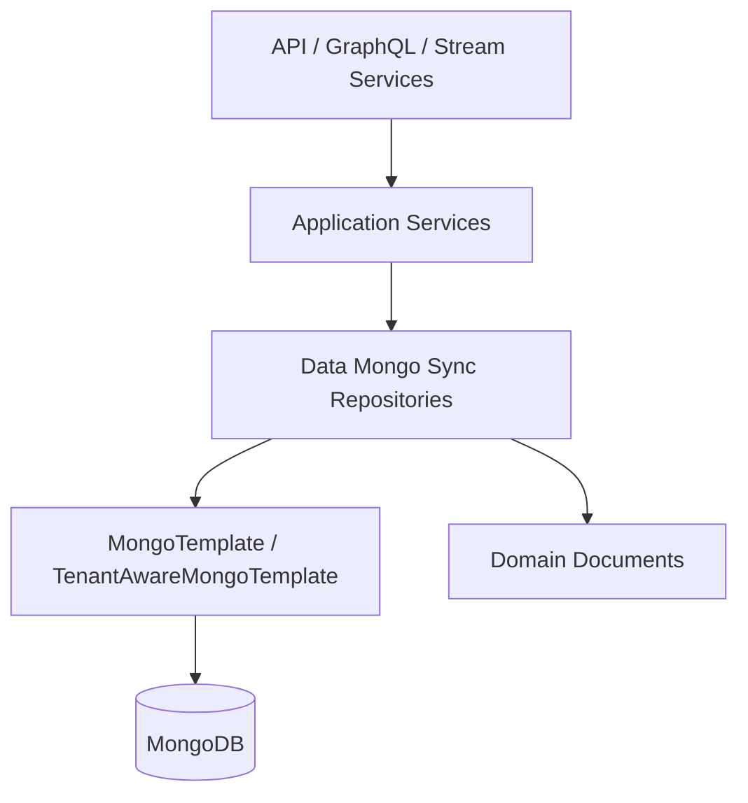
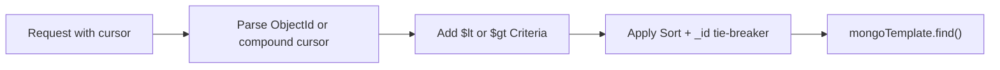
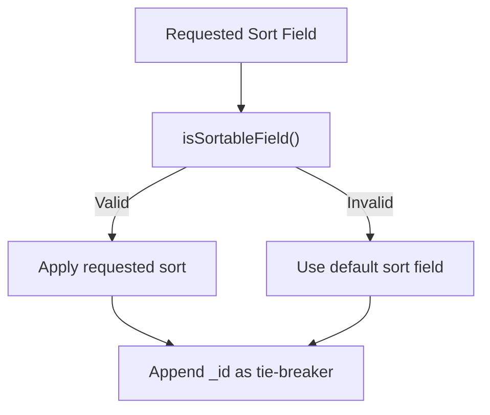
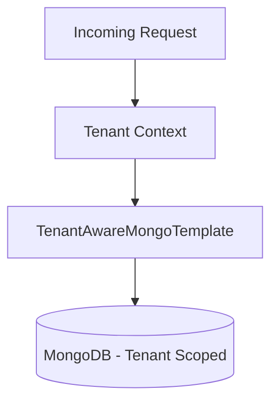

# Data Mongo Sync Repositories

## Overview

The **Data Mongo Sync Repositories** module provides custom, MongoTemplate-backed repository implementations for advanced querying, filtering, cursor-based pagination, faceting, and aggregation across the OpenFrame MongoDB domain model.

While Spring Data Mongo repositories provide basic CRUD capabilities, this module implements:

- Keyset (cursor-based) pagination
- Compound sorting with deterministic tie-breakers
- Complex filtering via domain-specific filter objects
- Aggregation pipelines for statistics and faceting
- Tenant-aware isolation (where enabled)
- Optimized query construction aligned with MongoDB index usage

This module operates directly on the domain documents defined in the sibling module:

- [Data Mongo Domain Model](../data-mongo-domain-model/data-mongo-domain-model.md)

It is consumed by higher-level modules such as API services, GraphQL data fetchers, stream processors, and external REST APIs.

---

## Architectural Role

The module sits between the service layer and MongoDB, translating rich filter objects and pagination requests into efficient Mongo queries.



### Responsibilities

- Build `Query` and `Criteria` objects from domain filter DTOs
- Implement forward and backward keyset pagination
- Enforce deterministic sort ordering using `_id` as tie-breaker
- Perform MongoDB aggregations for metrics and facet counts
- Support tenant isolation via `TenantAwareMongoTemplate`

---

## Core Design Patterns

### 1. Keyset (Cursor-Based) Pagination

Instead of offset-based pagination (`skip/limit`), repositories implement **keyset pagination** using `_id` or compound keys.

Typical pattern:

- Decode cursor into `ObjectId` (or compound value + `ObjectId`)
- Apply `$lt` or `$gt` depending on direction
- Apply stable sort with `_id` as secondary key



Benefits:

- No performance degradation at high offsets
- Stable pagination under concurrent writes
- Predictable ordering

---

### 2. Compound Keyset Pagination

Used when sorting by non-unique fields such as:

- `updatedAt`
- `repeat`
- `deviceCount`
- `createdAt`

Pattern:

```text
(sortFieldValue, _id)
```

Cursor encoding examples:

```text
updatedAtMillis_objectId
value|objectId
```

Repositories implementing compound keysets include:

- Organization (last activity)
- Script Schedule (repeat, deviceCount)
- Time Entry (dayKey + createdAt + _id)

---

### 3. Deterministic Sorting

All repositories:

- Maintain a whitelist of sortable fields
- Provide `isSortableField()` validation
- Fall back to `getDefaultSortField()` when necessary
- Append `_id` as secondary sort for stability

Example pattern:



---

### 4. Aggregation Pipelines

Several repositories use MongoDB aggregations for:

- Faceting (counts by status, shell, platform, etc.)
- Statistical summaries (averages, totals)
- Grouping by derived fields (e.g., work day)

Common aggregation stages:

- `$match`
- `$group`
- `$project`
- `$unwind`
- `$lookup`
- `$addFields`

---

### 5. Tenant Isolation

Repositories such as:

- Notification
- Ticket
- Time Entry

Extend `TenantAwareRepositorySupport` and use `TenantAwareMongoTemplate`.

This ensures:

- Automatic injection of tenant criteria
- Prevention of cross-tenant reads
- Safe lookup of cursor documents within tenant scope



---

## Repository Implementations

The module contains specialized repositories for major domain aggregates.

### Device / Machine

**CustomMachineRepositoryImpl**

Features:

- Filter via `MachineQueryFilter`
- Multi-field search (hostname, IP, serial, model)
- Keyset pagination on `_id` or arbitrary sortable fields
- Stable compound sort
- Count support

---

### Event

**CustomEventRepositoryImpl**

Features:

- Date-range filtering using `Instant`
- Type and user filtering
- Distinct user and event type retrieval
- Cursor pagination

---

### Knowledge Base

**CustomKnowledgeBaseItemRepositoryImpl**

Features:

- Folder and article separation
- Archived vs active handling
- Composite `$and` + `$or` construction
- Cursor pagination on `(updatedAt, _id)`
- Prevention of conflicting keyless criteria

---

### Organization

**CustomOrganizationRepositoryImpl**

Features:

- Complex business filters (status, category, employee range, contract validity)
- Last activity range filtering
- Compound keyset pagination on `(updatedAt, _id)`
- Default ACTIVE behavior

---

### Script Execution

**CustomScriptExecutionRepositoryImpl**

Features:

- Tenant + script scoped queries
- Status, initiator, machine filtering
- Facets:
  - Status counts
  - Initiator counts
  - Machine counts
- Cursor pagination sensitive to sort + direction

---

### Script

**CustomScriptRepositoryImpl**

Features:

- Tag-based filtering via tag assignment resolution
- Facets for:
  - Shell
  - Platform
  - Author
- Default exclusion of soft-deleted scripts

---

### Script Schedule

**CustomScriptScheduleRepositoryImpl**

Features:

- Compound keyset pagination
- Device count computed via `$lookup`
- Faceting by platform and author
- Deterministic sort with `_id` tie-breaker

---

### Ticket

**CustomTicketRepositoryImpl**

Features:

- Rich filtering (status, assignee, organization, device)
- Search across multiple fields
- Cursor pagination with compound logic
- Aggregations:
  - Count by status
  - Count by status kind
  - Average resolution time
- Bulk updates and reassignment

---

### Time Entry

**CustomTimeEntryRepositoryImpl**

Features:

- State filtering (ACTIVE vs COMPLETED)
- Composite date-group sorting
- Distinct active day aggregation
- Duration summaries
- Compound cursor on `(workDay, createdAt, _id)`

---

### Integrated Tool

**CustomIntegratedToolRepositoryImpl**

Features:

- Filter by enabled, type, category
- Distinct type/category/platform retrieval
- Sorted retrieval with tie-breaker

---

### User

**CustomUserRepositoryImpl**

Features:

- Regex-based email and name search
- Status filtering
- Limited result search with descending creation order

---

## Cross-Module Integration

This module is consumed by:

- API Service Core (REST controllers)
- API Service Core GraphQL (data fetchers)
- Stream Processing Core (event persistence and updates)
- External REST API Service

It depends directly on:

- [Data Mongo Domain Model](../data-mongo-domain-model/data-mongo-domain-model.md)

---

## Summary

The **Data Mongo Sync Repositories** module is the advanced query engine of OpenFrame’s MongoDB persistence layer.

It ensures:

- High-performance keyset pagination
- Deterministic sorting
- Safe tenant isolation
- Rich filtering semantics
- Aggregation-based analytics support
- Tight alignment with MongoDB index strategies

By centralizing complex Mongo query logic here, higher-level services remain clean, expressive, and focused on business behavior rather than persistence mechanics.
