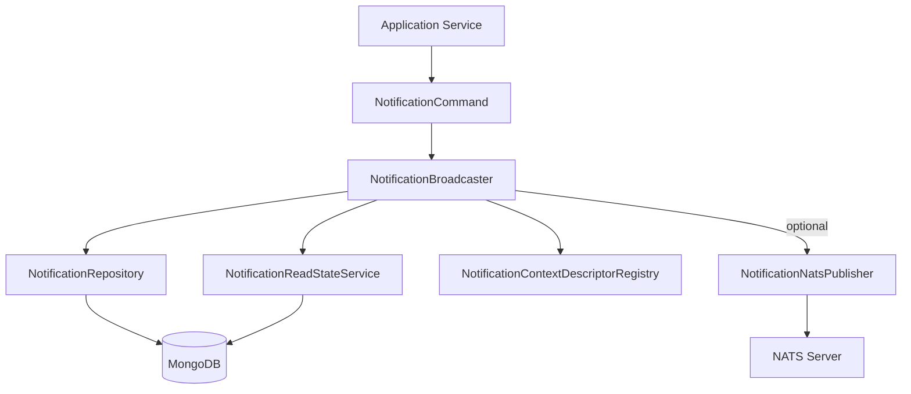
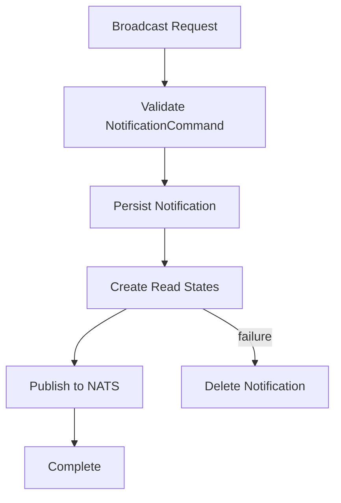
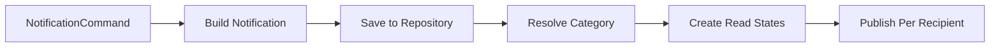
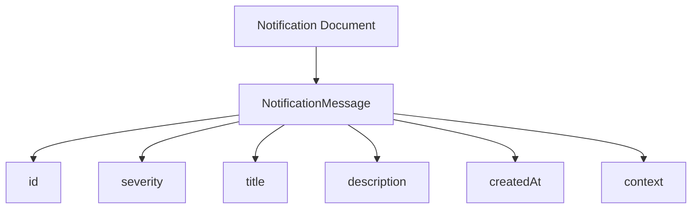
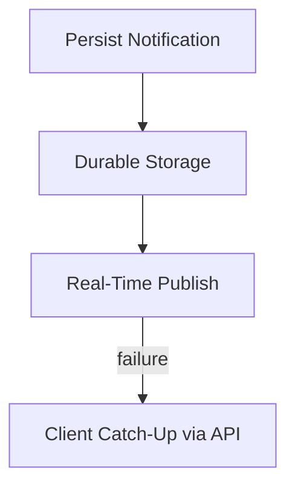
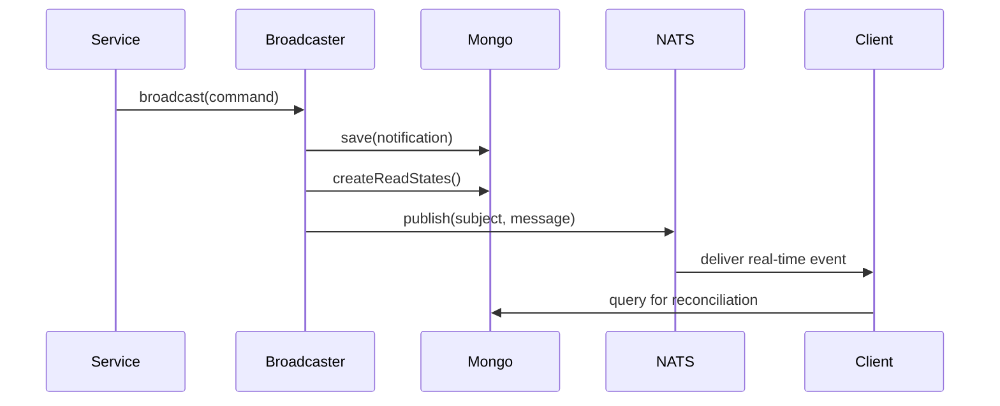

# Data Nats Notifications

## Overview

The **Data Nats Notifications** module is responsible for broadcasting real-time notifications over NATS while ensuring durable persistence in MongoDB. It acts as the bridge between:

- The persistent notification domain model (Mongo documents)
- The read-state tracking subsystem
- The NATS messaging infrastructure
- Downstream consumers such as WebSocket gateways, clients, and machine agents

This module guarantees that:

- Notifications are **persisted first** (source of truth).
- Read states are created for each recipient.
- Real-time delivery over NATS is **best-effort and non-blocking**.
- Clients can reconcile missed events via GraphQL or REST catch-up.

It is feature-flagged and can operate in persistence-only mode when NATS is disabled.

---

## Core Responsibilities

The Data Nats Notifications module provides:

1. ✅ Command validation and audience sanitation
2. ✅ Durable notification persistence
3. ✅ Read-state creation for users and machines
4. ✅ NATS subject-based publishing
5. ✅ Safe failure handling with rollback protection
6. ✅ Graceful degradation when NATS is unavailable

---

## High-Level Architecture



### Key Design Principle

**Persistence is the source of truth.**

NATS delivery is best-effort. If publishing fails, the notification remains persisted and recipients reconcile via API queries.

---

## Notification Lifecycle



### Transactional Strategy

- If **read-state creation fails**, the notification document is deleted.
- If **NATS publish fails**, no rollback occurs.
- Recipients catch up using stored notifications.

---

# Core Components

## 1. NotificationCommand

Immutable command object representing a validated broadcast request.

### Responsibilities

- Enforces required fields:
  - `title`
  - `severity`
  - `context`
- Ensures `context.type` is non-blank
- Sanitizes and validates:
  - `adminAudience`
  - `machineAudience`
- Requires at least one non-empty audience
- Produces immutable recipient sets

### Validation Rules

```text
- title must not be blank
- severity must not be null
- context must not be null
- context.type must not be blank
- at least one audience must be non-empty
- no blank entries in audience sets
```

This prevents invalid broadcasts from reaching persistence or NATS.

---

## 2. NotificationBroadcaster

The orchestration service of the module.

### Dependencies

- `NotificationRepository`
- `NotificationReadStateService`
- `NotificationContextDescriptorRegistry`
- Optional `NotificationNatsPublisher`

### Feature Flag

```text
openframe.features.notifications.enabled=false
```

If disabled:
- No persistence
- No read states
- No NATS publish
- Broadcast returns `null`

---

### Broadcast Flow



### Read-State Creation

Recipients are separated by type:

- `RecipientType.USER`
- `RecipientType.MACHINE`

The category is derived from:

- `NotificationContextDescriptorRegistry`

If read-state creation throws an exception:

1. The persisted notification is deleted.
2. The exception is rethrown.
3. Caller must retry.

---

### NATS Publishing Strategy

Publishing is performed per-recipient:

- Each admin user → `user.{userId}.notification`
- Each machine → `machine.{machineId}.notification`

Failures are handled individually:

- Logged as warnings
- No rollback
- Recipient reconciles via API

---

## 3. NotificationNatsPublisher

Encapsulates subject generation and NATS publishing.

### Conditional Activation

```text
@ConditionalOnProperty("spring.cloud.stream.enabled")
```

If Spring Cloud Stream is disabled:
- Publisher bean is not created
- Broadcaster logs persistence-only mode

---

### Subject Templates

```text
user.{userId}.notification
machine.{machineId}.notification
```

### Publish Safety Rules

- `userId` and `machineId` must not be blank
- Notification must be persisted (must have `id`)
- `NatsException` is caught and logged
- No exception propagates to caller

---

### Message Construction

The domain `Notification` document is mapped to a lightweight transport model:



Only fields required by clients are included.

---

## 4. NotificationMessage

Transport DTO published to NATS.

### Fields

```text
id          : String
severity    : NotificationSeverity
title       : String
description : String
createdAt   : Instant
context     : NotificationContext
```

Designed to:

- Be serialization-friendly
- Avoid heavy domain coupling
- Provide enough context for real-time rendering

---

# Reliability Model

The module intentionally separates:

- **Storage reliability** (strong)
- **Delivery reliability** (eventual)



### Guarantees

| Concern | Guarantee |
|----------|-----------|
| Persistence | Strong (Mongo) |
| Read State | Strong (created before publish) |
| NATS Delivery | Best effort |
| Consistency | Eventual for clients |

---

# Integration with the Platform

Although self-contained, this module integrates with:

- Mongo notification domain model
- Notification read-state services
- NATS infrastructure
- GraphQL notification queries
- Gateway WebSocket or client subscribers

### Typical End-to-End Flow



---

# Design Principles

## 1. Fail-Safe Persistence

No notification is published without being persisted.

## 2. Controlled Rollback

Only read-state failures trigger deletion.

## 3. Optional Real-Time Layer

System works fully without NATS.

## 4. Recipient Isolation

Failures per-recipient do not block others.

## 5. Immutable Command Pattern

Validation happens before orchestration.

---

# Configuration Summary

```text
openframe.features.notifications.enabled
spring.cloud.stream.enabled
```

| Property | Purpose |
|----------|----------|
| openframe.features.notifications.enabled | Master feature flag |
| spring.cloud.stream.enabled | Enables NATS publisher bean |

---

# Conclusion

The **Data Nats Notifications** module provides a robust, fault-tolerant notification broadcasting mechanism built on:

- Strong persistence guarantees
- Read-state tracking
- Optional real-time messaging via NATS
- Safe error handling and graceful degradation

It ensures that OpenFrame can deliver reliable notifications to both administrators and machine agents while maintaining consistency and operational safety across distributed services.