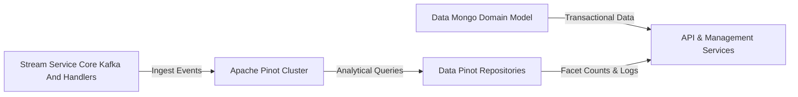
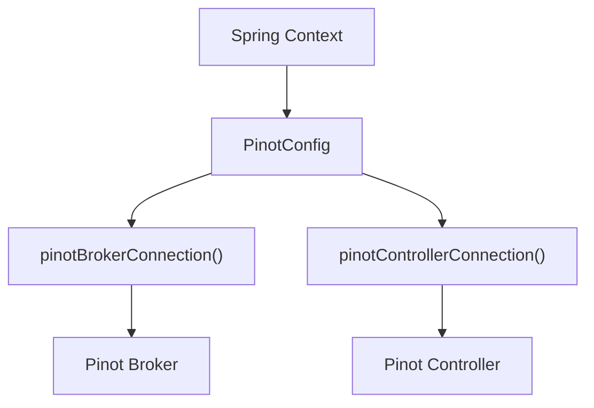
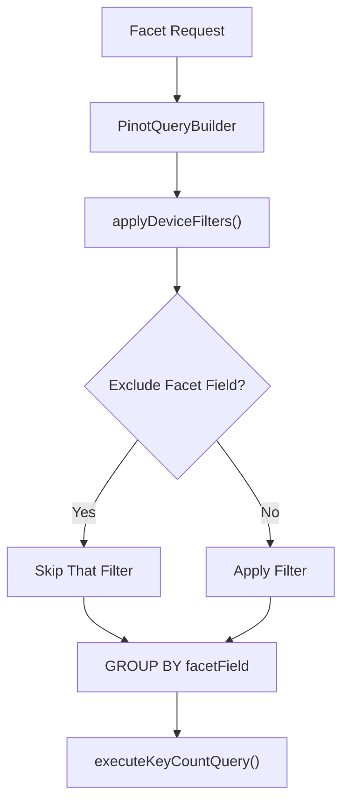
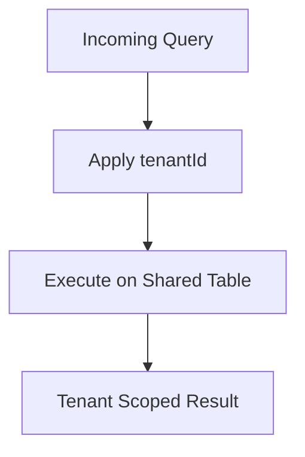
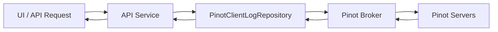

# Data Pinot Repositories

## Overview

The **Data Pinot Repositories** module provides analytical data access capabilities using **Apache Pinot** for high-performance, real-time OLAP queries. While transactional and operational data is stored in MongoDB, this module is responsible for:

- Real-time log analytics
- Device-level aggregations and facet queries
- High-volume, time-series filtering
- Efficient count and distinct queries for UI filters

It acts as the **analytics read layer** of the OpenFrame platform, optimized for dashboards, filters, and log exploration workloads.

---

## Architectural Role in the Platform

The platform follows a polyglot persistence architecture:

- **MongoDB** → transactional and domain persistence
- **Kafka / Stream Service** → event ingestion and enrichment
- **Apache Pinot** → analytical querying and aggregations

The Data Pinot Repositories module sits on top of Pinot and exposes structured repository abstractions used by API and management services.

### Upstream Dependencies

- Event ingestion from **Stream Service Core Kafka And Handlers**
- Pinot cluster availability and schema configuration

### Downstream Consumers

- API Service (GraphQL and REST)
- External API Service
- Management Service (resync operations)

---

## Core Components

The module contains the following core components:

| Component | Responsibility |
|------------|----------------|
| `PinotConfig` | Configures Pinot broker and controller connections |
| `PinotEventEntity` | Domain marker for Pinot-backed event projections |
| `PinotClientDeviceRepository` | Device analytics and facet queries |
| `PinotClientLogRepository` | Log search, filtering, and projection queries |

---

## Configuration Layer

### PinotConfig

`PinotConfig` provides Spring-managed `Connection` beans for interacting with Pinot:

- **Broker Connection** → Used for query execution
- **Controller Connection** → Used for cluster/controller operations

Configuration properties:

- `pinot.broker.url`
- `pinot.controller.url`
- `pinot.tables.devices.name`
- `pinot.tables.logs.name`

The broker connection is injected into repository implementations using `@Qualifier("pinotBrokerConnection")`.

---

## Device Analytics Repository

### PinotClientDeviceRepository

The **PinotClientDeviceRepository** provides analytical queries over the `devices` Pinot table.

It supports:

- Faceted filter queries
- Aggregated device counts
- Multi-dimensional filtering
- Tag-based filtering

### Supported Filters

- Status (excluding `DELETED`)
- Device type
- OS type
- Organization
- Tags
- Tag key-value pairs

### Facet Query Pattern

Facet queries dynamically exclude the field being aggregated to ensure correct filter option computation.

### Key Behaviors

1. Always excludes devices with status `DELETED`.
2. Dynamically removes the active facet field from filters.
3. Returns `Map<String, Integer>` for UI-ready filter counts.
4. Uses count queries for total filtered device count.

This repository is optimized for dashboard filters and device inventory analytics.

---

## Log Analytics Repository

### PinotClientLogRepository

The **PinotClientLogRepository** supports time-series log exploration and advanced filtering.

### Capabilities

- Date range filtering
- Cursor-based pagination
- Relevance search
- Sortable column validation
- Distinct filter options
- Organization option projections

### Query Construction Flow

```mermaid
flowchart LR
    Request["Log Query Request"] --> Builder["PinotQueryBuilder"]
    Builder --> DateRange["whereDateRange()"]
    DateRange --> Filters["whereIn() / whereEquals()"]
    Filters --> Search["whereRelevanceLogSearch()"]
    Search --> Cursor["whereCursor()"]
    Cursor --> Sorting["orderBySortInput()"]
    Sorting --> Limit["limit()"]
    Limit --> Execute["executeLogQuery()"]
```

### Sorting Controls

The repository enforces a whitelist of sortable columns:

- `eventTimestamp`
- `severity`
- `eventType`
- `toolType`
- `organizationId`
- `deviceId`
- `ingestDay`

If a field is not sortable:

- It falls back to `eventTimestamp`.

This protects against invalid or unsafe query construction.

### Projection Mapping

Results are mapped into `LogProjection` objects using column index mapping derived from Pinot result sets.

Important fields include:

- `toolEventId`
- `eventTimestamp`
- `toolType`
- `eventType`
- `severity`
- `organizationId`
- `summary`

The `eventTimestamp` is converted from epoch milliseconds to `Instant`.

---

## Multi-Tenant Isolation

All queries are built using a `tenantId` parameter via `PinotQueryBuilder`.

This ensures:

- Logical data isolation
- Tenant-safe aggregations
- Secure filtering across shared Pinot tables

---

## Interaction with Other Modules

### Stream Ingestion

Events are ingested via Kafka and enriched by the stream layer before being indexed into Pinot.

See:

- [Stream Service Core Kafka And Handlers](../stream-service-core-kafka-and-handlers.md)

### Device Pinot Resynchronization

Management workflows may trigger re-synchronization of device data into Pinot.

See:

- [Management Service Core Initializers And Schedulers](../management-service-core-initializers-and-schedulers.md)

### API Layer Consumption

The API layer consumes Pinot repositories to provide:

- Filter option endpoints
- Log search endpoints
- Aggregated dashboard counts

---

## Design Principles

### 1. Separation of Concerns

- MongoDB → transactional storage
- Pinot → analytical read queries

### 2. Query Builder Abstraction

All query logic flows through a `PinotQueryBuilder`, ensuring:

- Safe dynamic query construction
- Consistent filter application
- Centralized cursor logic

### 3. Facet-First Design

Repositories are optimized for UI filter experiences:

- Count per facet value
- Distinct option lists
- Filter exclusion logic

### 4. Performance-Oriented

- Aggregations pushed to Pinot
- Minimal application-side computation
- Projection-based mapping

---

## End-to-End Log Analytics Flow

---

## Summary

The **Data Pinot Repositories** module provides the analytical backbone of the OpenFrame platform.

It enables:

- Real-time log exploration
- High-performance device filtering
- Multi-dimensional facet queries
- Secure tenant-scoped analytics

By leveraging Apache Pinot, it ensures scalable, low-latency query execution for dashboard and filtering workloads while keeping transactional systems isolated in MongoDB.