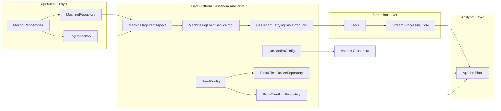
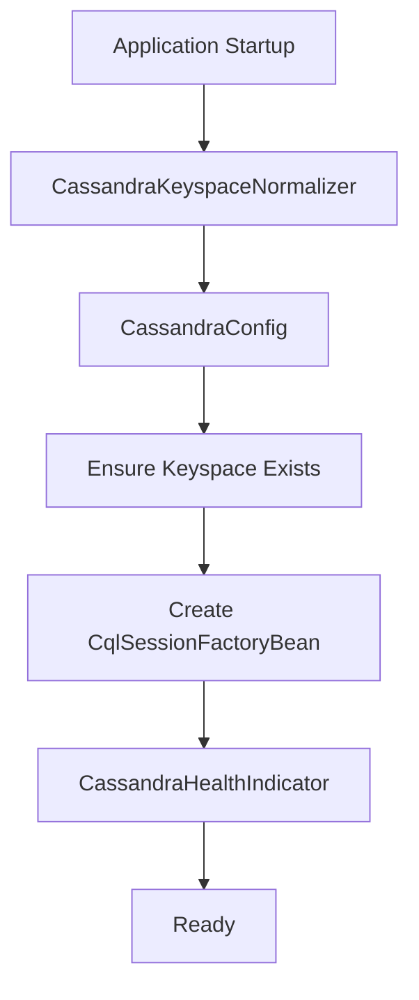
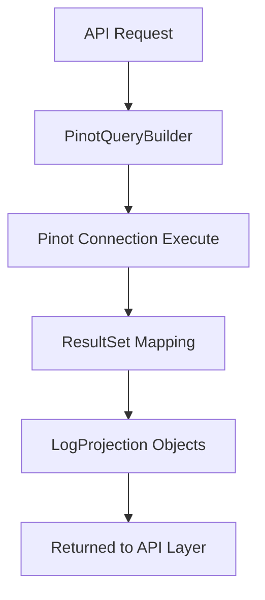
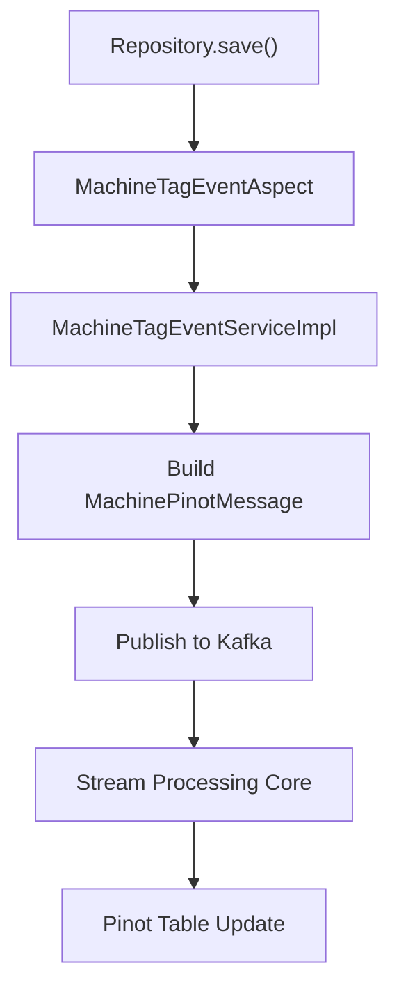
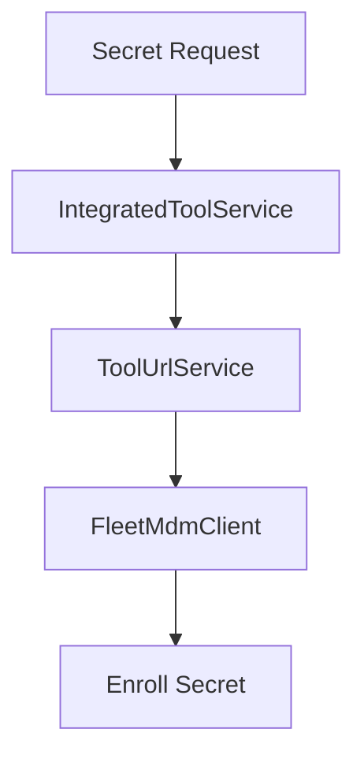
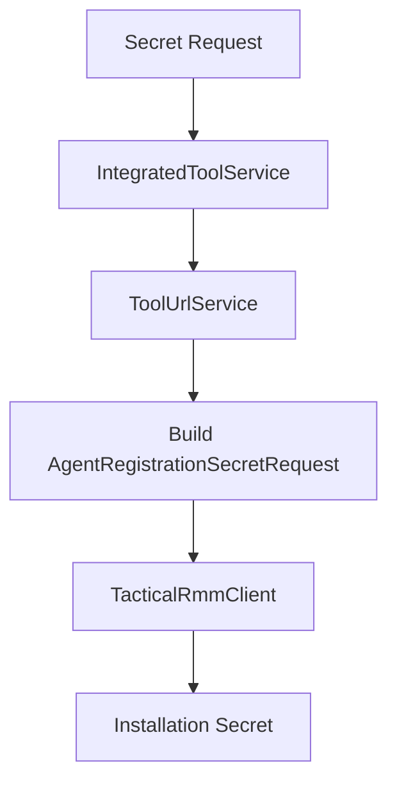

# Data Platform Cassandra And Pinot

## Overview

The **Data Platform Cassandra And Pinot** module provides the analytical and distributed data foundation for OpenFrame. It integrates:

- **Apache Cassandra** for distributed, high-availability operational storage
- **Apache Pinot** for real-time analytics and low-latency OLAP queries
- **Kafka-based event propagation** for machine and tag updates
- **Aspect-driven domain event publishing** for device and tag changes
- **Integration secret retrieval** for external tools such as Fleet MDM and Tactical RMM

This module acts as the bridge between:

- The operational data layer (MongoDB and domain repositories)
- The streaming layer (Kafka and stream-processing-core)
- The analytics layer (Pinot)
- Infrastructure orchestration (management-service-core)

It is a core part of the data ingestion and analytics pipeline powering device, tag, and log insights.

---

## High-Level Architecture



---

## Core Responsibilities

### 1. Cassandra Configuration and Lifecycle

**Key components:**
- `CassandraConfig`
- `CassandraKeyspaceNormalizer`
- `DataConfiguration.CassandraConfiguration`
- `CassandraHealthIndicator`

#### Responsibilities

- Dynamically configure Cassandra session
- Automatically create keyspace if not present
- Normalize keyspace names (replace dashes with underscores)
- Provide Spring Data Cassandra repository support
- Expose health checks via Actuator

### Cassandra Initialization Flow



#### Keyspace Normalization

Cassandra does not allow dashes in keyspace names. The `CassandraKeyspaceNormalizer` ensures:

```text
TENANT-ID  →  TENANT_ID
```

This allows tenant IDs to contain dashes in configuration while remaining Cassandra-compliant.

---

### 2. Pinot Analytics Integration

**Key components:**
- `PinotConfig`
- `PinotClientDeviceRepository`
- `PinotClientLogRepository`
- `PinotEventEntity`

This module enables low-latency analytical queries over:

- Devices
- Logs
- Filter options (status, type, organization, tags)
- Search and cursor-based pagination

#### Pinot Configuration

`PinotConfig` provides two connections:

- Broker connection (for querying)
- Controller connection (for table management)

#### Device Analytics Repository

`PinotClientDeviceRepository` provides:

- Dynamic filter option aggregation
- Device counts under multi-dimensional filters
- Exclusion-aware filter generation
- Deleted device filtering

Example query pattern generated internally:

```text
SELECT status, COUNT(*)
FROM "devices"
WHERE status != 'DELETED'
GROUP BY status
ORDER BY count DESC
```

#### Log Analytics Repository

`PinotClientLogRepository` supports:

- Date range filtering
- Cursor-based pagination
- Multi-field sorting
- Relevance search
- Distinct filter value extraction

### Log Query Flow



---

### 3. Machine and Tag Event Propagation

**Key components:**
- `MachineTagEventAspect`
- `MachineTagEventServiceImpl`

This subsystem ensures that changes in operational data are propagated to the analytics layer via Kafka.

#### Why Aspect-Based?

Instead of embedding Kafka publishing in repositories, the module uses AOP:

- Intercepts `save()` and `saveAll()` on:
  - Machine
  - MachineTag
  - Tag
- Delegates to a service for business logic
- Publishes normalized analytics events

### Event Propagation Flow



#### MachinePinotMessage Enrichment

When a machine changes:

1. Fetch all tags for machine
2. Reconstruct full tag state
3. Build normalized message
4. Publish using tenant-aware Kafka producer

This guarantees that Pinot always receives complete device state snapshots.

---

### 4. NATS Event Models

**Key components:**
- `ClientConnectionEvent`
- `InstalledAgentMessage`
- `ToolConnectionMessage`

These models represent integration-layer events and are used for:

- Client connection state
- Agent installation tracking
- Tool-agent linking

They serve as message contracts for messaging layers interacting with this module.

---

### 5. Tool Integration and Secret Retrieval

**Key components:**
- `FleetMdmAgentRegistrationSecretRetriever`
- `TacticalRmmAgentRegistrationSecretRetriever`
- `IntegratedToolTypes`
- `ToolCredentials`

This module supports retrieving agent enrollment secrets dynamically from external systems.

#### Fleet MDM Flow



#### Tactical RMM Flow



These retrievers are conditionally enabled and integrate with the broader integration layer.

---

## Conditional Configuration Strategy

Many components are conditionally activated:

| Property | Effect |
|----------|--------|
| `spring.data.cassandra.enabled` | Enables Cassandra repositories |
| `openframe.device.aspect.enabled` | Enables event aspect publishing |
| `openframe.integration.tool.enabled` | Enables tool secret retrievers |

This allows flexible deployment patterns:

- Analytics-only mode
- Cassandra-enabled mode
- Full event-streaming mode

---

## Integration with Other Modules

The Data Platform Cassandra And Pinot module integrates with:

- **data-mongo-domain-and-repos** for operational documents
- **data-kafka-foundation** for Kafka producers
- **stream-processing-core** for ingestion and enrichment
- **management-service-core** for Pinot initialization
- **integrations-sdks** for external tool API clients

It does not duplicate domain logic but acts as:

- A data transport layer
- A query optimization layer
- An analytics projection layer

---

## Deployment Considerations

### Cassandra

Required configuration:

```yaml
spring:
  data:
    cassandra:
      enabled: true
      contact-points: cassandra
      port: 9042
      local-datacenter: datacenter1
      keyspace-name: tenant_keyspace
```

### Pinot

```yaml
pinot:
  broker:
    url: pinot-broker:8099
  controller:
    url: pinot-controller:9000
```

---

## Summary

The **Data Platform Cassandra And Pinot** module provides:

- Distributed storage bootstrap via Cassandra
- Real-time analytics queries via Pinot
- Aspect-driven event propagation for device/tag changes
- Kafka publishing of normalized device snapshots
- External tool secret retrieval support
- Health monitoring and conditional activation

It is a critical component in OpenFrame’s data and analytics pipeline, ensuring operational data is transformed into queryable, low-latency analytical projections suitable for dashboards, filtering, and observability workloads.
