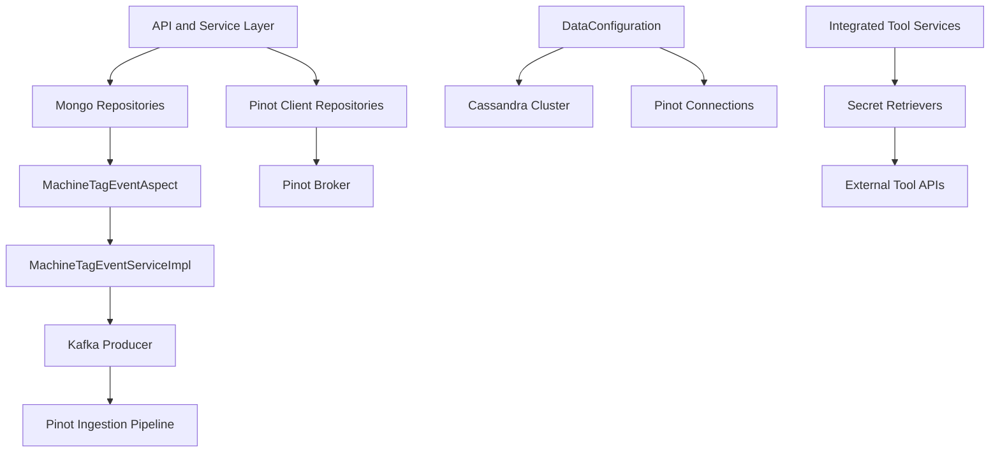
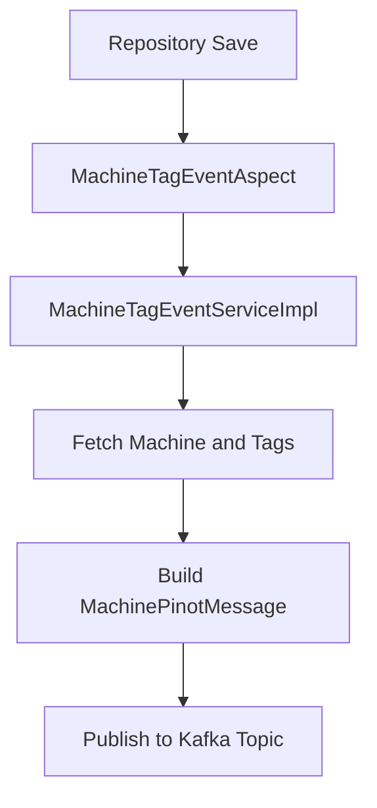
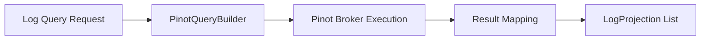
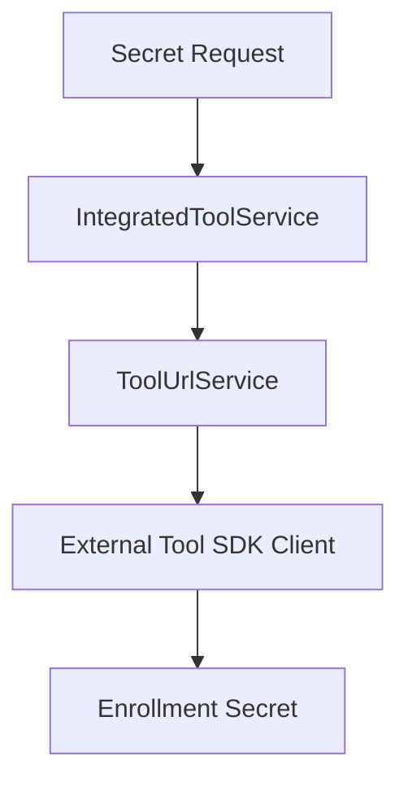
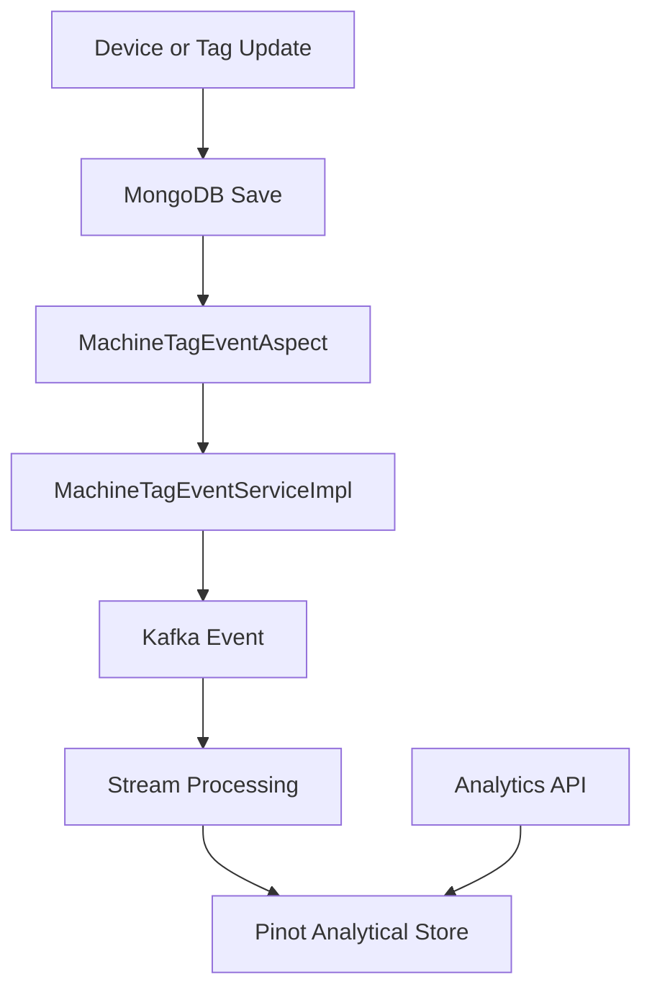

# Data Platform Core

## Overview

The **Data Platform Core** module is the foundational data orchestration layer of the OpenFrame platform. It integrates analytical storage (Apache Pinot), operational storage (Cassandra), event propagation (Kafka), tool SDK integrations, and cross-cutting concerns such as repository event interception.

This module acts as the bridge between:

- Persistent data layers (MongoDB, Cassandra)
- Analytical query engines (Pinot)
- Streaming infrastructure (Kafka)
- External integrated tools (Fleet MDM, Tactical RMM)
- Higher-level API and service modules

It ensures that data mutations, analytical queries, and tool integrations remain consistent, observable, and scalable.

---

## High-Level Architecture



### Responsibilities

The Data Platform Core module is responsible for:

1. Configuring data infrastructure (Cassandra, Pinot, tool SDKs)
2. Intercepting repository events and publishing Kafka messages
3. Providing optimized analytical queries via Pinot
4. Managing tool integration secrets dynamically
5. Providing health checks and configuration observability

---

# Core Functional Areas

## 1. Repository Event Interception and Kafka Propagation

### MachineTagEventAspect

`MachineTagEventAspect` is an AOP component that intercepts:

- `MachineRepository.save(...)`
- `MachineRepository.saveAll(...)`
- `MachineTagRepository.save(...)`
- `MachineTagRepository.saveAll(...)`
- `TagRepository.save(...)`
- `TagRepository.saveAll(...)`

It delegates business logic to `MachineTagEventService`.

### MachineTagEventServiceImpl

This service:

- Fetches related entities (Machine, Tags, MachineTag)
- Builds a `MachinePinotMessage`
- Publishes the message via `OssTenantRetryingKafkaProducer`



### Why This Matters

This design ensures:

- Strong decoupling between persistence and streaming
- Automatic propagation of device/tag updates
- Real-time synchronization of analytical indexes (Pinot)
- Multi-tenant safe publishing via tenant-aware Kafka producer

---

## 2. Apache Pinot Analytical Layer

The module provides direct Pinot integration for analytics queries.

### PinotConfig

Creates:

- Broker connection
- Controller connection

These are injected into Pinot repository classes.

### PinotClientDeviceRepository

Provides:

- Filter option aggregation (status, deviceType, osType, organizationId, tags)
- Filtered device counts
- Dynamic WHERE clause generation

Example query structure:

```text
SELECT status, COUNT(*)
FROM devices
WHERE status != 'DELETED'
GROUP BY status
ORDER BY count DESC
```

### PinotClientLogRepository

Provides:

- Log filtering by date, tool type, severity, organization
- Full-text log search
- Cursor-based pagination
- Sort validation and enforcement
- Distinct filter options



### Key Characteristics

- Optimized for analytical workloads
- Strong validation of sortable fields
- Supports cursor-based pagination
- Prevents deleted device inclusion

---

## 3. Cassandra Configuration and Health

### CassandraConfig

Extends `AbstractCassandraConfiguration` and:

- Ensures keyspace exists before connection
- Configures load balancing
- Sets schema action to CREATE_IF_NOT_EXISTS
- Configures timestamp generator

### CassandraKeyspaceNormalizer

Normalizes keyspace names by replacing dashes with underscores.

This ensures compatibility with Cassandra naming rules while allowing flexible tenant identifiers.

### CassandraHealthIndicator

Provides Actuator-based health checks by executing:

```text
SELECT release_version FROM system.local
```

If the query succeeds → Health is UP.
If it fails → Health is DOWN.

---

## 4. Tool Integration and Secret Retrieval

The Data Platform Core module integrates with external tools.

### ToolSdkConfig

Provides SDK client beans such as:

- TacticalRmmClient

### Secret Retrievers

- FleetMdmAgentRegistrationSecretRetriever
- TacticalRmmAgentRegistrationSecretRetriever

These components:

1. Retrieve tool configuration via `IntegratedToolService`
2. Resolve API URL via `ToolUrlService`
3. Extract credentials
4. Call external SDK to retrieve registration secrets



### Design Benefits

- Secrets are not hardcoded
- Dynamic tool configuration
- Supports multi-tool extensibility
- Conditional activation via configuration properties

---

## 5. Data Models

### IntegratedToolTypes

Defines supported tool identifiers including:

- Infrastructure tools (MongoDB, Redis, Cassandra, Kafka, Pinot)
- Integrated tools (Fleet, Authentik, MySQL, PostgreSQL)

### ToolCredentials

Encapsulates multiple credential types:

- Username/password
- Token
- API key
- Client ID / Client Secret

### NATS Message Models

Includes:

- ClientConnectionEvent
- InstalledAgentMessage
- ToolConnectionMessage

These represent real-time messaging contracts used across the platform.

---

## 6. Configuration Observability

### ConfigurationLogger

On application startup, logs:

- MongoDB URI
- Cassandra contact points
- Redis host
- Pinot controller and broker URLs

This improves deployment transparency and troubleshooting.

---

# Runtime Data Flow



---

# Conditional Configuration

Several components are conditionally enabled:

- Cassandra components: `spring.data.cassandra.enabled=true`
- Tool integration: `openframe.integration.tool.enabled=true`
- Device aspect: `openframe.device.aspect.enabled=true`

This makes the Data Platform Core adaptable to different deployment profiles.

---

# Design Principles

The Data Platform Core follows these architectural principles:

1. Event-driven propagation for consistency
2. Analytical separation between operational and query workloads
3. Multi-tenant safe infrastructure integration
4. Pluggable tool integrations
5. Conditional auto-configuration
6. Observability-first configuration logging

---

# Summary

The **Data Platform Core** module is the backbone of data orchestration within OpenFrame. It:

- Synchronizes operational data with analytical systems
- Enables advanced filtering and search via Pinot
- Propagates changes using Kafka
- Integrates external infrastructure tools dynamically
- Ensures environment health and configuration transparency

It provides the scalable, event-driven data foundation required for modern AI-powered MSP operations.