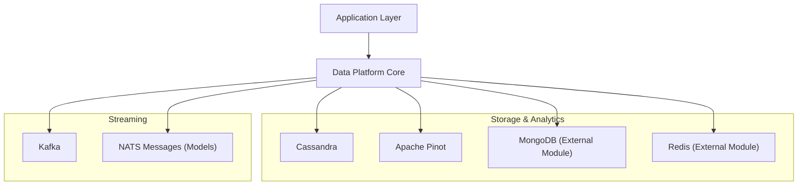
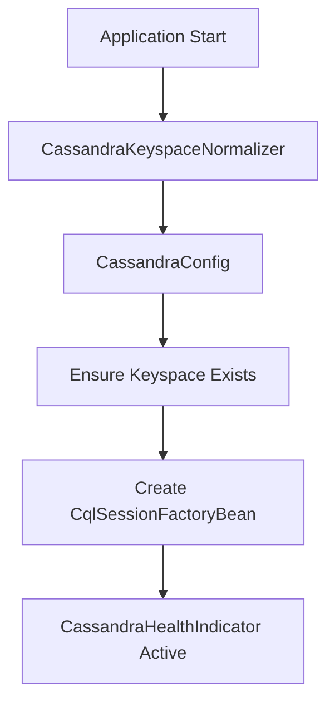
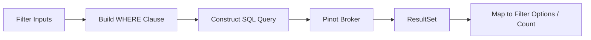
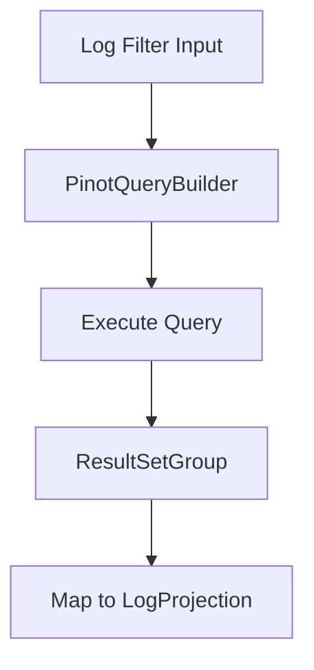
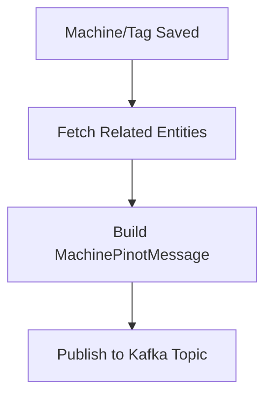
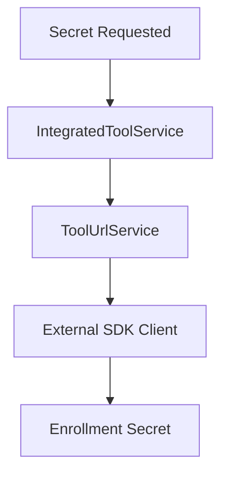
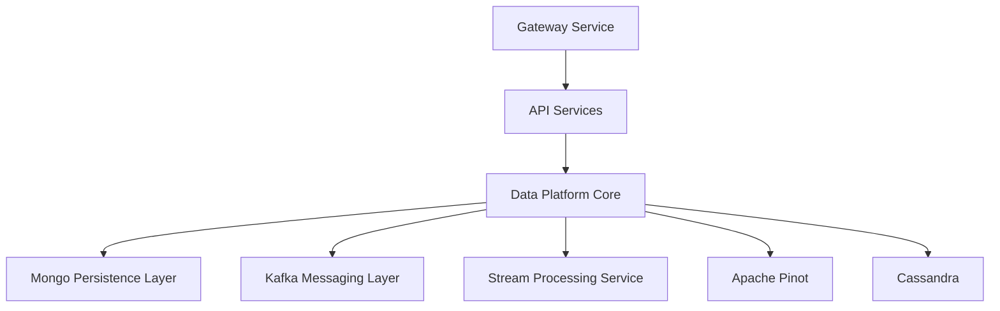

# Data Platform Core

The **Data Platform Core** module provides the foundational data infrastructure for the OpenFrame ecosystem. It encapsulates configuration, connectivity, health monitoring, event modeling, analytical repositories, and integration-specific services that enable the rest of the platform to persist, query, enrich, and stream data reliably.

This module acts as the central abstraction layer between:

- Operational data stores (MongoDB via a separate persistence module)
- Analytical data stores (Cassandra and Apache Pinot)
- Streaming infrastructure (Kafka)
- External integrated tools (Fleet MDM, Tactical RMM, etc.)

It is designed to be multi-tenant aware, cloud-ready, and analytics-first.

---

## Architectural Overview

At a high level, the Data Platform Core coordinates configuration, repositories, models, and event services.



### Responsibilities

The Data Platform Core module provides:

1. **Database Configuration & Bootstrapping** (Cassandra, Pinot)
2. **Health Monitoring** (Cassandra health indicator)
3. **Analytical Query Repositories** (Pinot repositories)
4. **Event-to-Stream Publishing** (Kafka publishing for device/tag changes)
5. **Integration Secret Retrieval** (Fleet MDM, Tactical RMM)
6. **Shared Domain Models & Tool Types**

---

# Configuration Layer

The configuration layer initializes and validates connections to analytical infrastructure.

## Cassandra Configuration

Key components:

- `CassandraConfig`
- `CassandraKeyspaceNormalizer`
- `DataConfiguration`
- `CassandraHealthIndicator`

### Key Features

- Conditional enablement via `spring.data.cassandra.enabled`
- Automatic keyspace creation (`CREATE_IF_NOT_EXISTS`)
- Replication factor configuration
- Load balancing configuration using local datacenter
- Server-side timestamp generation
- Health check via `system.local`

### Startup Flow



#### CassandraKeyspaceNormalizer

Cassandra keyspaces cannot contain dashes. This initializer:

- Reads `spring.data.cassandra.keyspace-name`
- Replaces `-` with `_`
- Injects normalized value into the environment

This enables tenant IDs with dashes while maintaining Cassandra compatibility.

---

## Pinot Configuration

Key component:

- `PinotConfig`

Two connections are created:

- Broker connection (`pinotBrokerConnection`) for query execution
- Controller connection (`pinotControllerConnection`) for administrative interactions

Configured via:

- `pinot.broker.url`
- `pinot.controller.url`

---

## Configuration Logging

`ConfigurationLogger` logs active infrastructure endpoints at application readiness:

- MongoDB URI
- Cassandra contact points
- Redis host
- Pinot controller & broker URLs

This improves observability and deployment diagnostics.

---

# Domain Models & Tool Types

## IntegratedToolTypes

Defines canonical constants for infrastructure and integrated tools, such as:

- `MONGODB`
- `CASSANDRA`
- `KAFKA`
- `PINOT`
- `FLEET`
- `AUTHENTIK`
- `POSTGRESQL`

This centralizes tool identification across modules.

## ToolCredentials

Encapsulates credential types:

- Username / Password
- Token
- API Key
- Client ID / Secret

Used by integration services to authenticate against external systems.

---

# Analytical Repositories (Pinot)

The module provides analytical query repositories backed by Apache Pinot.

## PinotClientDeviceRepository

Responsibilities:

- Filter option aggregation (status, device type, OS type, organization, tags)
- Filtered device counts
- Dynamic WHERE clause construction
- Exclusion-aware filter building

### Query Pattern



Key design features:

- Excludes `DELETED` device status
- Dynamically builds OR/AND conditions
- Groups results by attribute
- Returns counts for UI filter rendering

---

## PinotClientLogRepository

Responsibilities:

- Log retrieval with cursor pagination
- Full-text search support
- Dynamic sorting validation
- Distinct option queries (event type, severity, tool type)
- Organization option resolution

### Log Query Flow



Notable safeguards:

- Sort field validation via `SORTABLE_COLUMNS`
- Default fallback sort column
- Cursor-based pagination
- Date range filtering

This repository powers audit views, log dashboards, and search features.

---

# Event Publishing & Streaming Integration

## MachineTagEventServiceImpl

This service reacts to entity persistence events and publishes enriched machine data to Kafka.

### Triggered On

- Machine save
- MachineTag save
- Tag save

### Processing Flow



### Key Features

- Deduplicates machine IDs for batch operations
- Enriches machine message with all tags
- Uses `OssTenantRetryingKafkaProducer`
- Publishes to tenant-scoped topic

This enables:

- Near real-time device analytics
- Downstream stream processing
- Pinot materialization via Kafka pipelines

---

# NATS Event Models

The module defines message payload models for NATS-based communication:

- `ClientConnectionEvent`
- `InstalledAgentMessage`
- `ToolConnectionMessage`

These models standardize inter-service messaging without coupling to transport implementation.

---

# Tool Agent Registration Secret Retrieval

The module provides dynamic secret retrieval for integrated tools.

## FleetMdmAgentRegistrationSecretRetriever

- Tool ID: `fleetmdm-server`
- Retrieves tool configuration via `IntegratedToolService`
- Resolves API URL via `ToolUrlService`
- Uses `FleetMdmClient` to fetch enroll secret

## TacticalRmmAgentRegistrationSecretRetriever

- Tool ID: `tactical-rmm`
- Builds `AgentRegistrationSecretRequest`
- Uses `TacticalRmmClient`
- Retrieves installation secret

### Integration Flow



These retrievers abstract vendor-specific API logic from higher-level modules.

---

# Health Monitoring

## CassandraHealthIndicator

Performs:

```text
SELECT release_version FROM system.local
```

If query succeeds → `UP`
If exception occurs → `DOWN`

This integrates with Spring Boot Actuator health endpoints.

---

# Multi-Tenant & Analytics-Oriented Design

The Data Platform Core supports:

- Tenant-specific Kafka publishing
- Keyspace normalization for tenant-safe Cassandra naming
- Partitioned analytical queries in Pinot
- Infrastructure configuration via environment properties

This ensures the platform can scale across organizations without schema conflicts.

---

# How Data Platform Core Fits into the Overall System



### Summary of Positioning

- **Upstream**: API, Gateway, and Management services
- **Core Responsibility**: Data access, analytics, and event publishing
- **Downstream**: Stream processing, Pinot analytics, dashboards

---

# Design Principles

1. **Infrastructure Abstraction** – Encapsulates database drivers and SDKs.
2. **Analytics First** – Strong integration with Pinot and streaming.
3. **Event-Driven** – Entity changes propagate via Kafka.
4. **Tenant-Safe** – Normalized keyspaces and scoped publishing.
5. **Operational Visibility** – Configuration logging and health checks.

---

# Conclusion

The **Data Platform Core** module is the backbone of OpenFrame’s data architecture. It bridges persistence, analytics, streaming, and external tool integration while maintaining clean separation of concerns.

By centralizing configuration, analytical repositories, and event propagation logic, it enables:

- Scalable multi-tenant deployments
- Real-time device and log analytics
- Reliable integration with external tools
- Observable and resilient infrastructure connectivity

It serves as the foundation upon which higher-level API and management services build their data-driven capabilities.
