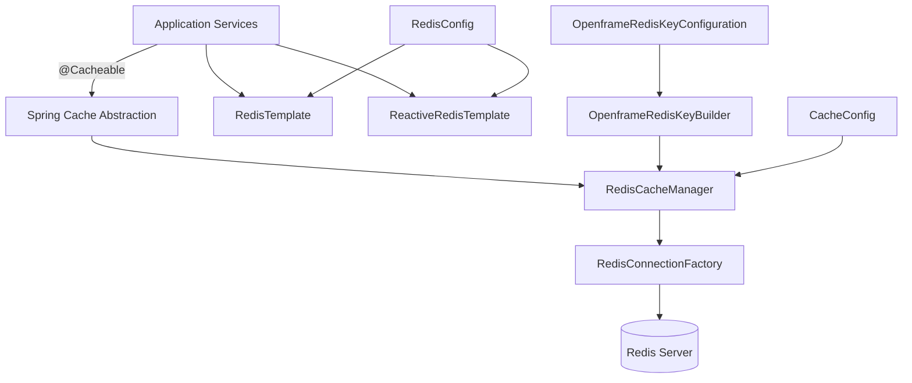
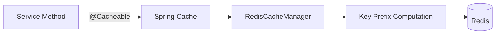
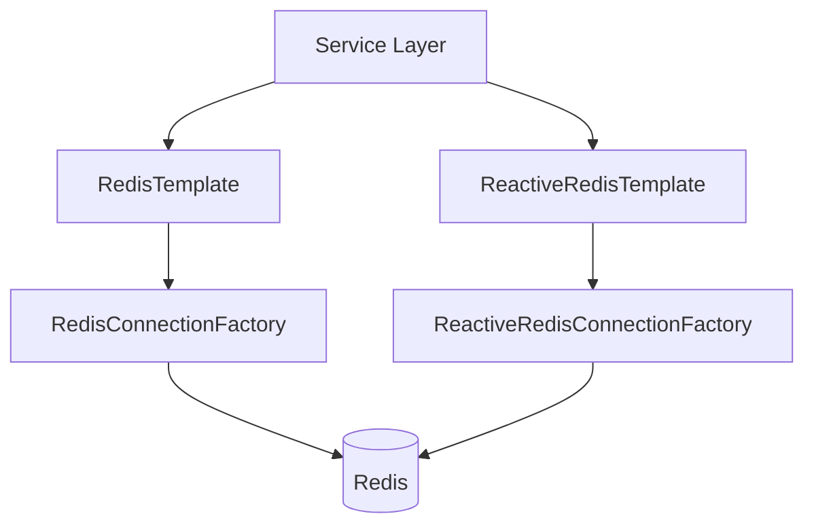
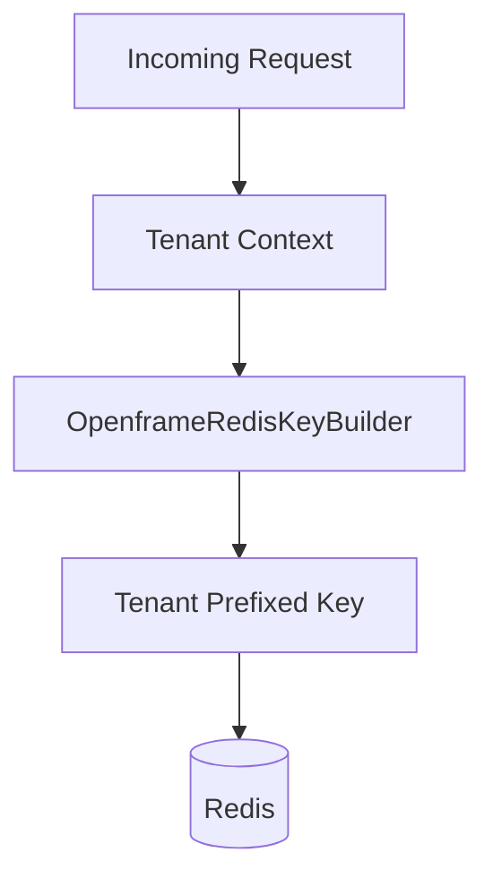

# Data Redis Cache

## Overview

The **Data Redis Cache** module provides Redis-based caching and key management infrastructure for the OpenFrame platform. It integrates Spring Cache, Redis templates (imperative and reactive), and tenant-aware key generation to deliver:

- Centralized cache configuration
- Multi-tenant safe key prefixes
- JSON and string serialization strategies
- Reactive and blocking Redis access patterns

This module acts as the caching foundation for higher-level services such as API Service Core, Authorization Service Core, Gateway Service Core, and data access modules.

Redis is enabled conditionally via the `spring.redis.enabled` property, allowing deployments to toggle caching without code changes.

---

## Architecture Overview



### Responsibilities by Component

| Component | Responsibility |
|------------|----------------|
| CacheConfig | Configures Spring Cache with Redis and tenant-aware key prefixing |
| RedisConfig | Defines RedisTemplate and ReactiveRedisTemplate beans |
| OpenframeRedisKeyConfiguration | Registers OpenframeRedisKeyBuilder for consistent key construction |

---

## Conditional Activation

Both caching and Redis infrastructure are enabled only when:

```text
spring.redis.enabled=true
```

This allows:

- Local development without Redis
- Feature toggling in test environments
- Controlled rollout of caching

If the property is disabled or missing, none of the Redis beans are registered.

---

## Core Components

### 1. CacheConfig

**Class:** `CacheConfig`

Enables and configures Spring Cache backed by Redis.

### Key Characteristics

- Enables caching via `@EnableCaching`
- Provides a default `CacheManager` if none exists
- Uses `RedisCacheManager`
- Applies:
  - Default TTL: 6 hours
  - JSON value serialization
  - String key serialization
  - Null value caching disabled
  - Tenant-aware key prefixing

### Cache Key Strategy

All cache entries use a computed prefix:

```text
<prefix>:<cacheName>::<key>
```

The prefix is generated using `OpenframeRedisKeyBuilder`, ensuring:

- Tenant isolation
- Consistent naming across services
- Safe multi-tenant deployments

### Cache Flow



---

### 2. RedisConfig

**Class:** `RedisConfig`

Provides Redis infrastructure beans for both blocking and reactive access.

### Beans Provided

#### RedisTemplate<String, String>

- Blocking Redis access
- String serialization for keys and values
- Hash operations supported

#### ReactiveStringRedisTemplate

- Reactive string-based operations
- Built on ReactiveRedisConnectionFactory

#### ReactiveRedisTemplate<String, String>

- Fully reactive template
- Custom serialization context
- Explicit key, value, hashKey, hashValue serializers

### Reactive vs Blocking Architecture



This dual-template strategy allows:

- Traditional synchronous service implementations
- Fully reactive WebFlux-based pipelines

---

### 3. OpenframeRedisKeyConfiguration

**Class:** `OpenframeRedisKeyConfiguration`

Registers the `OpenframeRedisKeyBuilder` bean.

### Purpose

- Centralizes Redis key construction logic
- Binds configuration properties via `OpenframeRedisProperties`
- Ensures consistent prefixing rules
- Allows customization without modifying business logic

### Key Builder Role

The key builder abstracts:

- Environment prefixing
- Tenant scoping
- Cache namespace generation
- Key normalization

This prevents:

- Key collisions across tenants
- Cross-environment pollution
- Inconsistent naming conventions

---

## Multi-Tenant Isolation Strategy

Multi-tenancy is enforced at the key level.



Example conceptual key:

```text
tenantA:deviceCache::deviceId_123
```

This ensures:

- Strong isolation between organizations
- Safe shared Redis clusters
- Clear observability in Redis CLI

---

## Serialization Strategy

### Cache Values

- `GenericJackson2JsonRedisSerializer`
- JSON-based serialization
- Allows storing complex DTOs and domain objects

### Templates

- `StringRedisSerializer` for keys
- String values for template usage

This combination provides:

- Human-readable keys
- Efficient value encoding
- Compatibility across services

---

## Integration Within the Platform

The Data Redis Cache module is consumed by higher-level modules such as:

- API Service Core (for query and response caching)
- Authorization Service Core (for token/session optimizations)
- Gateway Service Core (for rate limiting and metadata caching)
- Data access modules (for frequently accessed aggregates)

It acts as a horizontal infrastructure layer beneath business modules.

---

## Design Principles

1. Conditional Infrastructure Activation
2. Tenant-Safe by Default
3. Reactive and Blocking Support
4. Standardized Serialization
5. Replaceable CacheManager (via ConditionalOnMissingBean)

---

## Deployment Considerations

### Required Configuration

```text
spring.redis.enabled=true
spring.redis.host=localhost
spring.redis.port=6379
```

### Production Recommendations

- Use dedicated Redis clusters
- Enable authentication and TLS
- Configure eviction policies carefully
- Monitor memory usage
- Consider Redis Sentinel or Cluster for HA

---

## Summary

The **Data Redis Cache** module provides the foundational Redis infrastructure for OpenFrame. It standardizes:

- Cache management
- Key generation
- Multi-tenant isolation
- Reactive and synchronous access patterns

By centralizing Redis configuration and key semantics, the module ensures consistent, safe, and scalable caching behavior across the entire platform.