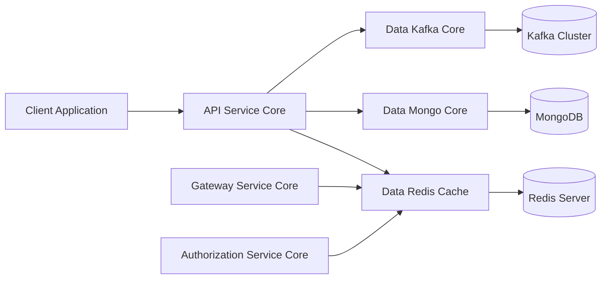
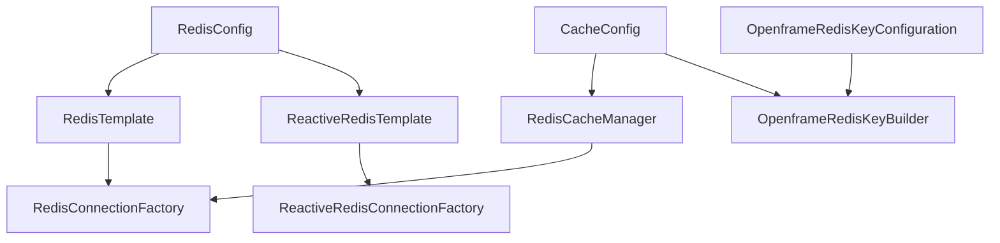
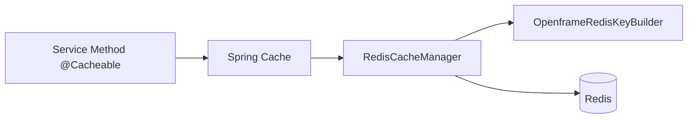
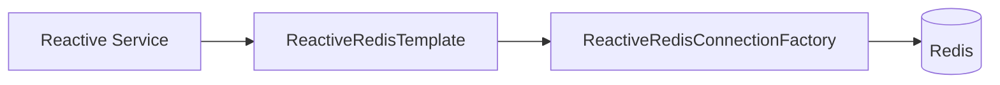
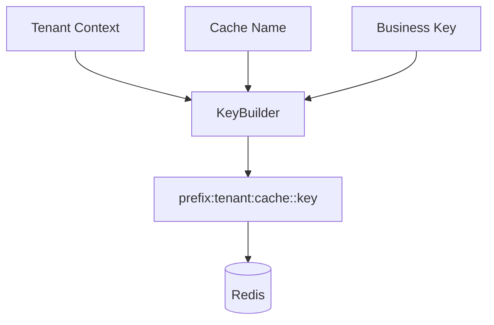

# Data Redis Cache

## Overview

The **Data Redis Cache** module provides Redis-based caching and key management infrastructure for the OpenFrame platform. It integrates Spring Cache, Redis (blocking and reactive), and tenant-aware key generation to deliver:

- Centralized cache configuration
- Tenant-aware cache key prefixes
- Reactive and imperative Redis templates
- Conditional auto-configuration via properties

This module is designed to be reusable across API services, authorization services, gateway services, and management services that require high-performance distributed caching.

---

## Purpose in the Overall Architecture

Within the OpenFrame ecosystem, Redis serves as:

- ✅ A distributed cache layer
- ✅ A short-lived data store (tokens, session data, rate limits)
- ✅ A reactive messaging/state component
- ✅ A performance optimization layer for MongoDB and other persistent stores

High-level system positioning:



The **Data Redis Cache** module abstracts Redis configuration and enforces consistent key formatting across all services.

---

## Core Components

The module contains three main configuration classes:

1. **CacheConfig** – Spring Cache + Redis CacheManager configuration
2. **RedisConfig** – RedisTemplate and ReactiveRedisTemplate configuration
3. **OpenframeRedisKeyConfiguration** – Tenant-aware key builder configuration

Component relationship overview:



---

# 1. Cache Configuration

## Class: CacheConfig

**Responsibility:**
Configures Spring’s caching abstraction backed by Redis.

### Key Characteristics

- Enabled via `@EnableCaching`
- Conditional on property: `spring.redis.enabled=true`
- Provides a `CacheManager` bean if none exists
- Enforces tenant-aware key prefixes

### Default Cache Behavior

```text
TTL: 6 hours
Null values: Disabled
Key serializer: StringRedisSerializer
Value serializer: GenericJackson2JsonRedisSerializer
Prefix format: <prefix>:<cacheName>::<key>
```

### Tenant-Aware Cache Prefixing

A critical design decision in this module is the use of a custom key prefix strategy:

```text
<prefix>:<cacheName>::<key>
```

This prefix is computed using:

- `OpenframeRedisKeyBuilder`
- `computePrefixWith(...)` in `RedisCacheConfiguration`

This ensures:

- Logical tenant isolation
- Reduced risk of cross-tenant key collision
- Environment-based prefixing support (dev/stage/prod)

### Cache Flow



---

# 2. Redis Template Configuration

## Class: RedisConfig

**Responsibility:**
Provides both blocking and reactive Redis clients.

Activated only when:

```text
spring.redis.enabled=true
```

## Beans Provided

### 1️⃣ RedisTemplate<String, String>

Used for imperative (blocking) Redis operations.

Serialization strategy:

```text
Keys: StringRedisSerializer
Values: StringRedisSerializer
Hash Keys: StringRedisSerializer
Hash Values: StringRedisSerializer
```

### 2️⃣ ReactiveStringRedisTemplate

High-level reactive template for string-based operations.

### 3️⃣ ReactiveRedisTemplate<String, String>

Custom reactive template with explicitly defined serialization context.

Reactive flow example:



### Why Both Blocking and Reactive?

The OpenFrame platform includes:

- Traditional Spring MVC services
- Reactive WebFlux services
- Asynchronous event-driven processing

Providing both templates ensures consistent Redis access across architectural styles.

---

# 3. Redis Key Builder Configuration

## Class: OpenframeRedisKeyConfiguration

**Responsibility:**
Registers a singleton `OpenframeRedisKeyBuilder` if not already defined.

### Configuration Properties

The configuration enables:

```text
OpenframeRedisProperties
```

These properties define:

- Key prefix
- Tenant behavior
- Environment scoping

### Design Goals

- Centralized key formatting
- Avoid hardcoded key naming patterns
- Ensure consistent multi-tenant boundaries

### Key Generation Concept



---

## Conditional Activation Strategy

All Redis-related configuration is guarded by:

```text
spring.redis.enabled=true
```

This allows:

- Running services without Redis (local development)
- Feature toggling caching
- Easier integration testing

If Redis is disabled:

- CacheManager is not created
- RedisTemplate beans are not registered
- Services must fall back to non-cached behavior

---

## Multi-Tenancy Considerations

Redis is a shared infrastructure component. This module enforces isolation through:

- Key prefix computation
- Cache name scoping
- Centralized key builder logic

Without this layer, services might:

- Overwrite keys across tenants
- Leak cached data
- Cause inconsistent invalidation behavior

The **Data Redis Cache** module prevents these risks by standardizing key structure.

---

## Integration with Other Modules

Although this module is infrastructure-focused, it supports:

- API Service Core (DTO caching, query result caching)
- Authorization Service Core (token/session caching)
- Gateway Service Core (rate limiting and request metadata)
- Management Service Core (scheduled job locks, temporary state)

It does not implement business logic itself — it provides the caching backbone for other modules.

---

## Serialization Strategy

Two serialization approaches are used:

### Cache Layer

```text
Value Serializer: GenericJackson2JsonRedisSerializer
```

Advantages:

- JSON-based storage
- Flexible object mapping
- Backward-compatible evolution

### Template Layer

```text
Value Serializer: StringRedisSerializer
```

Advantages:

- Lightweight
- Ideal for tokens, counters, and simple flags
- Minimal overhead

---

## Operational Characteristics

### Default TTL

```text
6 hours
```

This balances:

- Reduced database load
- Acceptable staleness window
- Memory control

### Null Caching Disabled

```text
.disableCachingNullValues()
```

Prevents:

- Cache pollution
- Memory waste
- Ambiguous null semantics

---

## Extensibility

This module is intentionally designed to be extensible:

- Custom `CacheManager` can override default
- Custom `OpenframeRedisKeyBuilder` can replace default
- TTL policies can be customized per cache
- Additional Redis templates can be registered

Because beans are guarded with `@ConditionalOnMissingBean`, downstream services can override behavior safely.

---

## Summary

The **Data Redis Cache** module provides:

- ✅ Standardized Redis configuration
- ✅ Distributed Spring Cache integration
- ✅ Reactive and blocking Redis support
- ✅ Tenant-aware key prefixing
- ✅ Safe conditional activation

It forms the distributed caching foundation for the OpenFrame platform, ensuring consistency, isolation, and performance across services.