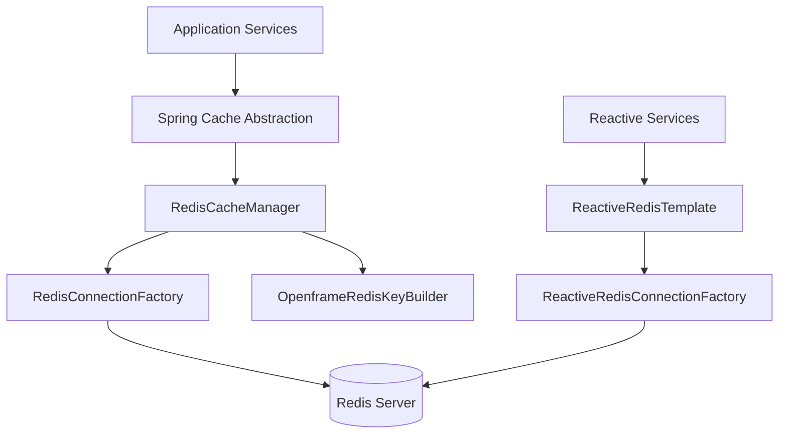
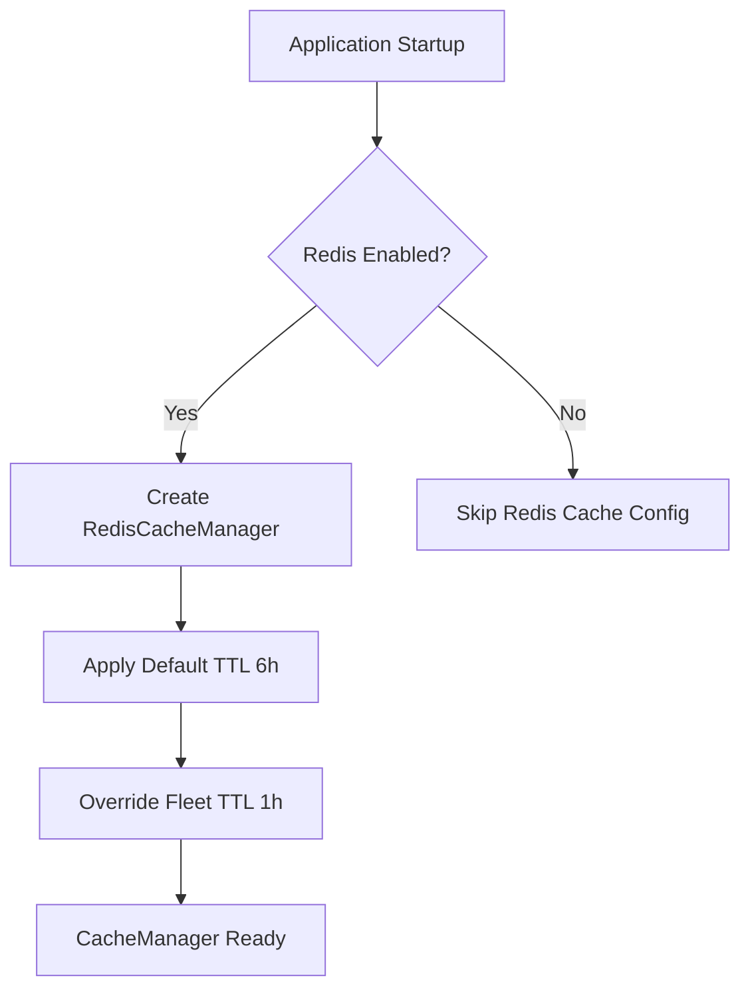
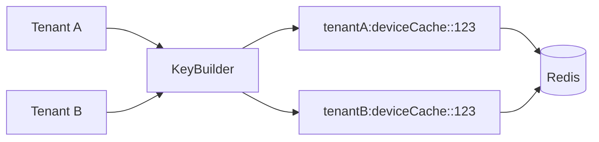

# Data Redis Cache

The **Data Redis Cache** module provides Redis-based caching and key infrastructure for the OpenFrame platform. It integrates Spring Cache with Redis, configures synchronous and reactive Redis templates, and enforces tenant-aware key prefixing to ensure strict data isolation across organizations.

This module acts as the foundational caching layer used by API services, management services, and other components that require high-performance, low-latency data access.

---

## Purpose and Responsibilities

The Data Redis Cache module is responsible for:

- Enabling and configuring Spring Cache backed by Redis
- Providing a tenant-aware cache key prefix strategy
- Supplying `RedisTemplate` and `ReactiveRedisTemplate` beans
- Enforcing standardized key/value serialization
- Supporting conditional activation based on configuration

Redis is enabled only when the property `spring.redis.enabled=true` is set, allowing flexible deployment topologies.

---

## High-Level Architecture


```mermaid
flowchart TD
    AppServices["Application Services"] --> CacheAbstraction["Spring Cache Abstraction"]
    CacheAbstraction --> CacheManager["RedisCacheManager"]
    CacheManager --> RedisConnection["RedisConnectionFactory"]
    CacheManager --> KeyBuilder["OpenframeRedisKeyBuilder"]
    RedisConnection --> RedisServer[("Redis Server")]

    ReactiveServices["Reactive Services"] --> ReactiveTemplate["ReactiveRedisTemplate"]
    ReactiveTemplate --> ReactiveConnection["ReactiveRedisConnectionFactory"]
    ReactiveConnection --> RedisServer
```

### Key Components

| Component | Responsibility |
|------------|----------------|
| CacheConfig | Configures Spring Cache and RedisCacheManager |
| RedisConfig | Provides RedisTemplate and ReactiveRedisTemplate beans |
| OpenframeRedisKeyConfiguration | Registers OpenframeRedisKeyBuilder for tenant-aware key prefixes |

---

# Core Configuration Classes

## CacheConfig

**Class:** `CacheConfig`

This class enables Spring caching and configures the Redis-backed `CacheManager`.

### Activation

The configuration is loaded only if:

```text
spring.redis.enabled=true
```

### Default Cache Behavior

The default cache configuration includes:

- Time-to-live (TTL): 6 hours
- Null values disabled
- String key serialization
- JSON value serialization using `GenericJackson2JsonRedisSerializer`
- Tenant-aware key prefixing

### Tenant-Aware Key Prefixing

All cache keys follow this structure:

```text
<prefix>:<cacheName>::<key>
```

The prefix is computed via `OpenframeRedisKeyBuilder`, ensuring isolation between tenants.

### Custom TTL Overrides

Certain caches use shorter TTL values:

| Cache Name | TTL |
|------------|------|
| fleetPolicyCache | 1 hour |
| fleetQueryCache | 1 hour |

This prevents stale policy or query data from persisting too long.

### Cache Initialization Flow


```mermaid
flowchart TD
    Start["Application Startup"] --> RedisEnabled{"Redis Enabled?"}
    RedisEnabled -->|Yes| CreateManager["Create RedisCacheManager"]
    RedisEnabled -->|No| Skip["Skip Redis Cache Config"]
    CreateManager --> DefaultConfig["Apply Default TTL 6h"]
    DefaultConfig --> FleetOverride["Override Fleet TTL 1h"]
    FleetOverride --> Ready["CacheManager Ready"]
```

---

## RedisConfig

**Class:** `RedisConfig`

This class provides low-level Redis beans for both blocking and reactive usage.

### Provided Beans

| Bean | Type | Purpose |
|------|------|----------|
| redisTemplate | RedisTemplate<String, String> | Standard Redis operations |
| reactiveStringRedisTemplate | ReactiveStringRedisTemplate | Reactive string-based operations |
| reactiveRedisTemplate | ReactiveRedisTemplate<String, String> | Reactive key-value operations |

### Serialization Strategy

All templates use:

- String serialization for keys
- String serialization for values (in template beans)
- JSON serialization for Spring Cache values (via CacheConfig)

This ensures consistent behavior across imperative and reactive flows.

### Repository Support

`@EnableRedisRepositories` enables Redis-backed repositories under:

```text
com.openframe.data.repository.redis
```

This allows future extensions such as token stores, distributed locks, or transient state persistence.

---

## OpenframeRedisKeyConfiguration

**Class:** `OpenframeRedisKeyConfiguration`

This configuration registers the `OpenframeRedisKeyBuilder` bean.

### Responsibilities

- Binds `OpenframeRedisProperties`
- Constructs a reusable key builder
- Ensures consistent prefix generation across the platform

The key builder centralizes key naming conventions, preventing:

- Cross-tenant collisions
- Environment conflicts
- Inconsistent naming patterns

---

# Multi-Tenant Key Strategy

The Data Redis Cache module enforces strict tenant-aware isolation.


```mermaid
flowchart LR
    TenantA["Tenant A"] --> KeyBuilder
    TenantB["Tenant B"] --> KeyBuilder
    KeyBuilder --> RedisKeyA["tenantA:deviceCache::123"]
    KeyBuilder --> RedisKeyB["tenantB:deviceCache::123"]
    RedisKeyA --> RedisServer[("Redis")]
    RedisKeyB --> RedisServer
```

Even when logical cache keys are identical, the computed prefix ensures physical separation in Redis.

---

# Integration Within the Platform

The Data Redis Cache module supports multiple platform layers:

- API services for query result caching
- Authorization services for token or metadata caching
- Management services for transient synchronization data
- Gateway services for rate limiting or session metadata

It works alongside:

- Mongo repositories (primary persistence layer)
- Kafka streaming services (event-driven updates)
- Security modules (authentication and token validation)

Redis acts as a performance optimization layer — never the source of truth.

---

# Conditional Activation and Deployment

Redis caching is optional and controlled by configuration.

```text
spring.redis.enabled=true
```

If disabled:

- CacheConfig is not loaded
- RedisConfig is not loaded
- No Redis repositories are enabled

This design supports:

- Local development without Redis
- Staging environments with partial caching
- Production environments with full caching enabled

---

# Design Principles

The Data Redis Cache module follows these principles:

1. Tenant Isolation by Default
2. Safe Serialization Strategies
3. Sensible TTL Defaults with Domain Overrides
4. Reactive and Imperative Support
5. Conditional Bootstrapping

---

# Summary

The **Data Redis Cache** module provides a structured, tenant-aware, and extensible Redis caching layer for the OpenFrame platform. By centralizing Redis configuration, serialization policies, and key naming strategies, it ensures consistent behavior across services while preserving strong multi-tenant boundaries.

It serves as the high-performance caching backbone of the platform while maintaining strict separation from the system's primary data stores.