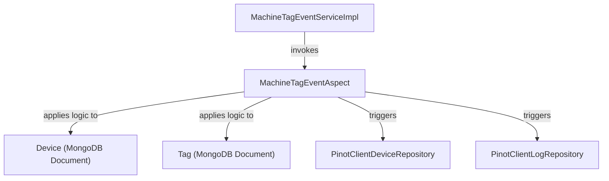
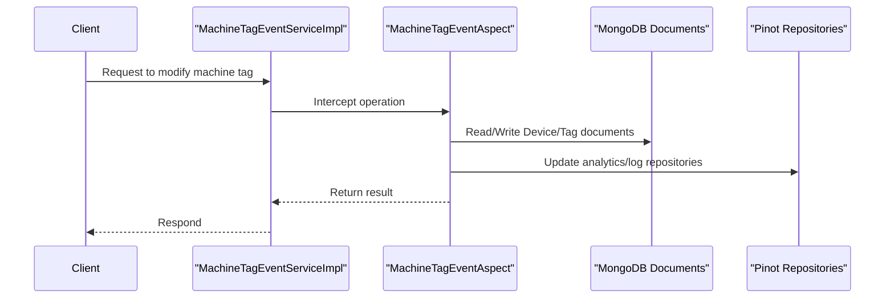

# data_aspect Module Documentation

## Introduction

data_aspect is a backend module responsible for handling cross-cutting concerns (aspects) related to data operations, particularly those involving machine tagging and event processing. Its primary role is to intercept, monitor, or augment data flows associated with machine tags and related events, enabling features such as auditing, enrichment, or propagation of tag-related changes throughout the system.

## Core Component

### MachineTagEventAspect

`MachineTagEventAspect` is the central aspect in this module. It is designed to intercept operations on machine tag events, providing hooks for additional processing such as logging, validation, or triggering downstream services. This aspect is typically used in conjunction with service implementations that manage machine tags and their associated events.

#### Responsibilities
- Intercept machine tag event operations (e.g., creation, update, deletion)
- Apply cross-cutting logic such as auditing, enrichment, or notification
- Integrate with downstream services or repositories as needed

#### Example Use Cases
- Automatically logging all tag changes for audit purposes
- Enriching tag events with additional metadata before persistence
- Triggering notifications or workflows when specific tag events occur

## Architecture and Component Relationships

The `data_aspect` module is part of the broader data layer and interacts with several other modules:

- **data_service_impl**: Implements the business logic for machine tag events (see [data_service_impl.md]).
- **data_model**: Defines the data structures for integrated tool types and tool credentials (see [data_model.md]).
- **data_mongo_document_device**: Contains the MongoDB document models for devices, alerts, and compliance requirements (see [data_mongo_document_device.md]).
- **data_mongo_document_tool**: Contains the MongoDB document model for tags (see [data_mongo_document_tool.md]).
- **data_repository_pinot**: Provides Pinot-based repositories for analytics and querying (see [data_repository_pinot.md]).

### High-Level Architecture

### Data Flow

## Integration in the Overall System

The `data_aspect` module is a key part of the data processing pipeline, ensuring that all machine tag event operations are consistently processed with the required cross-cutting logic. It works closely with service implementations, data models, and repositories to provide a robust and extensible mechanism for handling tag-related events.

- **Upstream**: Receives calls from service implementations (e.g., `MachineTagEventServiceImpl` in [data_service_impl.md])
- **Downstream**: Interacts with MongoDB documents (see [data_mongo_document_device.md], [data_mongo_document_tool.md]) and Pinot repositories (see [data_repository_pinot.md])

## Related Modules

- [data_service_impl.md]: Business logic for machine tag events
- [data_model.md]: Data structures for integrated tools and credentials
- [data_mongo_document_device.md]: MongoDB device and alert documents
- [data_mongo_document_tool.md]: MongoDB tag documents
- [data_repository_pinot.md]: Pinot repositories for analytics

## Summary

The `data_aspect` module provides a centralized mechanism for handling cross-cutting concerns related to machine tag events. By leveraging aspects, it ensures that all relevant operations are consistently processed, audited, and integrated with downstream analytics and storage systems.
