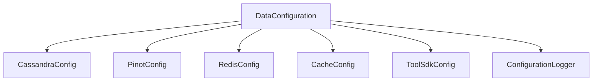
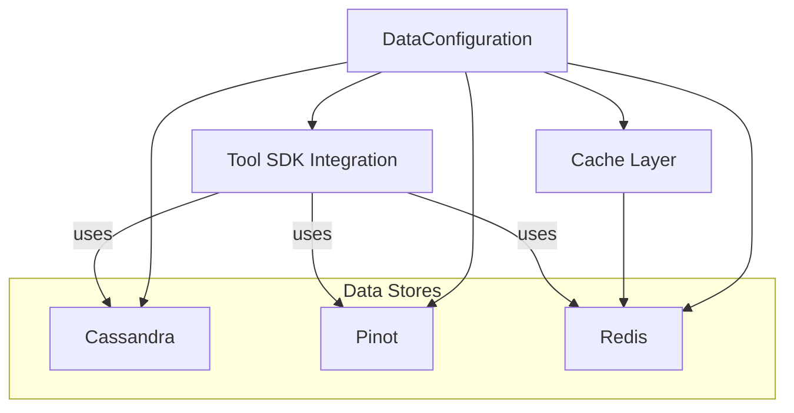

# data_config Module Documentation

## Introduction

the `data_config` module provides the foundational configuration and integration points for the system's data infrastructure. It centralizes the setup and management of various data storage and caching technologies, including Cassandra, Pinot, Redis, and caching mechanisms. This module is essential for ensuring that the system's data layer is robust, scalable, and easily maintainable.

## Core Components

- **CacheConfig**: Configuration for application-level caching, including cache providers and policies.
- **CassandraConfig**: Manages the connection and settings for Cassandra, a distributed NoSQL database used for high-availability and scalability.
- **ConfigurationLogger**: Utility for logging configuration states and changes, aiding in debugging and auditing.
- **DataConfiguration**: The central configuration aggregator that initializes and wires together all data-related configurations.
- **PinotConfig**: Handles the setup for Apache Pinot, a real-time distributed OLAP datastore for analytics.
- **RedisConfig**: Configures Redis, an in-memory data structure store used for caching and fast data access.
- **ToolSdkConfig**: Provides configuration for tool SDK integrations, enabling external tool communication and management.

## Architecture Overview

The `data_config` module acts as the backbone for the data layer, interfacing with both storage and caching systems. It is designed to be extensible and modular, allowing for easy integration of new data technologies as the system evolves.



## Component Relationships and Data Flow

- **DataConfiguration** serves as the orchestrator, initializing and managing the lifecycle of all data-related configurations.
- **CassandraConfig**, **PinotConfig**, and **RedisConfig** each encapsulate the connection and operational parameters for their respective data stores.
- **CacheConfig** defines caching strategies and integrates with Redis or other cache providers.
- **ToolSdkConfig** enables the system to communicate with external tools, leveraging the configurations for data access and management.
- **ConfigurationLogger** ensures that all configuration changes and states are logged for traceability.

### Data Flow Diagram



## Integration with Other Modules

The `data_config` module is foundational and is referenced by multiple other modules that require access to data storage or caching. Notable integrations include:

- **[data_mongo_config.md]**: For MongoDB configuration and indexing.
- **[data_kafka_config.md]**: For Kafka messaging and streaming configuration.
- **[data_health.md]**: For health checks of data stores (e.g., CassandraHealthIndicator).
- **[data_repository_pinot.md]**: For Pinot-based repositories.
- **[api_service_core_config.md]**: For application-level configuration that may depend on data layer settings.

## Example Usage

The following pseudocode demonstrates how the `DataConfiguration` component initializes the data layer:

```python
from data_config import DataConfiguration

data_config = DataConfiguration()
data_config.initialize()
# This will set up Cassandra, Pinot, Redis, Cache, and Tool SDK integrations
```

## Extensibility and Best Practices

- **Modular Design**: Each data technology is encapsulated in its own configuration class, making it easy to swap or upgrade components.
- **Centralized Logging**: Use `ConfigurationLogger` to track configuration changes and issues.
- **Health Monitoring**: Integrate with the `data_health` module for proactive monitoring of data stores.
- **Consistent Caching**: Leverage `CacheConfig` and `RedisConfig` for unified caching strategies across the application.

## Related Documentation

- [data_mongo_config.md]
- [data_kafka_config.md]
- [data_health.md]
- [data_repository_pinot.md]
- [api_service_core_config.md]

---

This documentation provides a high-level overview of the `data_config` module. For detailed configuration options and advanced usage, refer to the respective configuration class documentation or the related modules listed above.
