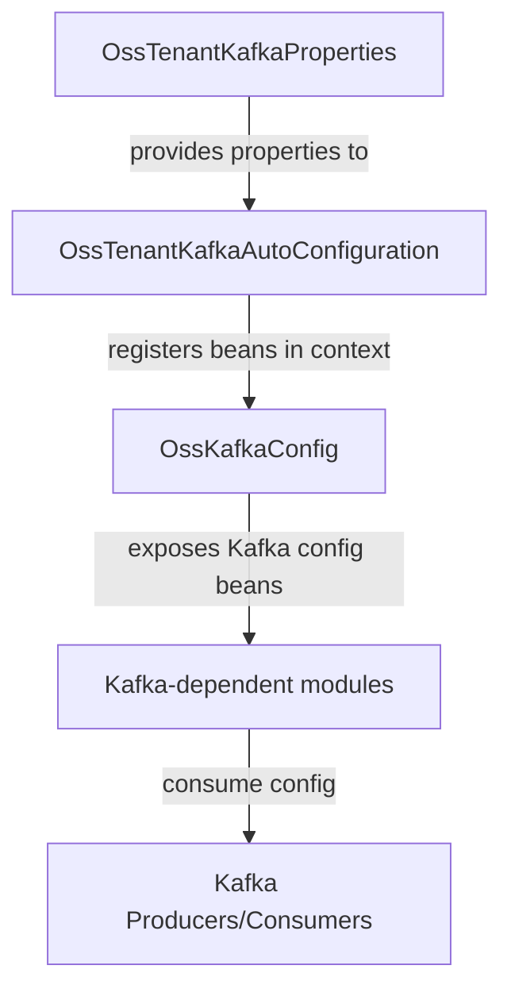
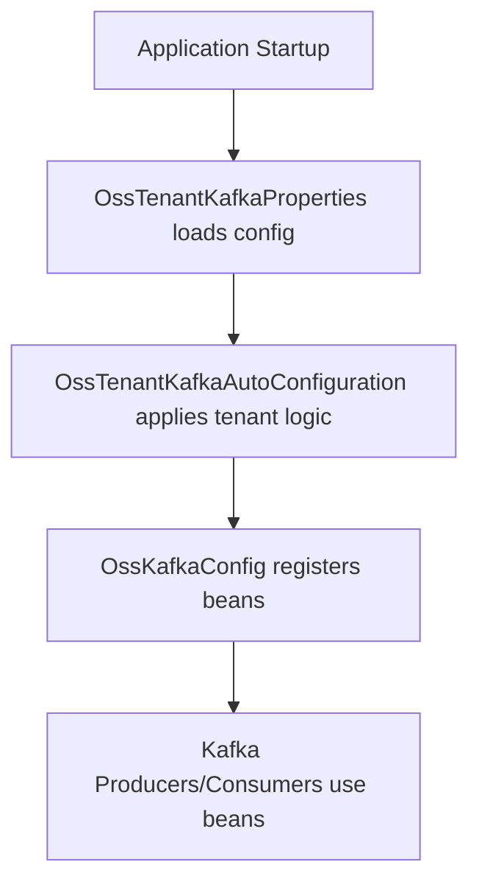

# data_kafka_config Module Documentation

## Introduction

the `data_kafka_config` module provides the foundational configuration and property management for Kafka integration within the system. It is responsible for setting up Kafka client properties, managing multi-tenant Kafka environments, and exposing configuration beans for use by other modules and services that interact with Kafka. This module is essential for ensuring reliable, scalable, and tenant-aware messaging infrastructure across the platform.

### Core Components
- **OssKafkaConfig**: Central configuration class for Kafka client setup and bean definitions.
- **OssTenantKafkaAutoConfiguration**: Auto-configuration for multi-tenant Kafka support, enabling tenant-specific Kafka property management.
- **OssTenantKafkaProperties**: Encapsulates Kafka property definitions, supporting tenant isolation and dynamic configuration.

## Architecture Overview

The `data_kafka_config` module is designed to be consumed by both data producers and consumers throughout the system. It provides configuration beans and property sources that are injected into Kafka-related services, such as message producers, consumers, and retry handlers. The module is also tightly integrated with tenant management, allowing for per-tenant Kafka configuration.

### High-Level Architecture

- **OssTenantKafkaProperties**: Loads and manages Kafka properties, supporting tenant-specific overrides.
- **OssTenantKafkaAutoConfiguration**: Uses the properties to auto-configure Kafka beans for each tenant.
- **OssKafkaConfig**: Exposes the final configuration beans (e.g., KafkaTemplate, ProducerFactory, ConsumerFactory) to the application context.
- **Kafka-dependent modules**: Modules such as [data_kafka_producer_retry.md], [data_kafka_model.md], and [stream_service_core_config.md] consume these beans for Kafka operations.

## Component Details

### OssKafkaConfig
- **Purpose**: Defines and exposes Kafka configuration beans (e.g., KafkaTemplate, ProducerFactory, ConsumerFactory) for use by the application.
- **Responsibilities**:
  - Centralizes Kafka client configuration.
  - Ensures beans are available for injection into Kafka producers and consumers.
  - May provide default serializers, deserializers, and error handlers.
- **Interactions**:
  - Consumed by modules that require Kafka messaging (see [data_kafka_producer_retry.md], [stream_service_core_config.md]).

### OssTenantKafkaAutoConfiguration
- **Purpose**: Enables multi-tenant Kafka support by auto-configuring Kafka beans based on tenant-specific properties.
- **Responsibilities**:
  - Detects tenant context and applies the appropriate Kafka configuration.
  - Registers tenant-aware Kafka beans in the application context.
- **Interactions**:
  - Relies on [OssTenantKafkaProperties](#osstenantkafkaproperties) for property resolution.
  - Used by services that require tenant isolation in Kafka messaging.

### OssTenantKafkaProperties
- **Purpose**: Encapsulates Kafka property definitions, supporting both global and tenant-specific settings.
- **Responsibilities**:
  - Loads Kafka properties from configuration sources (e.g., application.yml, environment variables).
  - Supports dynamic property resolution for multi-tenant environments.
- **Interactions**:
  - Consumed by [OssTenantKafkaAutoConfiguration](#osstenantkafkaautoconfiguration) to provide tenant-specific Kafka configuration.

## Data Flow and Process

The following diagram illustrates the data flow for Kafka configuration resolution and bean provisioning:

1. **Application Startup**: The application context is initialized.
2. **OssTenantKafkaProperties**: Loads Kafka configuration, including tenant-specific overrides.
3. **OssTenantKafkaAutoConfiguration**: Applies tenant logic and prepares configuration beans.
4. **OssKafkaConfig**: Registers Kafka beans in the application context.
5. **Kafka Producers/Consumers**: Use the injected beans for messaging operations.

## Dependencies and Integration

The `data_kafka_config` module is a foundational dependency for all modules that interact with Kafka, including:
- [data_kafka_producer_retry.md]: Implements retry logic for Kafka producers, relying on configuration beans.
- [data_kafka_model.md]: Defines message models that are serialized/deserialized using the configured Kafka beans.
- [stream_service_core_config.md]: Provides additional Kafka and stream processing configuration, building on the beans from this module.
- [data_kafka_enumeration.md]: Supplies Kafka header definitions used in message production/consumption.

## Extending and Customizing

- To add new tenant-specific Kafka properties, extend `OssTenantKafkaProperties` and update configuration sources.
- To customize bean creation (e.g., custom serializers), override bean definitions in `OssKafkaConfig`.
- For advanced multi-tenant scenarios, extend `OssTenantKafkaAutoConfiguration` to support dynamic tenant resolution.

## Related Modules

- [data_kafka_producer_retry.md]: Kafka producer retry and recovery logic
- [data_kafka_model.md]: Kafka message model definitions
- [stream_service_core_config.md]: Stream processing and Kafka stream configuration
- [data_kafka_enumeration.md]: Kafka header enumerations

## Summary

The `data_kafka_config` module is the backbone of Kafka configuration in the system, enabling robust, scalable, and tenant-aware messaging. It is designed for extensibility and seamless integration with all Kafka-dependent modules.
