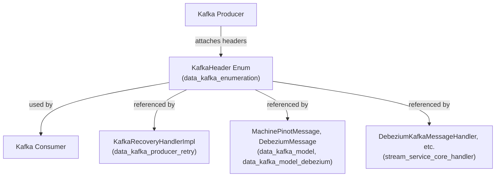
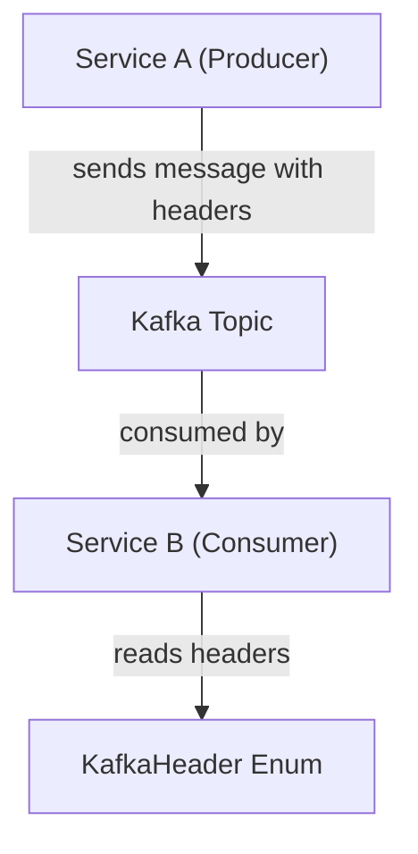
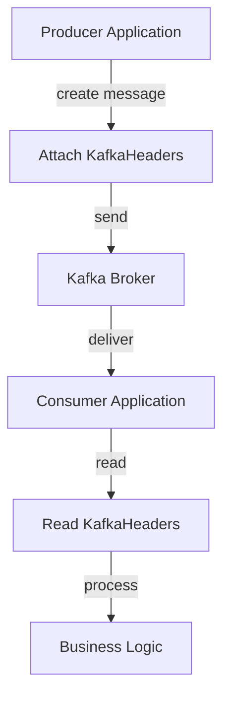

# data_kafka_enumeration Module Documentation

## Introduction

data_kafka_enumeration is a foundational module that defines enumerations and constants used for Kafka message processing within the data pipeline of the system. Its primary role is to standardize and centralize the definition of Kafka headers, ensuring consistent usage across Kafka producers, consumers, and related services. This module is essential for maintaining interoperability and clarity in the handling of Kafka message metadata throughout the platform.

## Core Component: `KafkaHeader`

The main component of this module is the `KafkaHeader` enumeration. This enumeration defines a set of well-known Kafka message header keys that are used to annotate messages with metadata such as tenant information, message type, correlation IDs, and other context required for distributed processing and multi-tenancy support.

### Typical Usage
- **Producers**: Attach standardized headers to outgoing Kafka messages for downstream consumers to interpret.
- **Consumers**: Read and interpret headers to route, process, or audit messages appropriately.
- **Middleware/Interceptors**: Enforce or validate the presence and correctness of required headers.

## Architecture and Integration

The `data_kafka_enumeration` module is a low-level dependency for any component that interacts with Kafka, including message producers, consumers, and retry/recovery handlers. It is typically imported by modules such as:
- [data_kafka_producer_retry.md](data_kafka_producer_retry.md) (for recovery and retry logic)
- [data_kafka_model.md](data_kafka_model.md) and [data_kafka_model_debezium.md](data_kafka_model_debezium.md) (for message modeling)
- [stream_service_core_handler.md](stream_service_core_handler.md) and [stream_service_core_listener.md](stream_service_core_listener.md) (for message handling and listening)

### High-Level Architecture



### Data Flow Example



## Component Details

### KafkaHeader

- **Purpose**: Enumerates all standard Kafka message headers used in the system.
- **Typical Values**: (examples)
    - `TENANT_ID`: Identifies the tenant for multi-tenant message routing
    - `MESSAGE_TYPE`: Specifies the type of the message (event, command, etc.)
    - `CORRELATION_ID`: Used for tracing and correlation across distributed systems
    - `RETRY_COUNT`: Indicates the number of delivery attempts
    - `TIMESTAMP`: Message creation or event time
- **Usage Context**: Used by all Kafka-integrated modules to ensure consistent header usage.

## Relationships to Other Modules

- **Kafka Configuration**: See [data_kafka_config.md](data_kafka_config.md) for Kafka client and topic configuration.
- **Kafka Message Models**: See [data_kafka_model.md](data_kafka_model.md) and [data_kafka_model_debezium.md](data_kafka_model_debezium.md) for message payload structures that may reference headers.
- **Retry/Recovery Logic**: See [data_kafka_producer_retry.md](data_kafka_producer_retry.md) for how headers are used in retry scenarios.
- **Stream Processing**: See [stream_service_core_handler.md](stream_service_core_handler.md) and [stream_service_core_listener.md](stream_service_core_listener.md) for header usage in stream processing and event handling.

## Example: Attaching and Reading Kafka Headers

```java
// Attaching headers in a producer
ProducerRecord<String, String> record = new ProducerRecord<>(topic, key, value);
record.headers().add(KafkaHeader.TENANT_ID.name(), tenantId.getBytes(StandardCharsets.UTF_8));
record.headers().add(KafkaHeader.MESSAGE_TYPE.name(), "EVENT".getBytes(StandardCharsets.UTF_8));

// Reading headers in a consumer
for (Header header : record.headers()) {
    if (header.key().equals(KafkaHeader.TENANT_ID.name())) {
        String tenantId = new String(header.value(), StandardCharsets.UTF_8);
        // process tenantId
    }
}
```

## Process Flow: Kafka Message Lifecycle with Headers



## Summary

The `data_kafka_enumeration` module is a critical building block for Kafka-based communication in the system. By centralizing the definition of Kafka headers, it ensures that all components interacting with Kafka do so in a consistent, maintainable, and interoperable manner. For further details on Kafka integration and advanced usage, refer to the related modules listed above.
