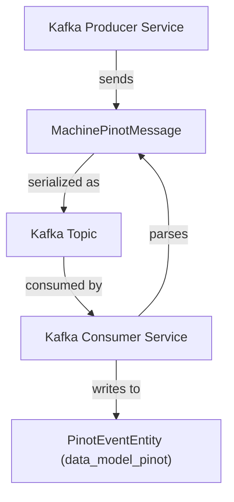
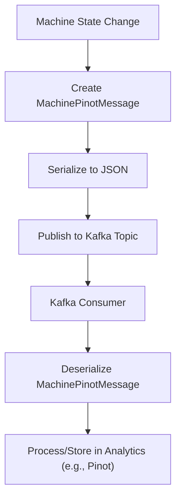

# data_kafka_model Module Documentation

## Introduction

data_kafka_model is a core module responsible for defining the data models used for Kafka message exchange within the system. It provides the schema and structure for messages that are published to and consumed from Kafka topics, enabling reliable and structured communication between distributed services. The primary component in this module is `MachinePinotMessage`, which encapsulates the data payloads relevant to machine and event streaming, particularly for integration with analytics and event processing pipelines such as Apache Pinot.

## Core Functionality

- **Defines Kafka message data models**: Ensures consistent serialization/deserialization of messages across services.
- **Facilitates event-driven architecture**: Enables microservices to communicate asynchronously via Kafka topics.
- **Supports analytics pipelines**: Structures data for downstream processing, e.g., in Pinot or other analytics engines.

## Key Component: MachinePinotMessage

`MachinePinotMessage` is the central data structure in this module. It represents the schema for machine-related events or state changes that are transmitted over Kafka. This message is typically produced by services monitoring machine state and consumed by analytics or event processing services.

### Typical Fields (Example)
> *Note: The actual fields may vary depending on implementation. Refer to the code for the authoritative schema.*

- `machine_id`: Unique identifier for the machine
- `timestamp`: Event time (epoch or ISO8601)
- `event_type`: Type of event (e.g., status update, alert)
- `payload`: Event-specific data (could be a nested object)

### Example Usage

```python
from data_kafka_model import MachinePinotMessage

# Creating a new message instance
message = MachinePinotMessage(
    machine_id="abc123",
    timestamp="2024-06-01T12:00:00Z",
    event_type="status_update",
    payload={"cpu": 0.7, "memory": 0.8}
)

# Serializing for Kafka
serialized = message.to_json()

# Deserializing from Kafka
message = MachinePinotMessage.from_json(serialized)
```

## Architecture & Data Flow

The `data_kafka_model` module is a foundational part of the event streaming pipeline. It interacts with Kafka producers and consumers, and is often used in conjunction with other modules such as:

- [data_kafka_config.md]: Kafka configuration and topic management
- [data_kafka_enumeration.md]: Kafka header and metadata definitions
- [data_kafka_model_debezium.md]: Debezium message models for CDC (Change Data Capture)
- [data_model_pinot.md]: Pinot event entity models for analytics

### Component Relationships



### Data Flow Overview



## Integration with Other Modules

- **Kafka Configuration**: See [data_kafka_config.md] for details on Kafka topic setup and connection properties.
- **Pinot Analytics**: See [data_model_pinot.md] for how messages are mapped to Pinot event entities.
- **Debezium CDC**: For change data capture message models, refer to [data_kafka_model_debezium.md].

## Extending the Model

To add new fields or message types, update the `MachinePinotMessage` schema and ensure all producer and consumer services are updated accordingly. For more advanced message types (e.g., CDC, tool events), see related modules:

- [data_kafka_model_debezium.md]: Debezium CDC message models
- [data_model_nats.md]: NATS message models for other streaming systems

## References

- [data_kafka_config.md]: Kafka configuration and auto-configuration
- [data_kafka_enumeration.md]: Kafka header definitions
- [data_kafka_model_debezium.md]: Debezium message models
- [data_model_pinot.md]: Pinot event entity models
- [data_model_nats.md]: NATS message models

---

*For further details on message schemas and integration points, refer to the respective module documentation linked above.*
