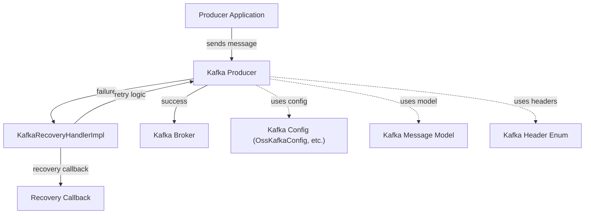
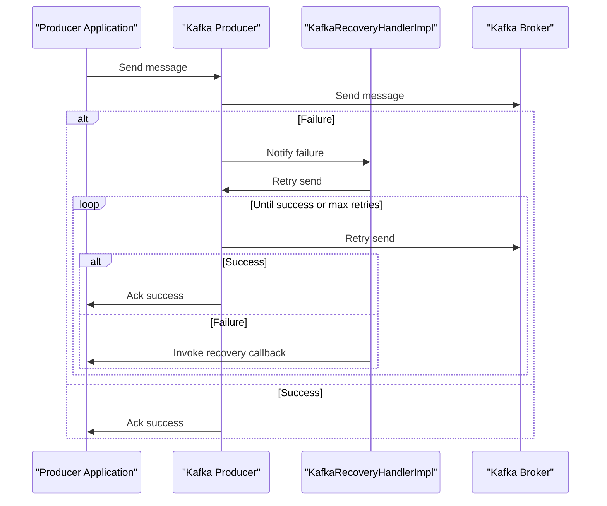

# data_kafka_producer_retry Module Documentation

## Introduction

data_kafka_producer_retry is a backend infrastructure module responsible for handling Kafka message production retries and recovery in the event of transient failures. It is a critical component in ensuring reliable delivery of messages to Kafka topics, especially in distributed systems where network or broker issues may cause temporary disruptions. The module is designed to work seamlessly with the broader Kafka configuration and messaging ecosystem, providing robust error handling and recovery mechanisms.

## Core Functionality

- **Reliable Kafka Message Delivery:** Ensures that messages which fail to be delivered to Kafka due to transient errors are retried according to a configurable policy.
- **Recovery Handling:** Implements logic to recover or compensate for failed message deliveries, preventing data loss and maintaining system consistency.
- **Integration with Kafka Producer:** Works in conjunction with the Kafka producer configuration and message models defined in related modules.

## Core Components

### KafkaRecoveryHandlerImpl
This is the primary implementation class responsible for handling message recovery and retry logic for Kafka producers. It encapsulates the strategies and mechanisms for retrying failed message sends and for executing recovery callbacks when retries are exhausted.

#### Responsibilities
- Intercepts failed Kafka message sends.
- Applies retry policies (e.g., exponential backoff, max attempts).
- Invokes recovery logic when retries are exhausted.
- Integrates with the broader Kafka configuration and message model ecosystem.

#### Dependencies
- [data_kafka_config.md]: For Kafka configuration and properties (e.g., OssKafkaConfig, OssTenantKafkaAutoConfiguration).
- [data_kafka_model.md]: For message model definitions (e.g., MachinePinotMessage).
- [data_kafka_enumeration.md]: For Kafka header definitions and enumerations (e.g., KafkaHeader).

## Architecture Overview

The following diagram illustrates the high-level architecture and component interactions for the data_kafka_producer_retry module:

## Data Flow

1. **Message Production:** The application sends a message to Kafka via the Kafka producer.
2. **Failure Detection:** If the message send fails (e.g., due to network issues), the failure is intercepted by `KafkaRecoveryHandlerImpl`.
3. **Retry Mechanism:** `KafkaRecoveryHandlerImpl` applies the configured retry policy, attempting to resend the message.
4. **Recovery Callback:** If all retry attempts are exhausted, a recovery callback is invoked to handle the failure (e.g., logging, alerting, or compensating actions).
5. **Success Path:** On successful send, the message is delivered to the Kafka broker.

## Component Interaction

## Integration with Other Modules

- **Kafka Configuration:** See [data_kafka_config.md] for details on Kafka configuration and properties.
- **Kafka Message Models:** See [data_kafka_model.md] for message model structures.
- **Kafka Headers and Enumerations:** See [data_kafka_enumeration.md] for header definitions.

## Extensibility and Customization

- **Retry Policy:** The retry logic can be customized via configuration (e.g., max attempts, backoff strategy) in the Kafka config module.
- **Recovery Actions:** Custom recovery callbacks can be implemented to handle exhausted retries according to business requirements.

## Summary

data_kafka_producer_retry is a foundational module for ensuring reliable Kafka message delivery in the face of transient failures. By centralizing retry and recovery logic, it enables robust, maintainable, and extensible message production workflows in distributed systems.
