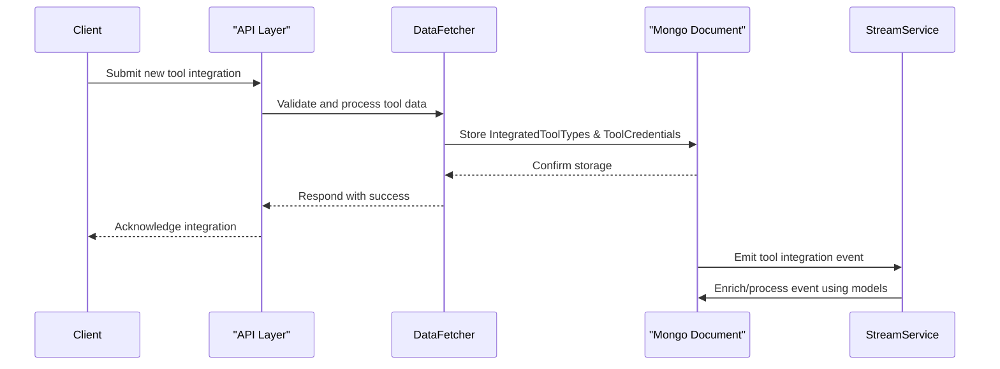

# data_model Module Documentation

## Introduction

the `data_model` module provides core data structures that are foundational for representing integrated tool types and tool credentials within the system. These models are used across multiple services and repositories to ensure consistent handling of tool integration and authentication data.

## Core Components

- **IntegratedToolTypes**: Enumerates or defines the types of tools that can be integrated into the platform.
- **ToolCredentials**: Represents the credentials or authentication data required to connect to and manage integrated tools.

## Role in System Architecture

The `data_model` module acts as a central definition point for tool-related data models. These models are referenced by service, repository, and messaging modules that handle tool integration, agent management, and secure credential storage.

### Key Relationships

- **Used by**:
    - [data_mongo_document_tool](data_mongo_document_tool.md): For storing tool metadata and tags.
    - [data_mongo_document_toolagent](data_mongo_document_toolagent.md): For representing tool agents and their assets.
    - [data_mongo_document_tool_filter](data_mongo_document_tool_filter.md): For querying/filtering tools.
    - [data_mongo_repository_tool](data_mongo_repository_tool.md): For repository operations on integrated tools.
    - [api_lib_dto_tool](api_lib_dto_tool.md): For API-level data transfer objects related to tools.
    - [api_service_core_datafetcher](api_service_core_datafetcher.md): For fetching tool data in API layer.
    - [management_service_core_controller_integratedtool](management_service_core_controller_integratedtool.md): For handling tool save requests.
    - [stream_service_core_service](stream_service_core_service.md): For tool data enrichment and activity tracking.

- **Depends on**: None directly, but is referenced by many modules for type safety and data consistency.

## Architecture Diagram

```mermaid
flowchart TD
    IntegratedToolTypes["IntegratedToolTypes"]
    ToolCredentials["ToolCredentials"]
    data_mongo_document_tool["data_mongo_document_tool"]
    data_mongo_document_toolagent["data_mongo_document_toolagent"]
    data_mongo_document_tool_filter["data_mongo_document_tool_filter"]
    data_mongo_repository_tool["data_mongo_repository_tool"]
    api_lib_dto_tool["api_lib_dto_tool"]
    api_service_core_datafetcher["api_service_core_datafetcher"]
    management_service_core_controller_integratedtool["management_service_core_controller_integratedtool"]
    stream_service_core_service["stream_service_core_service"]

    IntegratedToolTypes -->|referenced by| data_mongo_document_tool
    IntegratedToolTypes -->|referenced by| data_mongo_document_toolagent
    IntegratedToolTypes -->|referenced by| data_mongo_document_tool_filter
    IntegratedToolTypes -->|referenced by| data_mongo_repository_tool
    IntegratedToolTypes -->|referenced by| api_lib_dto_tool
    IntegratedToolTypes -->|referenced by| api_service_core_datafetcher
    IntegratedToolTypes -->|referenced by| management_service_core_controller_integratedtool
    IntegratedToolTypes -->|referenced by| stream_service_core_service
    ToolCredentials -->|referenced by| data_mongo_document_tool
    ToolCredentials -->|referenced by| data_mongo_document_toolagent
    ToolCredentials -->|referenced by| data_mongo_repository_tool
    ToolCredentials -->|referenced by| stream_service_core_service
```

## Data Flow Example

When a new tool is integrated into the system:

1. The tool's type is defined using `IntegratedToolTypes`.
2. The tool's credentials are captured using `ToolCredentials`.
3. These models are stored in the database via [data_mongo_document_tool](data_mongo_document_tool.md) and [data_mongo_document_toolagent](data_mongo_document_toolagent.md).
4. API DTOs in [api_lib_dto_tool](api_lib_dto_tool.md) and fetchers in [api_service_core_datafetcher](api_service_core_datafetcher.md) use these models to expose tool data to clients.
5. Enrichment and activity services in [stream_service_core_service](stream_service_core_service.md) utilize these models for processing tool-related events.

## Component Interactions

- **IntegratedToolTypes** and **ToolCredentials** are not standalone; they are always used in conjunction with higher-level modules for storage, retrieval, and processing.
- These models ensure that all tool integrations follow a consistent structure, simplifying validation, querying, and event processing.

## References

- [data_mongo_document_tool.md](data_mongo_document_tool.md)
- [data_mongo_document_toolagent.md](data_mongo_document_toolagent.md)
- [data_mongo_document_tool_filter.md](data_mongo_document_tool_filter.md)
- [data_mongo_repository_tool.md](data_mongo_repository_tool.md)
- [api_lib_dto_tool.md](api_lib_dto_tool.md)
- [api_service_core_datafetcher.md](api_service_core_datafetcher.md)
- [management_service_core_controller_integratedtool.md](management_service_core_controller_integratedtool.md)
- [stream_service_core_service.md](stream_service_core_service.md)

---

This documentation provides a high-level overview. For details on how these models are used in specific contexts, refer to the linked module documentation.