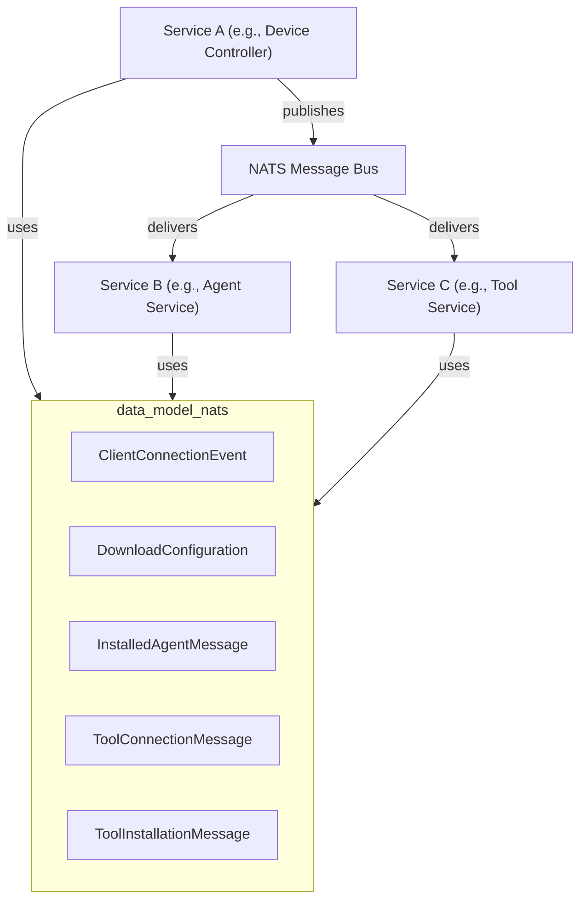
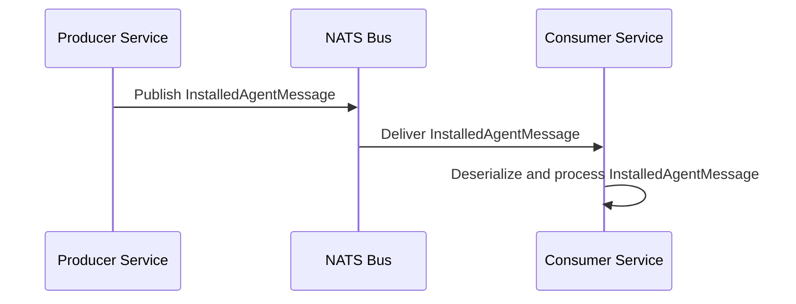
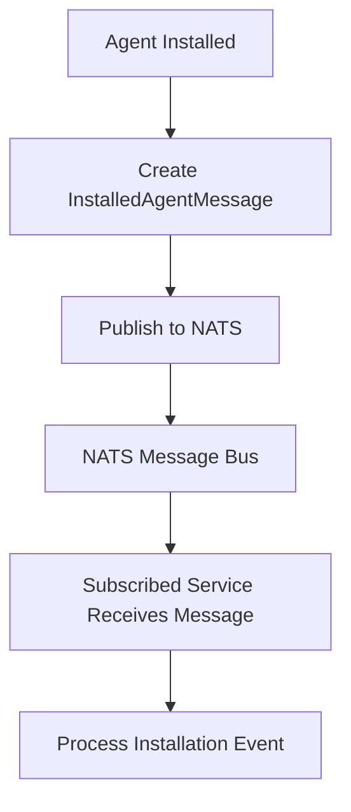

# data_model_nats Module Documentation

## Introduction

the `data_model_nats` module defines the core data models used for communication and event propagation over the NATS messaging system within the platform. These models are essential for representing and serializing key events and messages exchanged between distributed services, such as client connections, agent installations, tool connections, and configuration downloads. The module ensures a consistent schema for NATS-based event-driven workflows, supporting real-time updates and system integration.

## Core Components

- **ClientConnectionEvent**: Represents events related to client connections, such as connect/disconnect actions.
- **DownloadConfiguration**: Encapsulates configuration data to be downloaded by agents or clients.
- **InstalledAgentMessage**: Carries information about agent installation events.
- **ToolConnectionMessage**: Represents events related to tool connections, such as establishing or terminating a connection.
- **ToolInstallationMessage**: Encapsulates data about tool installation events, including status and metadata.

## Architecture Overview

The `data_model_nats` module is a foundational part of the platform's event-driven architecture. It provides the data contracts for NATS-based messaging, enabling decoupled communication between services such as device management, tool orchestration, and agent lifecycle management.

### High-Level Architecture

- **Producers** (e.g., Device Controller, Agent Service) create and publish events using the models from `data_model_nats`.
- **NATS Message Bus** acts as the transport layer.
- **Consumers** (e.g., Tool Service, Agent Service) subscribe to relevant topics and deserialize messages using the same models.

## Component Relationships and Data Flow

### Event Publishing and Consumption

- **Producer Service**: Constructs a message (e.g., `InstalledAgentMessage`) and publishes it to a NATS topic.
- **NATS Bus**: Routes the message to all subscribed consumers.
- **Consumer Service**: Receives, deserializes, and processes the message.

### Data Model Usage Example

- When a new agent is installed, the `InstalledAgentMessage` is published to notify other services.
- When a client connects or disconnects, a `ClientConnectionEvent` is broadcast.
- When a tool is installed or its connection state changes, `ToolInstallationMessage` or `ToolConnectionMessage` is used.
- For configuration updates, `DownloadConfiguration` is sent to relevant agents.

## Integration with Other Modules

The `data_model_nats` module is used by multiple service modules for event-driven workflows:

- **api_service_core_controller** ([api_service_core_controller.md]): Publishes and consumes events for device, agent, and tool management.
- **client_core_listener** ([client_core_listener.md]): Listens for NATS events to update client state.
- **management_service_core_initializer** ([management_service_core_initializer.md]): Initializes NATS stream configurations and publishes system events.
- **data_kafka_model** ([data_kafka_model.md]): May interoperate with NATS models for cross-bus event translation.

## Dependencies and Extensibility

- The models in `data_model_nats` are designed to be serializable and compatible with the NATS messaging protocol.
- They may reference or embed types from other data model modules (e.g., [data_model.md], [data_model_pinot.md]) for richer event payloads.
- The module is extensible: new event/message types can be added as the platform evolves.

## Process Flow: Agent Installation Event

## Summary

The `data_model_nats` module is a critical enabler for real-time, event-driven communication across the platform. By standardizing the message formats for NATS, it ensures reliable, decoupled, and scalable integration between distributed services. For details on specific message structures, refer to the code or the documentation of the respective core components.
