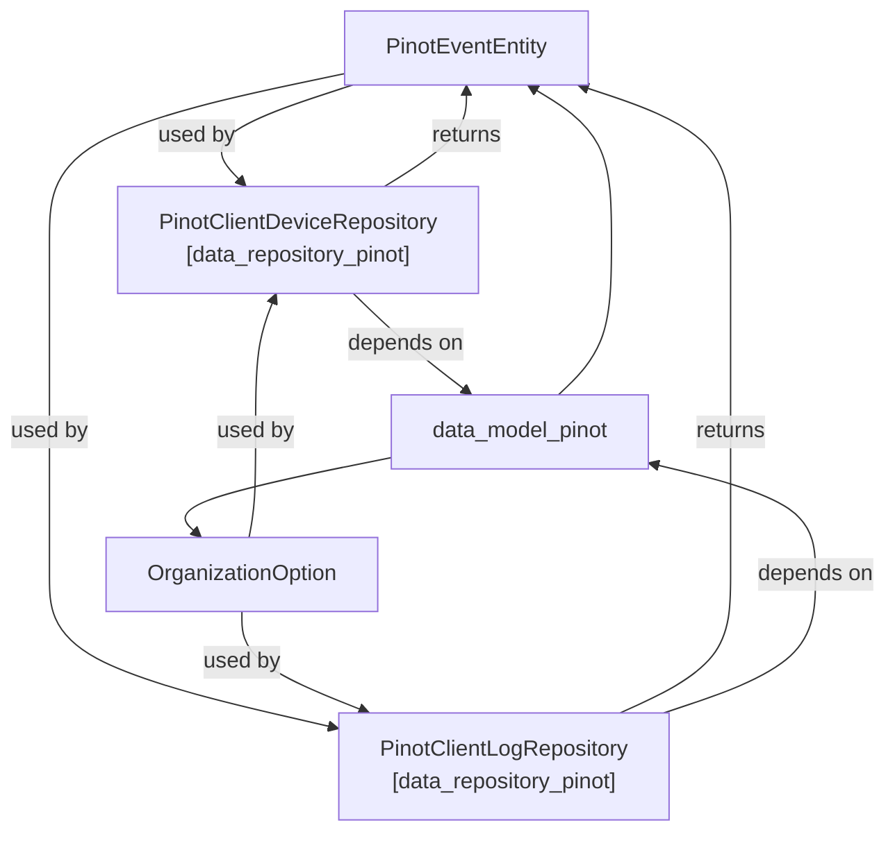
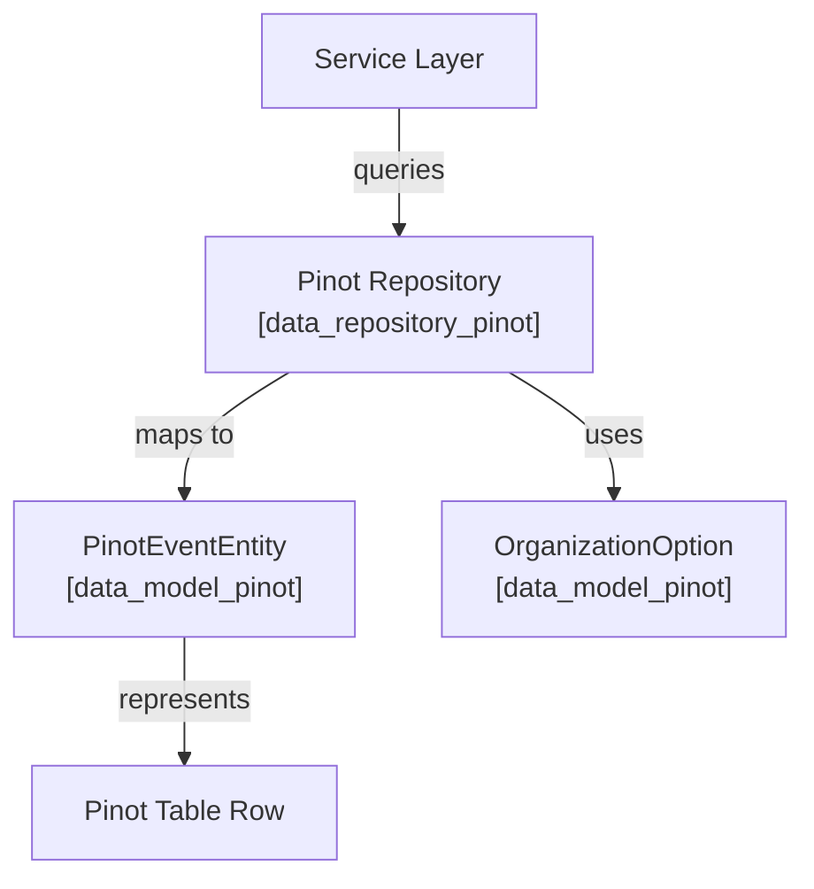
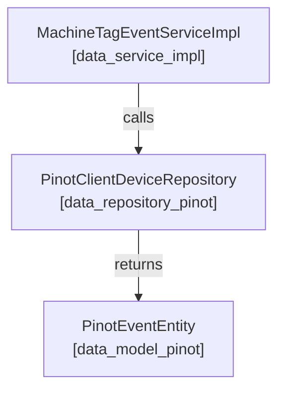

# data_model_pinot Module Documentation

## Introduction

data_model_pinot provides the core data model abstractions for integrating with Apache Pinot, a real-time distributed OLAP datastore. This module defines the entity and option types used for representing and querying Pinot-based event and organization data within the broader system. It acts as the schema and contract layer for Pinot-related repositories and services, ensuring type safety and consistency across the data access and processing layers.

## Core Components

- **OrganizationOption**: Represents organization-level options or filters relevant to Pinot queries.
- **PinotEventEntity**: The primary data entity representing an event record as stored in Pinot.

## Architecture Overview

data_model_pinot is a foundational module in the Pinot data access stack. It is typically used by repository modules (such as [data_repository_pinot.md]) and service implementations that require direct interaction with Pinot data structures. The module is designed to be lightweight, containing only data model definitions and no business logic or data access code.

### Module Relationships

### Data Flow and Usage

- **Service Layer**: Initiates queries for event or organization data.
- **Pinot Repository**: Implements query logic, returning results as PinotEventEntity objects.
- **PinotEventEntity**: Maps directly to rows in Pinot tables, encapsulating event data.
- **OrganizationOption**: Used to filter or scope queries at the organization level.

## Component Details

### OrganizationOption
Represents options or filters for scoping Pinot queries to specific organizations. Typically used as part of query construction in repository modules.

- **Used by**: Pinot repositories ([data_repository_pinot.md])
- **Related modules**: [api_lib_dto_organization.md] (for organization filter options in API layer)

### PinotEventEntity
Defines the schema for an event record as stored in Pinot. This entity is the primary data transfer object between Pinot and the application.

- **Used by**: Pinot repositories ([data_repository_pinot.md])
- **Related modules**: [data_kafka_model.md] (for Kafka event message models), [api_lib_dto_event.md] (for API event DTOs)

## Integration in the System

data_model_pinot is not used directly by business logic or controllers. Instead, it is consumed by repository modules (such as [data_repository_pinot.md]), which in turn are used by service implementations. This separation ensures that changes to the Pinot data schema are isolated and do not impact higher-level application logic.

### Example Integration Flow

- **Service**: [data_service_impl.md] (e.g., MachineTagEventServiceImpl)
- **Repository**: [data_repository_pinot.md] (e.g., PinotClientDeviceRepository)
- **Entity**: PinotEventEntity (this module)

## Dependencies and Related Modules

- [data_repository_pinot.md]: Implements data access using the models defined here.
- [data_kafka_model.md]: Defines Kafka message models that may be mapped to Pinot entities.
- [api_lib_dto_event.md]: API-level event DTOs, which may be mapped to or from PinotEventEntity.
- [api_lib_dto_organization.md]: Organization filter options at the API layer.
- [data_service_impl.md]: Service implementations that consume Pinot repositories.

## Summary

data_model_pinot is a low-level, schema-focused module that defines the core data types for interacting with Apache Pinot. It is essential for ensuring type safety and consistency in Pinot data access, and serves as the contract between repository implementations and the rest of the application stack.
