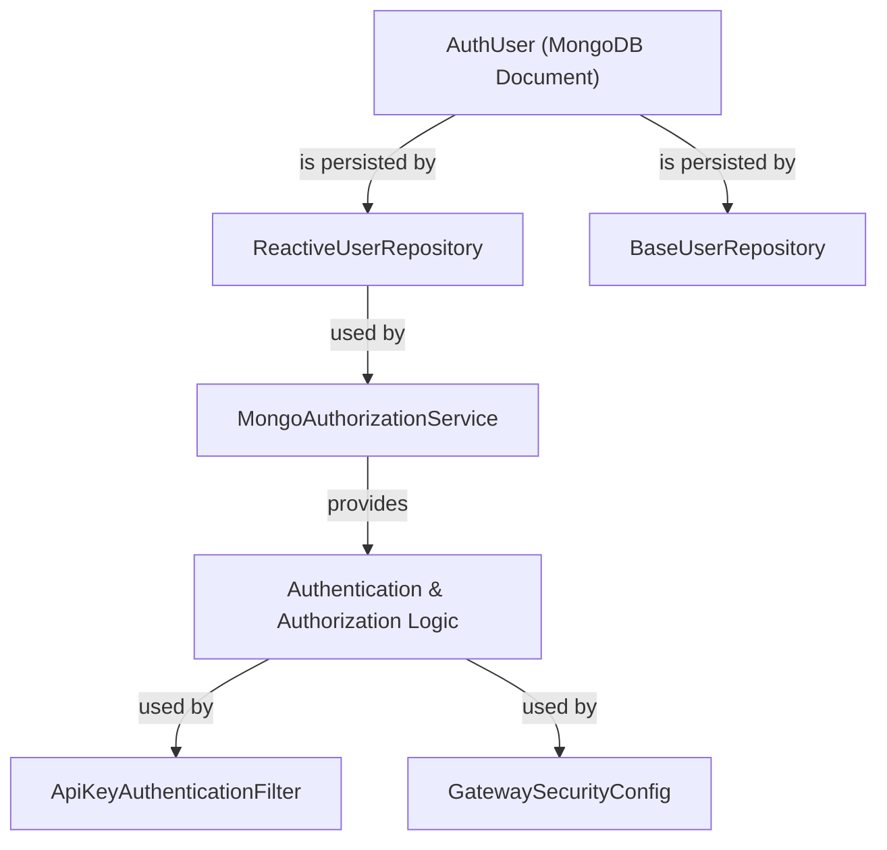
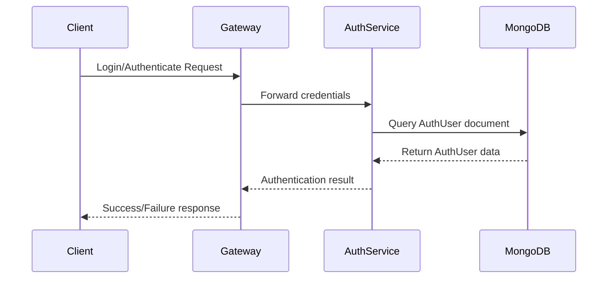
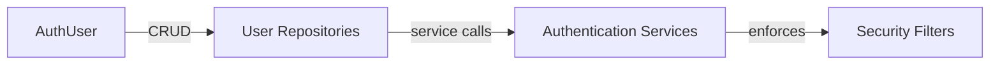

# data_mongo_document_auth Module Documentation

## Introduction

data_mongo_document_auth is a data access module responsible for defining the MongoDB document structure for authentication users within the system. It provides the core data model for representing authenticated users, which is essential for user management, authentication, and authorization workflows across the platform.

This module is foundational for any service or repository that needs to persist, retrieve, or manipulate user authentication data in MongoDB. It is typically used in conjunction with user repositories, authentication services, and authorization logic.

## Core Component

### AuthUser

The `AuthUser` component defines the MongoDB document schema for an authenticated user. It encapsulates all relevant fields required for authentication, such as user identifiers, credentials, roles, and status flags. This document is the canonical representation of a user in the authentication context.

**Key responsibilities:**
- Store user credentials and authentication metadata
- Track user status (active, locked, etc.)
- Associate users with roles and permissions
- Provide a basis for user queries and updates in MongoDB

## Architecture and Relationships

The `data_mongo_document_auth` module is a low-level data model module. It is typically used by repository modules (such as `data_mongo_reactive_repository_user` and `data_mongo_repository_user`) and by authentication/authorization service modules (such as `authorization_service_core_service_auth`).

### High-Level Architecture

- **AuthUser**: The MongoDB document representing a user
- **ReactiveUserRepository** ([data_mongo_reactive_repository_user.md]): Reactive repository for user documents
- **BaseUserRepository** ([data_mongo_repository_user.md]): Base repository for user documents
- **MongoAuthorizationService** ([authorization_service_core_service_auth.md]): Service for user authentication/authorization
- **Authentication & Authorization Logic**: Consumes user data for security checks
- **ApiKeyAuthenticationFilter** ([gateway_service_core_filter.md]): Uses user data for API key authentication
- **GatewaySecurityConfig** ([gateway_service_core_security.md]): Configures security using user data

### Data Flow

## Integration with Other Modules

- **Repositories**: The `AuthUser` document is accessed via [ReactiveUserRepository](data_mongo_reactive_repository_user.md) and [BaseUserRepository](data_mongo_repository_user.md).
- **Authentication Services**: [MongoAuthorizationService](authorization_service_core_service_auth.md) uses the user document for authentication and authorization logic.
- **Security Filters**: [ApiKeyAuthenticationFilter](gateway_service_core_filter.md) and [GatewaySecurityConfig](gateway_service_core_security.md) rely on user data for enforcing security policies.

## Component Interaction

- **User Repositories**: [ReactiveUserRepository](data_mongo_reactive_repository_user.md), [BaseUserRepository](data_mongo_repository_user.md)
- **Authentication Services**: [MongoAuthorizationService](authorization_service_core_service_auth.md)
- **Security Filters**: [ApiKeyAuthenticationFilter](gateway_service_core_filter.md), [GatewaySecurityConfig](gateway_service_core_security.md)

## How It Fits Into the Overall System

The `data_mongo_document_auth` module is a foundational building block for user authentication and authorization. It provides the persistent data model that underpins all user-related security operations. By defining the structure and storage of user authentication data, it enables secure, scalable, and maintainable user management across the platform.

For more details on related modules, see:
- [data_mongo_reactive_repository_user.md]
- [data_mongo_repository_user.md]
- [authorization_service_core_service_auth.md]
- [gateway_service_core_filter.md]
- [gateway_service_core_security.md]

---
*This documentation is auto-generated. For implementation details, refer to the source code and related module documentation.*
