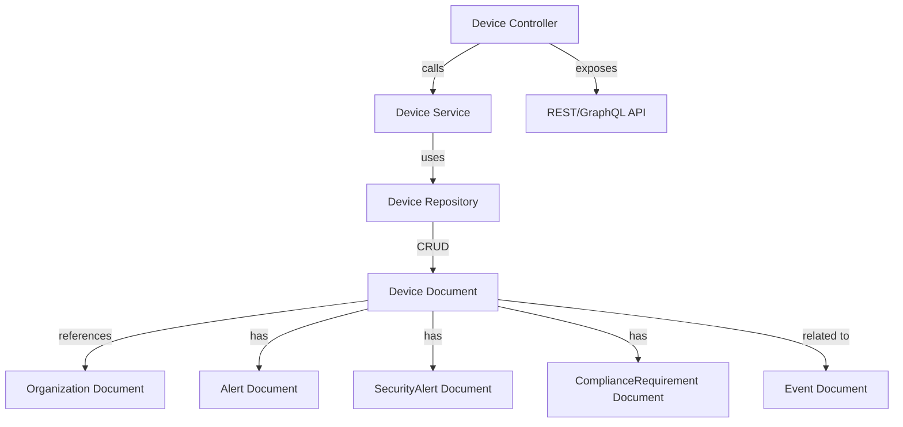
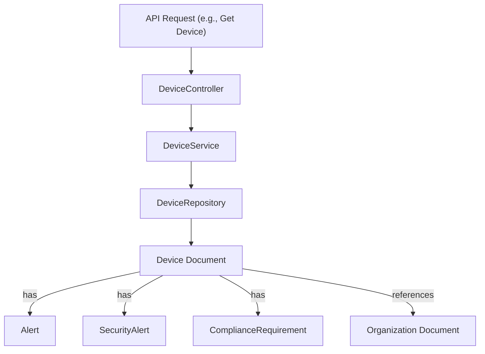
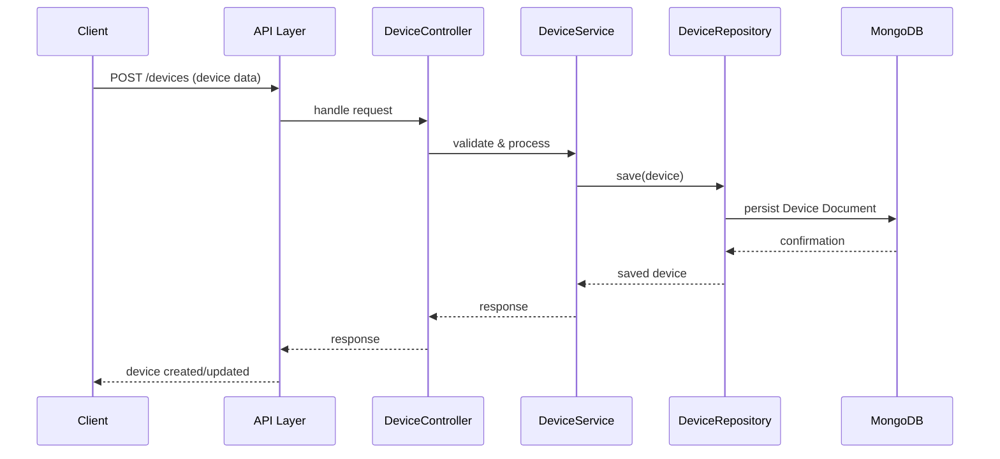
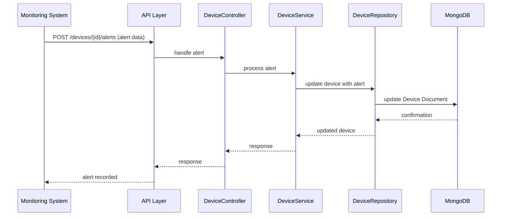

# data_mongo_document_device Module Documentation

## Introduction

the `data_mongo_document_device` module defines the core MongoDB document models for representing devices and their associated security and compliance information within the system. These models are central to the persistence and retrieval of device-related data, including alerts, compliance requirements, and security events. The module is foundational for device management, compliance tracking, and security alerting features across the platform.

**Core Components:**
- `Alert`
- `ComplianceRequirement`
- `Device`
- `SecurityAlert`

## Purpose and Core Functionality

This module provides the MongoDB document schemas for devices and related entities. It enables:
- Storage and retrieval of device metadata and state
- Representation of compliance requirements for devices
- Management of security alerts and general alerts associated with devices
- Integration with higher-level services for device monitoring, compliance, and security workflows

These document models are used by repository and service layers to implement business logic, queries, and data manipulation for device-centric features.

## Architecture Overview

The `data_mongo_document_device` module is part of the data persistence layer. It interacts with:
- **Repositories** (e.g., `data_mongo_repository_device`) for CRUD operations
- **Service layers** (e.g., `api_lib_service`, `api_service_core_service`) for business logic
- **Controller layers** (e.g., `api_service_core_controller.DeviceController`) for API exposure
- **Other document modules** (e.g., `data_mongo_document_organization`, `data_mongo_document_event`) for cross-entity relationships

### High-Level Architecture

- **Device Document**: Central entity representing a managed device
- **Alert/SecurityAlert/ComplianceRequirement**: Embedded or referenced documents for device state
- **Organization/Event**: Cross-referenced for multi-tenant and event-driven features
- **Repository/Service/Controller**: Standard Spring Data and service layering

## Component Relationships

### Device Document
- Represents a managed device (e.g., server, workstation, IoT device)
- Contains references to organization, compliance, and alert documents
- Used as the primary entity for device management features

### Alert & SecurityAlert
- Represent general and security-specific alerts for a device
- May be embedded in the device document or stored as separate documents with device references
- Used for alerting, monitoring, and incident response workflows

### ComplianceRequirement
- Captures compliance rules or requirements applicable to a device
- Used for compliance tracking and reporting

### Example Data Flow

## Integration with the Overall System

The `data_mongo_document_device` module is tightly integrated with:
- **Device Repositories**: [data_mongo_repository_device.md]
- **Device Services**: [api_lib_service.md], [api_service_core_service.md]
- **Device Controllers**: [api_service_core_controller.md], [external_api_service_core_controller.md]
- **Organization Documents**: [data_mongo_document_organization.md]
- **Event Documents**: [data_mongo_document_event.md]

These integrations enable end-to-end device management, from persistence to API exposure.

## Dependencies and Related Modules

- **Repositories**: [data_mongo_repository_device.md] (for custom queries and persistence)
- **Organization Documents**: [data_mongo_document_organization.md] (for multi-tenant support)
- **Event Documents**: [data_mongo_document_event.md] (for device event tracking)
- **Service Layers**: [api_lib_service.md], [api_service_core_service.md] (for business logic)
- **Controller Layers**: [api_service_core_controller.md], [external_api_service_core_controller.md] (for API endpoints)

## Process Flows

### Device Creation/Update Flow

### Device Alert Handling Flow

## Summary

The `data_mongo_document_device` module is a foundational part of the system's data layer, providing the core MongoDB document models for device management, compliance, and security alerting. It is designed for extensibility and integration with repository, service, and controller layers, enabling robust device-centric features across the platform.

For further details on related modules, see:
- [data_mongo_repository_device.md]
- [api_lib_service.md]
- [api_service_core_controller.md]
- [data_mongo_document_organization.md]
- [data_mongo_document_event.md]
