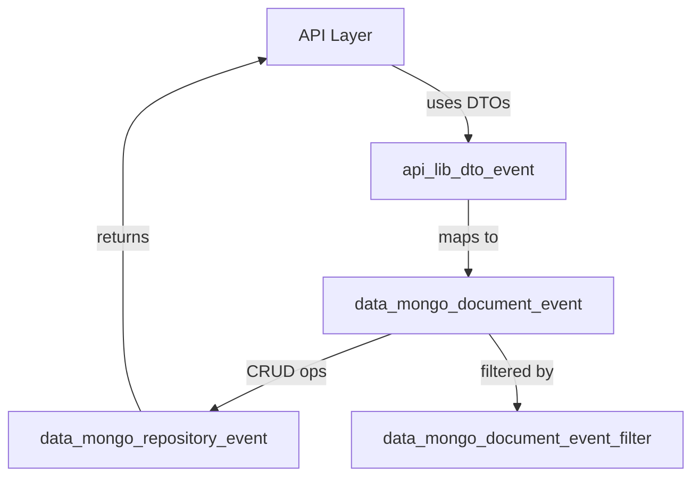
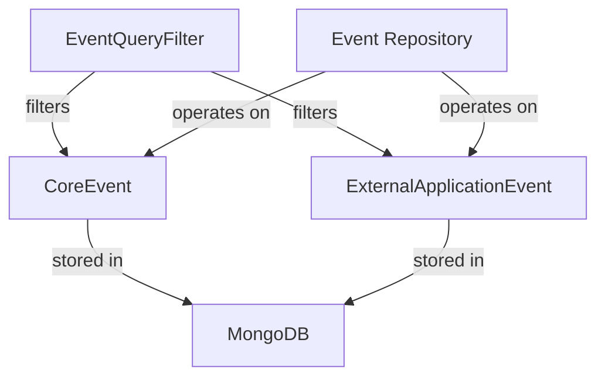
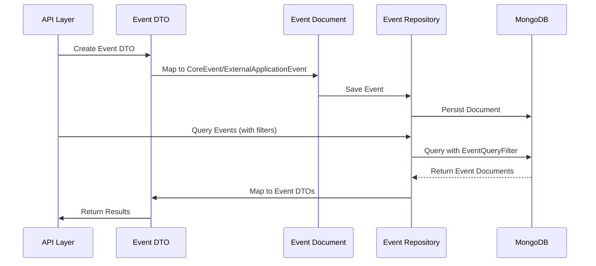

# data_mongo_document_event Module Documentation

## Introduction

data_mongo_document_event is a core data access module responsible for defining the MongoDB document models for events within the system. It provides the schema and persistence logic for storing and retrieving event data, including both internal system events and those originating from external applications. This module is foundational for event-driven features, audit trails, and integrations with external systems.

## Core Components

- **CoreEvent**: Represents the primary event document stored in MongoDB. Used for all internal and system-generated events.
- **ExternalApplicationEvent**: Represents events ingested from or related to external applications, enabling integration and tracking of third-party or external system activities.

## Architecture Overview

The data_mongo_document_event module is part of the data persistence layer. It defines the structure of event documents and interacts with repository modules for CRUD operations. It is closely related to:

- [data_mongo_repository_event.md]: Provides repository interfaces for querying and persisting event documents.
- [data_mongo_document_event_filter.md]: Defines filtering logic and query helpers for event documents.
- [api_lib_dto_event.md]: Supplies DTOs for event data transfer between API and data layers.

### High-Level Architecture

## Component Relationships

## Data Flow

1. **Event Creation**: Events are created by system processes or external integrations and instantiated as either `CoreEvent` or `ExternalApplicationEvent` objects.
2. **Persistence**: These objects are persisted to MongoDB via repository interfaces defined in [data_mongo_repository_event.md].
3. **Querying**: Consumers use [data_mongo_document_event_filter.md] to construct queries, which are executed by the repository layer.
4. **DTO Mapping**: Results are mapped to DTOs from [api_lib_dto_event.md] for use in the API layer.

## Integration with Other Modules

- **Filtering**: Uses [data_mongo_document_event_filter.md] for advanced event querying.
- **Repositories**: Works with [data_mongo_repository_event.md] for persistence and retrieval.
- **DTOs**: Integrates with [api_lib_dto_event.md] for data transfer to/from the API layer.

## Extensibility

- New event types can be added by extending the document models in this module.
- Filtering and querying logic can be enhanced in [data_mongo_document_event_filter.md].
- Repository logic can be customized in [data_mongo_repository_event.md].

## See Also

- [data_mongo_document_event_filter.md]: Event filtering and query helpers
- [data_mongo_repository_event.md]: Event repository interfaces
- [api_lib_dto_event.md]: Event DTOs for API communication
