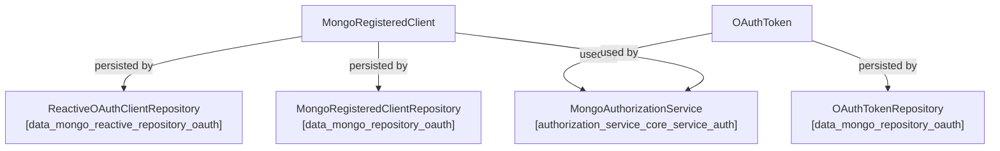
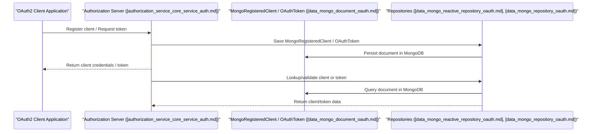

# data_mongo_document_oauth Module Documentation

## Introduction

the `data_mongo_document_oauth` module provides the core MongoDB document models for handling OAuth2 client registrations and token storage within the system. It is a foundational part of the authentication and authorization infrastructure, enabling secure storage and retrieval of OAuth client and token data for multi-tenant and federated identity scenarios.

**Core Components:**
- `MongoRegisteredClient`: Represents OAuth2 client registrations stored in MongoDB.
- `OAuthToken`: Represents OAuth2 access and refresh tokens stored in MongoDB.

This module is typically used in conjunction with the [data_mongo_reactive_repository_oauth.md] and [data_mongo_repository_oauth.md] modules, which provide repository interfaces for reactive and standard MongoDB operations, respectively. It is also closely integrated with the authorization and authentication service layers (see [authorization_service_core_service_auth.md]).

---

## Architecture Overview

The `data_mongo_document_oauth` module is part of the data persistence layer for OAuth2 and OpenID Connect (OIDC) flows. It defines the MongoDB document schemas that are used by repository and service layers to manage OAuth clients and tokens.

---

## Core Components

### MongoRegisteredClient

Represents an OAuth2 client registration, including client credentials, redirect URIs, scopes, and other metadata required for OAuth2 and OIDC flows. This document is the MongoDB equivalent of the standard OAuth2 client registration entity.

**Key Fields:**
- `clientId`: Unique identifier for the client.
- `clientSecret`: Secret used for client authentication.
- `redirectUris`: List of allowed redirect URIs.
- `scopes`: List of allowed scopes.
- `clientName`: Human-readable name for the client.
- `clientAuthenticationMethods`: Supported authentication methods.
- `authorizationGrantTypes`: Supported grant types (e.g., authorization_code, client_credentials).
- `clientSettings`: Additional client-specific settings (e.g., require PKCE, require consent).
- `tokenSettings`: Token-related settings (e.g., token lifetimes).

**Usage:**
- Used by the authorization server to validate and manage OAuth2 clients.
- Managed via repository interfaces in [data_mongo_reactive_repository_oauth.md] and [data_mongo_repository_oauth.md].
- Consumed by service logic in [authorization_service_core_service_auth.md] and client registration strategies (see [authorization_service_core_service_auth_strategy.md]).

### OAuthToken

Represents an OAuth2 access or refresh token, including metadata about the token, its owner, and its validity.

**Key Fields:**
- `tokenValue`: The actual token string (access or refresh token).
- `tokenType`: Type of token (access_token, refresh_token).
- `clientId`: The client to which the token was issued.
- `principalName`: The user or entity to whom the token was issued.
- `issuedAt`: Timestamp when the token was issued.
- `expiresAt`: Expiry timestamp.
- `scopes`: Scopes granted by the token.
- `metadata`: Additional metadata (e.g., device info, session info).

**Usage:**
- Used by the authorization server to validate and manage issued tokens.
- Managed via [data_mongo_repository_oauth.md] and consumed by [authorization_service_core_service_auth.md].

---

## Data Flow and Interactions

The following diagram illustrates the typical data flow for OAuth2 client registration and token issuance/storage:

---

## Module Relationships and Dependencies

- **Repositories:**
    - [data_mongo_reactive_repository_oauth.md]: Reactive repository for MongoRegisteredClient.
    - [data_mongo_repository_oauth.md]: Standard repository for MongoRegisteredClient and OAuthToken.
- **Authorization Service:**
    - [authorization_service_core_service_auth.md]: Service layer for OAuth2 authorization, uses these documents for client and token management.
    - [authorization_service_core_service_auth_strategy.md]: Client registration strategies (e.g., Google, Microsoft) that may create or update MongoRegisteredClient documents.
- **Related Document Modules:**
    - [data_mongo_document_auth.md]: For user authentication documents.
    - [data_mongo_document_organization.md]: For organization-level OAuth client scoping.
    - [data_mongo_document_tenant.md]: For tenant-specific SSO/OAuth configuration.

---

## Example Usage

**Registering a new OAuth2 client:**
1. Service receives a client registration request.
2. Constructs a `MongoRegisteredClient` document.
3. Persists it using the repository interface.

**Issuing a new OAuth2 token:**
1. Service authenticates client and user.
2. Constructs an `OAuthToken` document.
3. Persists it using the repository interface.

---

## See Also
- [data_mongo_reactive_repository_oauth.md]
- [data_mongo_repository_oauth.md]
- [authorization_service_core_service_auth.md]
- [authorization_service_core_service_auth_strategy.md]
- [data_mongo_document_auth.md]
- [data_mongo_document_organization.md]
- [data_mongo_document_tenant.md]
