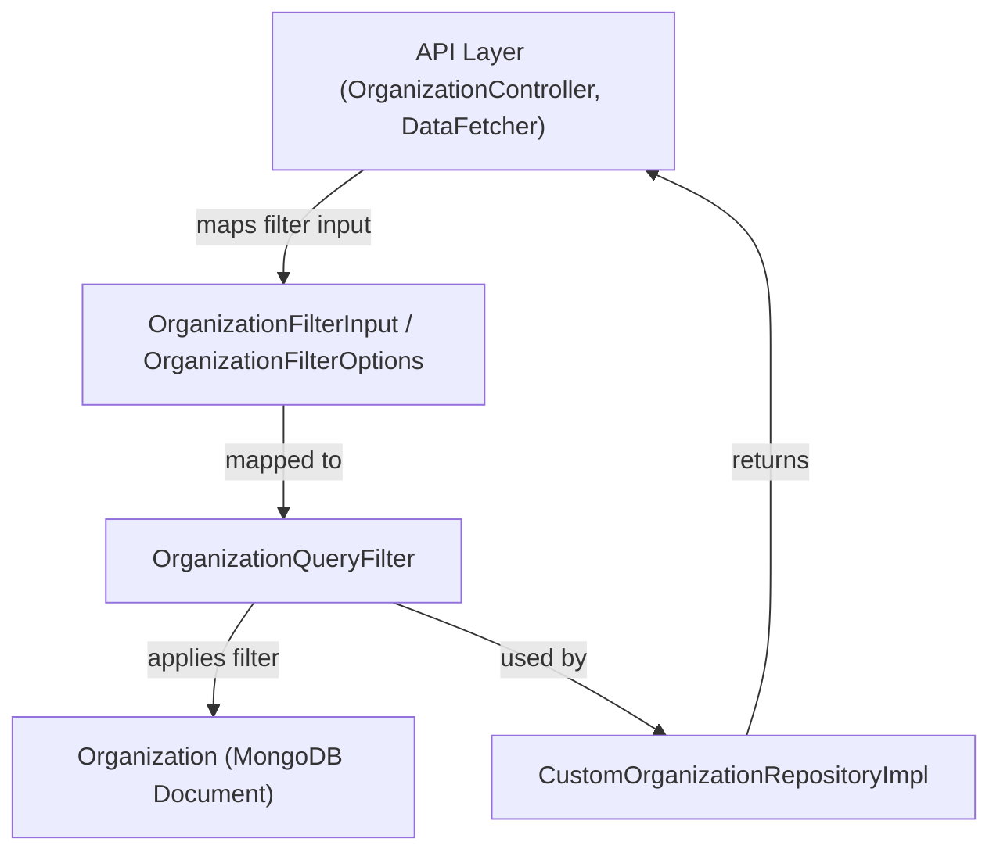
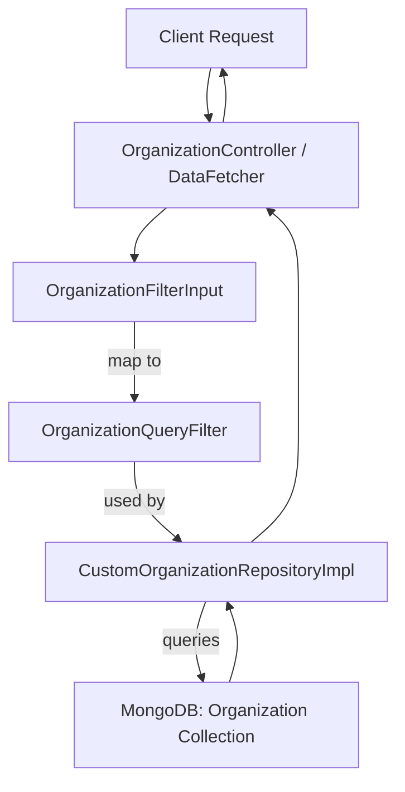

# data_mongo_document_organization_filter Module Documentation

## Introduction

the `data_mongo_document_organization_filter` module provides the core MongoDB query filter logic for organization documents within the system. It defines the data structures and mechanisms used to construct, represent, and apply organization-level filters when querying organization data from MongoDB. This module is essential for supporting advanced search, filtering, and access control features related to organizations across the platform.

## Core Component

- **OrganizationQueryFilter**: The primary data structure representing filter criteria for organization queries in MongoDB.

## Purpose and Functionality

The main purpose of this module is to encapsulate all logic and data structures required to filter organization documents in MongoDB collections. It enables other modules and services to:

- Build complex queries for organizations based on various criteria (e.g., name, status, tags, contact info)
- Support pagination, sorting, and advanced search features
- Integrate organization-level filtering into higher-level business logic (e.g., API endpoints, data loaders, repositories)

## Architecture and Component Relationships

The `data_mongo_document_organization_filter` module is a low-level data access component. It is typically used by repository and service layers that need to query organization data efficiently and flexibly.

### Key Relationships

- **Depends on:**
  - [data_mongo_document_organization.md](data_mongo_document_organization.md): Defines the `Organization` document structure that is being filtered.
  - [data_mongo_repository_organization.md](data_mongo_repository_organization.md): Custom repository implementations use `OrganizationQueryFilter` to build and execute queries.
  - [api_lib_dto_organization.md](api_lib_dto_organization.md): Higher-level DTOs (such as `OrganizationFilterOptions` and `OrganizationFilterInput`) are mapped to `OrganizationQueryFilter` for persistence-layer filtering.

- **Used by:**
  - Service and repository layers that require organization filtering (e.g., `CustomOrganizationRepositoryImpl`)
  - Data fetchers and controllers that expose organization search/filter APIs

### Architecture Diagram



### Data Flow

1. **API Layer** receives filter input from the client (e.g., via GraphQL or REST).
2. **DTOs** such as `OrganizationFilterInput` or `OrganizationFilterOptions` are populated.
3. These DTOs are mapped to an `OrganizationQueryFilter` instance.
4. The repository layer (e.g., `CustomOrganizationRepositoryImpl`) uses `OrganizationQueryFilter` to construct MongoDB queries.
5. Filtered organization documents are returned to the API layer and then to the client.

## Component Interaction Diagram



## Integration with Other Modules

- **Organization Document Structure:** See [data_mongo_document_organization.md](data_mongo_document_organization.md) for the definition of the `Organization` document.
- **Repository Implementation:** See [data_mongo_repository_organization.md](data_mongo_repository_organization.md) for how custom queries are built using `OrganizationQueryFilter`.
- **API DTOs:** See [api_lib_dto_organization.md](api_lib_dto_organization.md) for the filter input and options structures used at the API boundary.

## Example Usage

Below is a conceptual example of how the filtering process works:

```python
# Pseudocode for mapping API filter input to OrganizationQueryFilter
from api_lib_dto_organization import OrganizationFilterInput
from data_mongo_document_organization_filter import OrganizationQueryFilter

# Assume filter_input is an instance of OrganizationFilterInput
query_filter = OrganizationQueryFilter.from_dto(filter_input)

# Use in repository
results = custom_organization_repository.find(query_filter)
```

## Related Documentation

- [data_mongo_document_organization.md](data_mongo_document_organization.md)
- [data_mongo_repository_organization.md](data_mongo_repository_organization.md)
- [api_lib_dto_organization.md](api_lib_dto_organization.md)

## Summary

The `data_mongo_document_organization_filter` module is a foundational building block for all organization-related filtering in the system. It provides a clean separation between API-level filter definitions and MongoDB query logic, enabling robust, maintainable, and extensible organization search capabilities.
