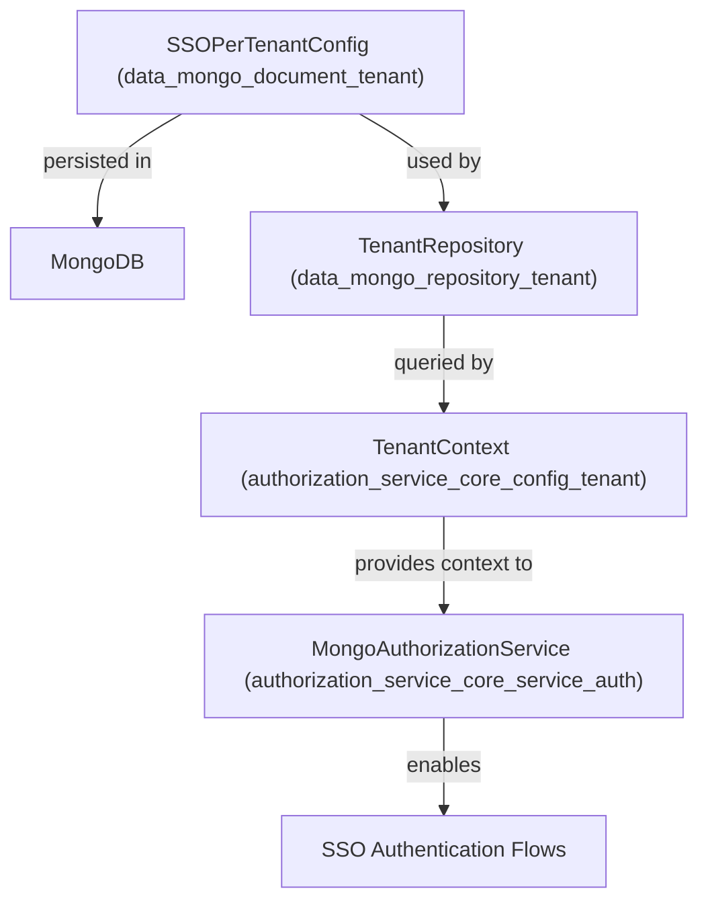
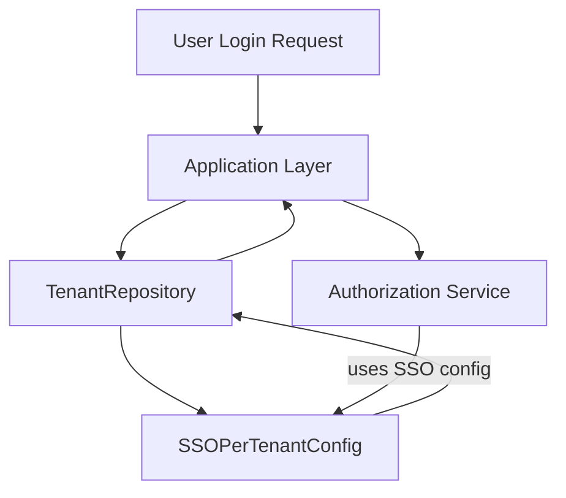

# data_mongo_document_tenant Module Documentation

## Introduction

data_mongo_document_tenant is a persistence-layer module responsible for representing and managing tenant-specific configuration documents in a MongoDB database. Its primary focus is to encapsulate per-tenant Single Sign-On (SSO) configuration data, which is essential for supporting multi-tenant authentication and authorization scenarios in the broader system.

This module is a foundational part of the data access layer, providing the schema and mapping for tenant SSO configuration documents. It is typically used by repository and service modules that require access to or manipulation of tenant-specific SSO settings.

## Core Component

### SSOPerTenantConfig

- **Purpose:** Represents the SSO configuration for a specific tenant, including provider details, client credentials, and any custom settings required for SSO integration.
- **Usage:** This document is stored in MongoDB and is accessed by higher-level modules (such as repositories and services) to retrieve or update SSO configuration for a given tenant.

> **Note:** For details on how this document is used in authentication flows, see [authorization_service_core_config_tenant.md] and [authorization_service_core_service_auth.md].

## Architecture & Relationships

The following diagram illustrates how `data_mongo_document_tenant` fits into the overall system architecture:

### Component Interaction Flow

1. **SSOPerTenantConfig** is defined as a MongoDB document representing SSO configuration for each tenant.
2. **TenantRepository** (see [data_mongo_repository_tenant.md]) provides CRUD operations for tenant documents, including SSO config.
3. **TenantContext** (see [authorization_service_core_config_tenant.md]) loads the current tenant's context, including SSO config, for each request.
4. **MongoAuthorizationService** (see [authorization_service_core_service_auth.md]) uses the loaded SSO config to perform authentication and authorization logic.

## Data Flow

## Dependencies

- **MongoDB**: Underlying database for document storage.
- **data_mongo_repository_tenant**: Provides repository interfaces for accessing tenant documents.
- **authorization_service_core_config_tenant**: Loads tenant context and SSO config for authentication flows.
- **authorization_service_core_service_auth**: Consumes SSO config for authorization logic.

## Related Modules

- [data_mongo_repository_tenant.md]: Repository interfaces for tenant documents
- [authorization_service_core_config_tenant.md]: Tenant context and filter logic
- [authorization_service_core_service_auth.md]: Authorization service using tenant SSO config

## Summary

data_mongo_document_tenant is a low-level, schema-focused module that plays a critical role in enabling multi-tenant SSO by providing a persistent, structured representation of per-tenant SSO configuration. It is not used directly by application logic, but is essential for repository and service modules that implement authentication and authorization features for different tenants.
