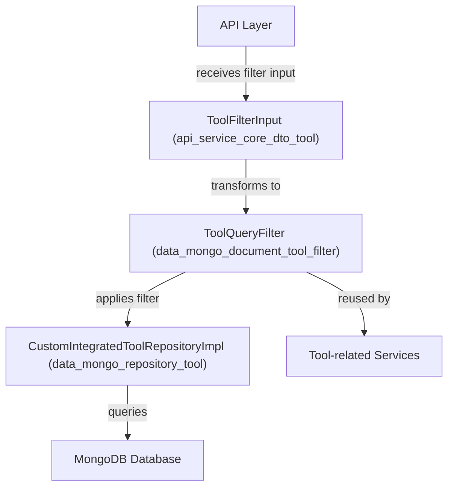
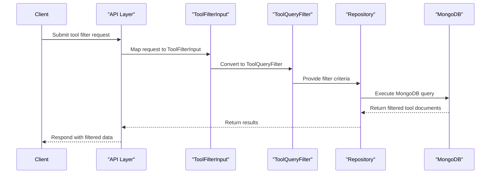

# data_mongo_document_tool_filter Module Documentation

## Introduction

data_mongo_document_tool_filter is a backend module responsible for defining and managing MongoDB query filters for tool-related entities within the system. It provides the core filtering logic and data structures that enable efficient querying, searching, and aggregation of tool documents in the MongoDB database. This module is essential for supporting advanced filtering capabilities in APIs and services that interact with tool data, such as listing, searching, and reporting on integrated tools.

## Core Component: ToolQueryFilter

The primary component of this module is `ToolQueryFilter`, which encapsulates the filter criteria and logic for querying tool documents in MongoDB. It is designed to be used by repository and service layers that require flexible and performant filtering of tool data.

### Key Responsibilities
- Define filter fields and criteria for tool documents (e.g., by name, type, tags, status)
- Support complex query composition for MongoDB
- Enable integration with higher-level filter DTOs and API input types
- Facilitate reuse of filtering logic across different services and controllers

## Architecture and Component Relationships

The `data_mongo_document_tool_filter` module fits into the broader data access and filtering architecture as follows:

- **API Layer**: Receives filter criteria from clients (e.g., via REST or GraphQL).
- **ToolFilterInput**: DTO representing filter input from the API layer ([api_service_core_dto_tool.md]).
- **ToolQueryFilter**: Converts DTO input into MongoDB query objects.
- **CustomIntegratedToolRepositoryImpl**: Repository implementation that uses `ToolQueryFilter` to build and execute MongoDB queries ([data_mongo_repository_tool.md]).
- **MongoDB Database**: The underlying data store.
- **Tool-related Services**: Business logic services that may reuse `ToolQueryFilter` for internal queries.

## Data Flow and Process Overview

The typical data flow for filtering tool documents is as follows:

## Dependencies and Integration Points

- **DTO Integration**: Closely integrated with `ToolFilterInput` ([api_service_core_dto_tool.md]) and `ToolFilterOptions` ([api_lib_dto_tool.md]) for receiving and processing filter criteria.
- **Repository Usage**: Utilized by `CustomIntegratedToolRepositoryImpl` ([data_mongo_repository_tool.md]) to construct MongoDB queries.
- **Service Layer**: May be used by tool-related services for advanced querying and business logic ([api_lib_service.md]).
- **Tag Filtering**: Can interact with tag-based filtering logic, leveraging the `Tag` document ([data_mongo_document_tool.md]).

## Related Modules

- [api_service_core_dto_tool.md]: Defines API-level filter input types for tools.
- [api_lib_dto_tool.md]: Provides shared DTOs for tool filtering options.
- [data_mongo_repository_tool.md]: Contains repository implementations that use `ToolQueryFilter`.
- [data_mongo_document_tool.md]: Defines the `Tag` document and other tool-related MongoDB documents.
- [api_lib_service.md]: Contains services that may use tool filtering logic.

## Example Usage

Suppose a client wants to list all tools of a certain type with a specific tag. The process would be:

1. Client sends a filter request to the API specifying tool type and tag.
2. API maps the request to a `ToolFilterInput` DTO.
3. The DTO is converted to a `ToolQueryFilter` instance.
4. The repository uses `ToolQueryFilter` to build a MongoDB query.
5. The query is executed, and matching tool documents are returned to the client.

## Extensibility

- New filter fields can be added to `ToolQueryFilter` to support additional query capabilities.
- The filter logic can be extended to support aggregation, sorting, and pagination in conjunction with other modules (e.g., [api_lib_dto_shared.md] for pagination input).

## Summary

data_mongo_document_tool_filter is a foundational module for tool data filtering in the system, enabling robust, reusable, and efficient MongoDB queries for tool-related entities. It acts as a bridge between API-level filter inputs and low-level database queries, supporting a wide range of filtering scenarios for integrated tools.
