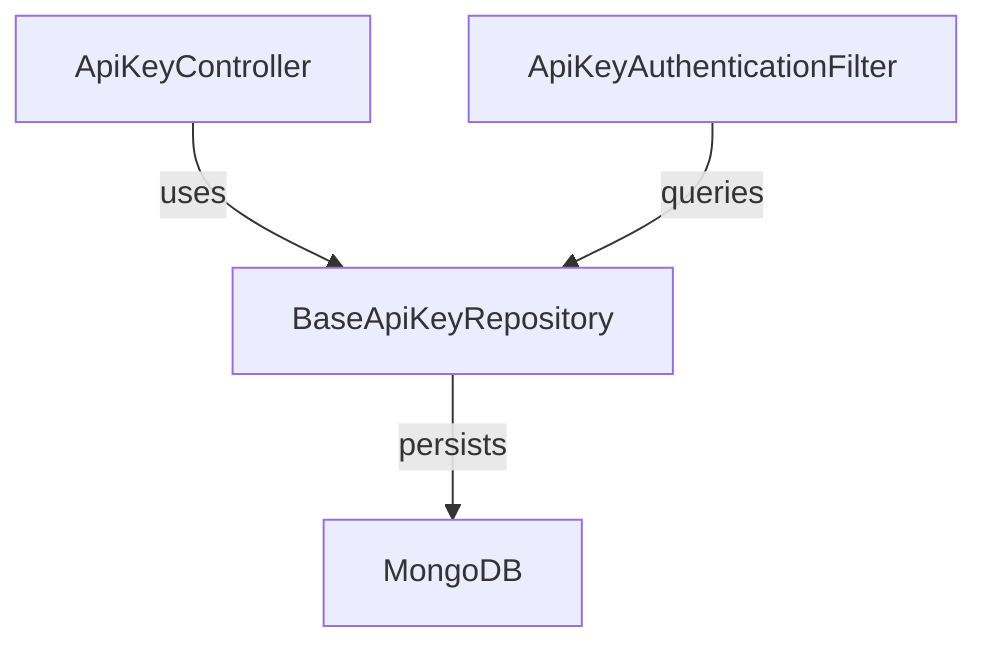
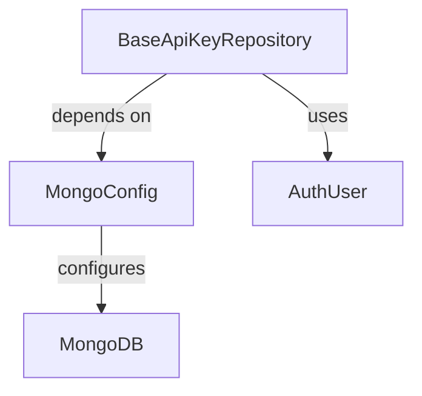
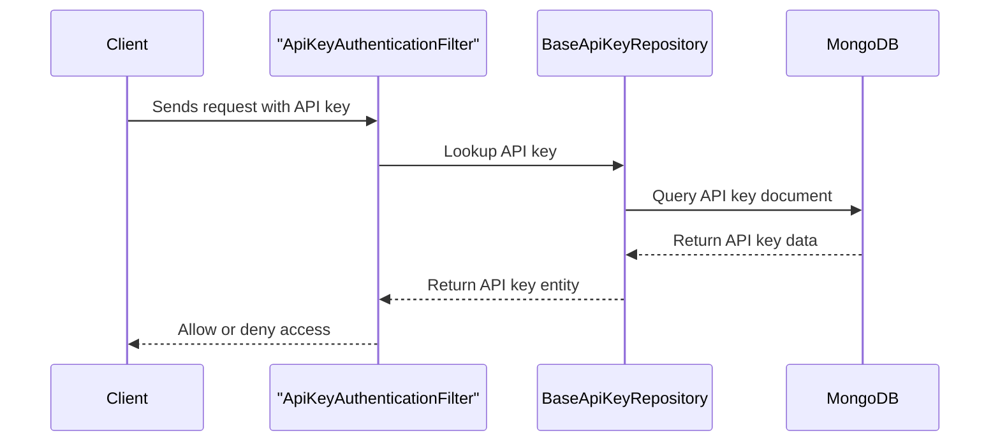

# data_mongo_repository_apikey Module Documentation

## Introduction

data_mongo_repository_apikey is a data access module responsible for managing API key persistence and retrieval in a MongoDB database. It provides repository-level abstractions for API key entities, supporting secure storage, lookup, and integration with authentication and authorization flows across the system.

This module is a key part of the backend infrastructure, enabling secure API key management for services that require programmatic access control. It is typically used by authentication filters, controllers, and service layers that need to validate or issue API keys.

## Core Component

- **BaseApiKeyRepository**: The primary repository interface or implementation for API key data operations in MongoDB.

## Architecture Overview

The data_mongo_repository_apikey module fits into the system as the persistence layer for API key data. It interacts with MongoDB collections (via Spring Data or similar frameworks) and is used by higher-level authentication and authorization components.

- **ApiKeyController**: Handles API key management endpoints (see [api_service_core_controller.md]).
- **ApiKeyAuthenticationFilter**: Validates incoming requests using API keys (see [gateway_service_core_filter.md]).
- **MongoDB**: The underlying database for storing API key documents.

## Component Relationships

- **MongoConfig**: Provides MongoDB connection and index configuration (see [data_mongo_config.md]).
- **AuthUser**: Represents the user or entity associated with an API key (see [data_mongo_document_auth.md]).

## Data Flow

The typical data flow for API key validation is as follows:

## Integration with Other Modules

- **Controllers**: [api_service_core_controller.md] (e.g., ApiKeyController) for API key management endpoints.
- **Authentication Filters**: [gateway_service_core_filter.md] for request validation.
- **MongoDB Configuration**: [data_mongo_config.md] for database setup.
- **User/Entity Documents**: [data_mongo_document_auth.md] for user associations.

## Extensibility and Customization

- The repository can be extended for custom query methods or additional security checks.
- Integrates with Spring Data MongoDB for query derivation and transaction management.
- Can be used in conjunction with other repositories (e.g., [data_mongo_repository_user.md]) for cross-entity operations.

## Summary

data_mongo_repository_apikey provides the foundational persistence and lookup logic for API keys in the system. It is a critical component for secure, scalable, and maintainable API key management, and is tightly integrated with authentication, authorization, and user management modules.

For more details on related modules, see:
- [api_service_core_controller.md]
- [gateway_service_core_filter.md]
- [data_mongo_config.md]
- [data_mongo_document_auth.md]
