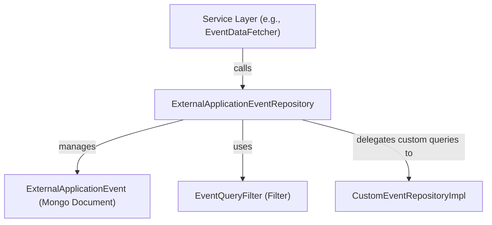

# data_mongo_repository_event Module Documentation

## Introduction

data_mongo_repository_event is a data access module responsible for managing event-related data persistence and retrieval in a MongoDB database. It provides repository interfaces and implementations for storing, querying, and managing external application events, which are a key part of the system's event-driven architecture. This module is designed to be used by higher-level services and data fetchers that require access to event data, especially those related to integrations with external applications.

## Core Functionality

- **Repository Abstraction:** Defines repository interfaces for event data, enabling decoupled and testable data access logic.
- **MongoDB Integration:** Leverages Spring Data MongoDB to interact with the underlying MongoDB collections.
- **External Application Event Support:** Focuses on the persistence and retrieval of `ExternalApplicationEvent` entities, which represent events originating from or destined for external systems.
- **Custom Query Support:** Works in conjunction with [data_mongo_repository_event_impl.md](data_mongo_repository_event_impl.md) for advanced or custom event queries.

## Key Component

### ExternalApplicationEventRepository
This is the primary repository interface in this module. It provides CRUD operations and custom query methods for `ExternalApplicationEvent` documents.

- **Entity Managed:** [ExternalApplicationEvent](data_mongo_document_event.md)
- **Filter/Query Support:** Utilizes [EventQueryFilter](data_mongo_document_event_filter.md) for advanced filtering.
- **Custom Implementation:** Extended by [CustomEventRepositoryImpl](data_mongo_repository_event_impl.md) for complex queries.

## Architecture & Component Relationships



### Data Flow

1. **Service Layer** (e.g., [EventDataFetcher](api_service_core_datafetcher.md)) requests event data.
2. **ExternalApplicationEventRepository** provides standard and custom query methods.
3. **CustomEventRepositoryImpl** (from [data_mongo_repository_event_impl.md](data_mongo_repository_event_impl.md)) handles advanced queries.
4. **MongoDB** stores and returns `ExternalApplicationEvent` documents.

## Dependencies & Integration

- **Documents:**
  - [ExternalApplicationEvent](data_mongo_document_event.md): The main event entity managed by this repository.
  - [EventQueryFilter](data_mongo_document_event_filter.md): Used for filtering and querying events.
- **Custom Implementation:**
  - [CustomEventRepositoryImpl](data_mongo_repository_event_impl.md): Provides custom query logic.
- **Consumers:**
  - [EventDataFetcher](api_service_core_datafetcher.md): Fetches event data for API and service layers.
  - Other service modules that require event data access.

## Example Usage

```java
@Autowired
private ExternalApplicationEventRepository eventRepository;

// Find events by custom filter
List<ExternalApplicationEvent> events = eventRepository.findByFilter(eventQueryFilter);
```

## Related Modules

- [data_mongo_document_event.md](data_mongo_document_event.md): Defines the `ExternalApplicationEvent` entity.
- [data_mongo_document_event_filter.md](data_mongo_document_event_filter.md): Defines filtering logic for event queries.
- [data_mongo_repository_event_impl.md](data_mongo_repository_event_impl.md): Custom repository implementation for advanced queries.
- [api_service_core_datafetcher.md](api_service_core_datafetcher.md): Service layer that consumes this repository.

## Summary

data_mongo_repository_event is a focused repository module that abstracts MongoDB operations for external application events. It is a foundational building block for event-driven features, providing a clean interface for event data access and supporting extensibility through custom query implementations.
