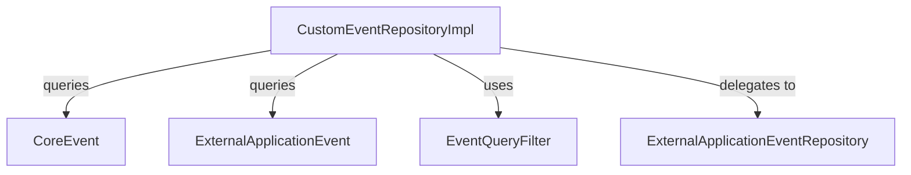
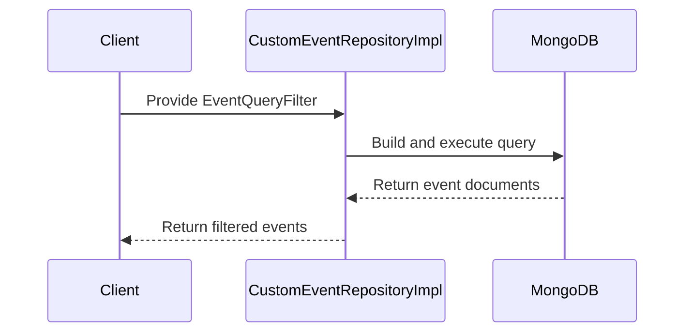

# data_mongo_repository_event_impl Module Documentation

## Introduction

the `data_mongo_repository_event_impl` module provides a custom implementation for event-related data access and query logic in a MongoDB-backed persistence layer. It is designed to support advanced event filtering, querying, and retrieval operations that go beyond the capabilities of standard Spring Data MongoDB repositories. This module is a key part of the event data infrastructure, enabling flexible and efficient access to event records for downstream services and APIs.

## Core Functionality

- Implements custom query logic for event data, supporting complex filtering and pagination.
- Integrates with MongoDB collections storing event documents (such as `CoreEvent` and `ExternalApplicationEvent`).
- Works in conjunction with filter and query objects (e.g., `EventQueryFilter`) to enable dynamic and efficient event searches.
- Supports use cases such as event search, analytics, and integration with external event sources.

## Key Components and Relationships

- **CustomEventRepositoryImpl**: The main implementation class providing custom event query methods.
- **CoreEvent** ([data_mongo_document_event.md]): The primary event document model stored in MongoDB.
- **ExternalApplicationEvent** ([data_mongo_document_event.md]): Represents events originating from external applications.
- **EventQueryFilter** ([data_mongo_document_event_filter.md]): Encapsulates filtering criteria for querying events.
- **ExternalApplicationEventRepository** ([data_mongo_repository_event.md]): Standard repository interface for external application events.

## Architecture Overview

The following diagram illustrates the relationships and data flow between the main components of the event repository implementation:

## Data Flow and Process

1. **Query Construction**: The client (e.g., a service or data fetcher) constructs an `EventQueryFilter` object with the desired filtering criteria.
2. **Custom Query Execution**: The `CustomEventRepositoryImpl` receives the filter and builds a MongoDB query, possibly involving aggregation pipelines for advanced filtering.
3. **Data Retrieval**: The repository executes the query against the `CoreEvent` and/or `ExternalApplicationEvent` collections.
4. **Result Processing**: The results are returned to the caller, often with pagination and additional metadata.

## Integration with the System

- **Upstream**: Consumed by data fetchers (see [api_service_core_datafetcher.md]) and service layers that require advanced event search capabilities.
- **Downstream**: Relies on MongoDB document models ([data_mongo_document_event.md], [data_mongo_document_event_filter.md]) and repository interfaces ([data_mongo_repository_event.md]).
- **Related Modules**: Closely related to modules handling event DTOs ([api_lib_dto_event.md]), event data fetchers, and analytics services.

## References

- [data_mongo_document_event.md]: Event document models (CoreEvent, ExternalApplicationEvent)
- [data_mongo_document_event_filter.md]: EventQueryFilter definition
- [data_mongo_repository_event.md]: Standard event repository interfaces
- [api_service_core_datafetcher.md]: Data fetchers using custom event queries
- [api_lib_dto_event.md]: Event DTOs and filter options

## See Also

- [data_mongo_repository_organization.md]: For custom organization repository patterns
- [data_mongo_repository_tool.md]: For custom tool repository implementations

---
*This documentation is auto-generated to provide a high-level overview and architectural context for the `data_mongo_repository_event_impl` module. For detailed API and method documentation, refer to the source code and related module docs.*
