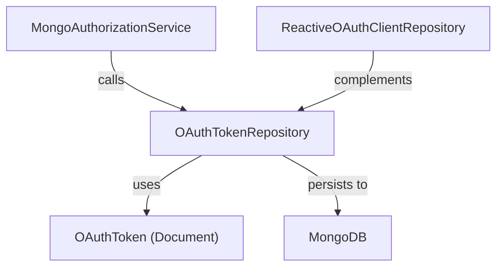
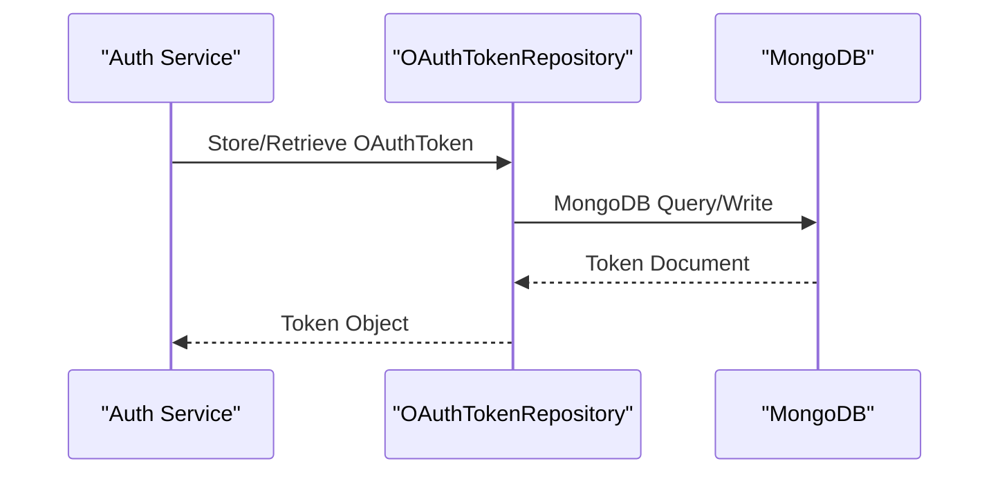

# data_mongo_repository_oauth Module Documentation

## Introduction

data_mongo_repository_oauth is a persistence layer module responsible for managing OAuth token storage and retrieval in a MongoDB database. It provides repository interfaces and implementations for handling OAuth tokens, which are essential for secure authentication and authorization flows in the system. This module is a key part of the backend infrastructure, supporting OAuth-based integrations and user authentication mechanisms.

## Core Functionality

- **OAuthTokenRepository**: The primary repository interface for CRUD operations on OAuth tokens stored in MongoDB.

## Architecture Overview

The data_mongo_repository_oauth module is part of the broader data persistence and authentication infrastructure. It interacts closely with:

- **MongoDB**: As the underlying data store for OAuth tokens.
- **data_mongo_document_oauth** ([data_mongo_document_oauth.md]): Defines the MongoDB document models such as `OAuthToken` and `MongoRegisteredClient` used by the repository.
- **authorization_service_core_service_auth** ([authorization_service_core_service_auth.md]): Provides higher-level OAuth authorization services that utilize this repository for token management.
- **data_mongo_reactive_repository_oauth** ([data_mongo_reactive_repository_oauth.md]): Offers reactive (non-blocking) repository interfaces for OAuth clients, complementing the synchronous repository in this module.

### High-Level Component Diagram



## Component Details

### OAuthTokenRepository

- **Purpose**: Provides CRUD operations for `OAuthToken` documents in MongoDB.
- **Responsibilities**:
  - Store, retrieve, update, and delete OAuth tokens.
  - Support queries for token validation and revocation.
- **Dependencies**:
  - Relies on the `OAuthToken` document model from [data_mongo_document_oauth.md].
  - Used by higher-level services such as `MongoAuthorizationService` ([authorization_service_core_service_auth.md]).

#### Data Flow



## Module Relationships

- **Upstream**: Used by authentication and authorization services (see [authorization_service_core_service_auth.md]).
- **Downstream**: Depends on document models from [data_mongo_document_oauth.md] and MongoDB configuration from [data_mongo_config.md].
- **Related Modules**:
  - [data_mongo_reactive_repository_oauth.md]: For reactive repository support.
  - [authorization_service_core_service_auth.md]: For business logic and service layer integration.

## Example Usage

A typical usage scenario involves the authentication service calling `OAuthTokenRepository` to persist a new OAuth token after successful user authentication, or to validate an existing token during an API request.

```java
// Example (Java/Spring Data)
@Autowired
private OAuthTokenRepository oAuthTokenRepository;

public void saveToken(OAuthToken token) {
    oAuthTokenRepository.save(token);
}

public Optional<OAuthToken> findByTokenValue(String tokenValue) {
    return oAuthTokenRepository.findByTokenValue(tokenValue);
}
```

## See Also

- [data_mongo_document_oauth.md]: Document models for OAuth tokens and clients
- [authorization_service_core_service_auth.md]: Service layer for OAuth authorization
- [data_mongo_reactive_repository_oauth.md]: Reactive repository for OAuth clients
- [data_mongo_config.md]: MongoDB configuration and index management

---

*For more details on the OAuth token document structure, refer to [data_mongo_document_oauth.md]. For service-level logic, see [authorization_service_core_service_auth.md].*
