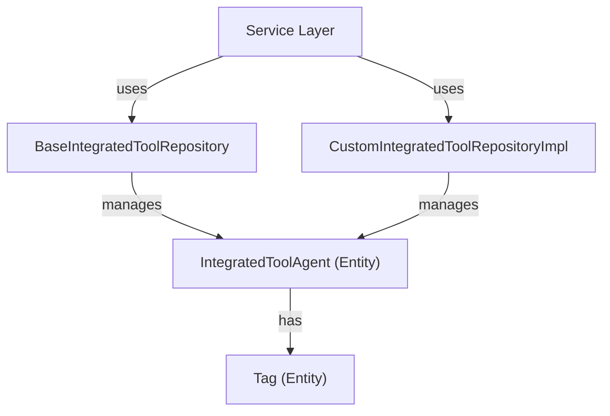
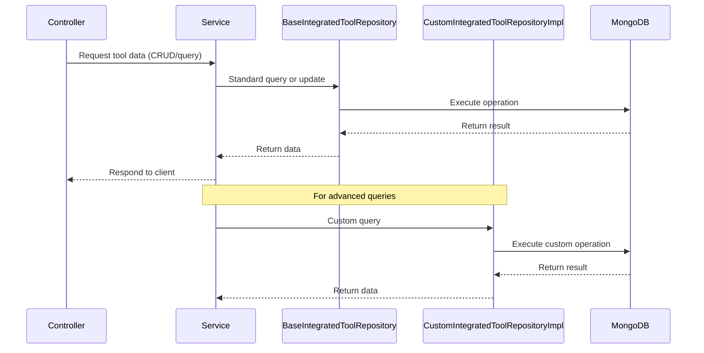

# data_mongo_repository_tool Module Documentation

## Introduction

data_mongo_repository_tool is a core data access module responsible for managing the persistence and retrieval of integrated tool entities in a MongoDB database. It provides repository interfaces and custom implementations for querying, updating, and managing tool-related data, supporting the broader system's integration and automation capabilities.

This module is essential for enabling the management of integrated tools, their agents, and associated metadata, and is typically used by service layers and controllers that require access to tool data.

---

## Core Components

- **BaseIntegratedToolRepository**: The primary repository interface for Integrated Tool entities, providing standard CRUD operations and query methods.
- **CustomIntegratedToolRepositoryImpl**: A custom implementation for advanced or non-standard queries and operations on Integrated Tool entities.

> **Note:** The actual entity definitions (such as `IntegratedToolAgent` and `Tag`) are defined in the [data_mongo_document_tool.md](data_mongo_document_tool.md) module. Refer to that documentation for detailed schema and field information.

---

## Architecture Overview

The module follows the repository pattern, separating data access logic from business logic. It leverages Spring Data MongoDB for standard operations and provides custom implementations for complex queries.

---

## Component Relationships

- **BaseIntegratedToolRepository**
  - Extends Spring Data repository interfaces for MongoDB.
  - Provides standard CRUD and query methods for `IntegratedToolAgent` entities.
  - Used by service layers to interact with tool data.

- **CustomIntegratedToolRepositoryImpl**
  - Implements custom query logic not covered by standard repository methods.
  - Used for advanced filtering, aggregation, or performance-optimized queries.

- **IntegratedToolAgent** and **Tag**
  - Defined in [data_mongo_document_tool.md](data_mongo_document_tool.md).
  - Represent the core data models managed by the repositories.

---

## Data Flow and Process

The typical data flow for tool management operations is as follows:

---

## Dependencies and Integration

- **Depends on:**
  - [data_mongo_document_tool.md](data_mongo_document_tool.md) for entity definitions
  - Spring Data MongoDB for repository infrastructure
- **Used by:**
  - Service layers (see [api_lib_service.md](api_lib_service.md), [management_service_core_service.md](management_service_core_service.md))
  - Controllers for tool management (see [management_service_core_controller.md](management_service_core_controller.md))

---

## Extending and Customizing

To add new queries or extend repository functionality:
1. Define new methods in the repository interface (`BaseIntegratedToolRepository`).
2. Implement custom logic in `CustomIntegratedToolRepositoryImpl` as needed.
3. Update the corresponding service and controller layers to use the new methods.

---

## See Also
- [data_mongo_document_tool.md](data_mongo_document_tool.md): Entity and schema definitions for IntegratedToolAgent and Tag.
- [api_lib_service.md](api_lib_service.md): Service layer usage patterns.
- [management_service_core_controller.md](management_service_core_controller.md): Controllers interacting with tool repositories.
